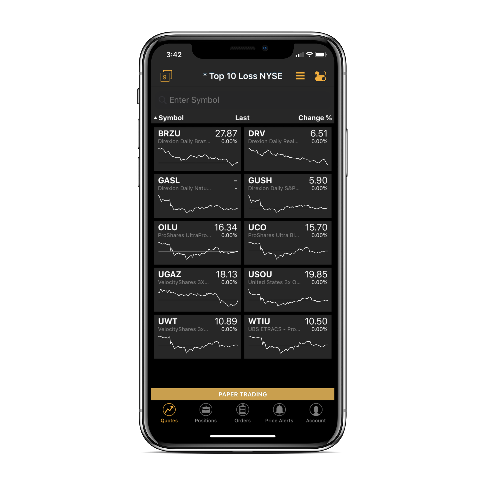

# App Layout

### Introduction

Once you launch ETNA Trader for iOS, you'll notice that the app's layout is based on a five-tab bar, each tab containing a separate screen with its own purpose. The list of tabs in the bar is as follows:

1. **Quotes**. This screen displays the current \(or the closing price\) price for securities in a specific watchlist. 
2. **Positions**. This screens displays the trader's current positions.
3. **Orders**. This screen displays all active, completed, and rejected orders of the trading account.
4. **Price Alerts**. The screen displays all price alerts of the trading account.
5. **Account**. This screen contains information about the trading account as well as the app's settings.


The selection of items in the tab bar may vary depending on the broker's settings. Namely, the app can omit certain screens or add one extra at the request of the broker.


