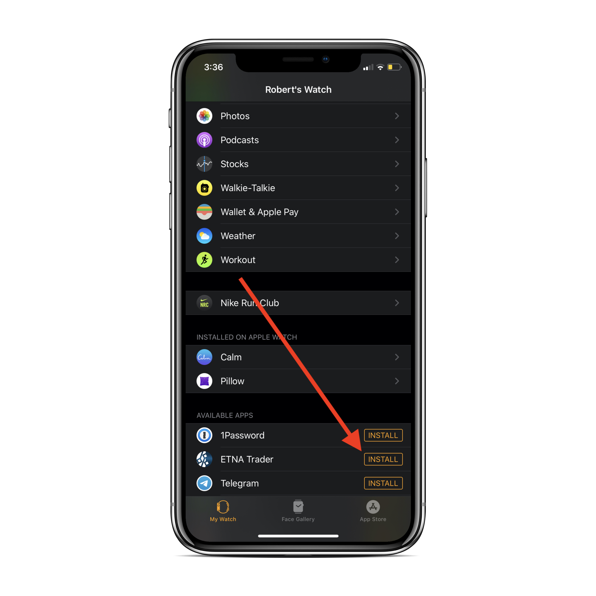
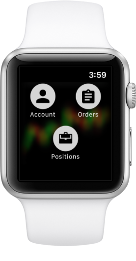
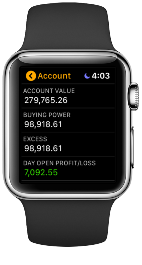
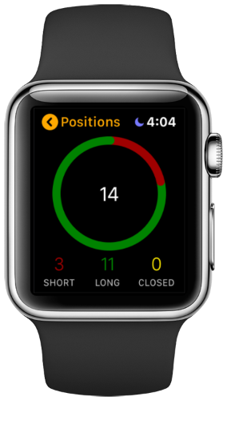
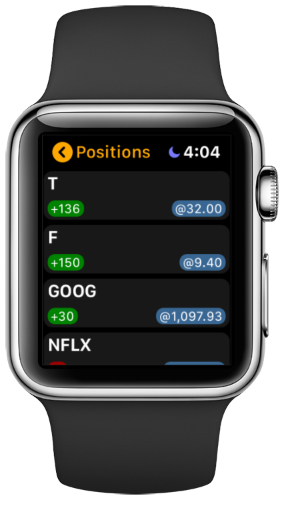
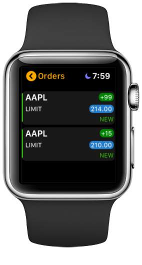

# Apple Watch Extension

### Introduction

ETNA Trader for iOS comes with an Apple Watch extension that enables traders to swiftly glance at their positions and orders as well as analyze the positions' current profit and loss. This extension does not need to be installed separately from the App Store; rather, once you have installed ETNA Trader to your iPhone or iPad, the Apple Watch extension will automatically be installed as well. However, if for some reason it's not installed, you can open the Apple Watch app on your device, scroll down to the Available Apps section, locate ETNA Trader, and then tap **Install**.

Once the extension is installed, it can immediately be opened from the app grid on the Apple Watch:

Once the extension is opened, you're presented with three buttons:

* Account
* Orders
* Positions

Tapping on each of these will bring up the corresponding view.

### Account View

If you tap on **Accounts**, you will be re-directed to the account information screen that lists detailed information about your trading account, including its current value, available cash, open profit/loss, buying power, and so forth.

### Positions View

If you tap on **Positions**, this will bring up the Positions view that gives you a visual breakdown of your positions. The entire screen is occupied by the piechart displaying the short positions, long positions, and closed positions as part of all positions.

Scrolling downward, there's a list of all positions opened on this trading account. Each position contains the ticker symbol of the underlying security \(top-left corner\), number of securities \(bottom-left corner\) as well as the limit, market, or stop price \(bottom-right corner\).

### Orders View

If you tap on **Orders**, this will bring up the Orders view that lists all orders of this trading account sorted by their status. It's similar to the Positions view in that it also visually breaks down all orders with a piechart. Moving downward, there's a list of all orders placed on this trading account along with pertinent information about the order like the ticker symbol of the underlying security, type of the order, quantity, limit, stop, or market price as well as as the order's status.

