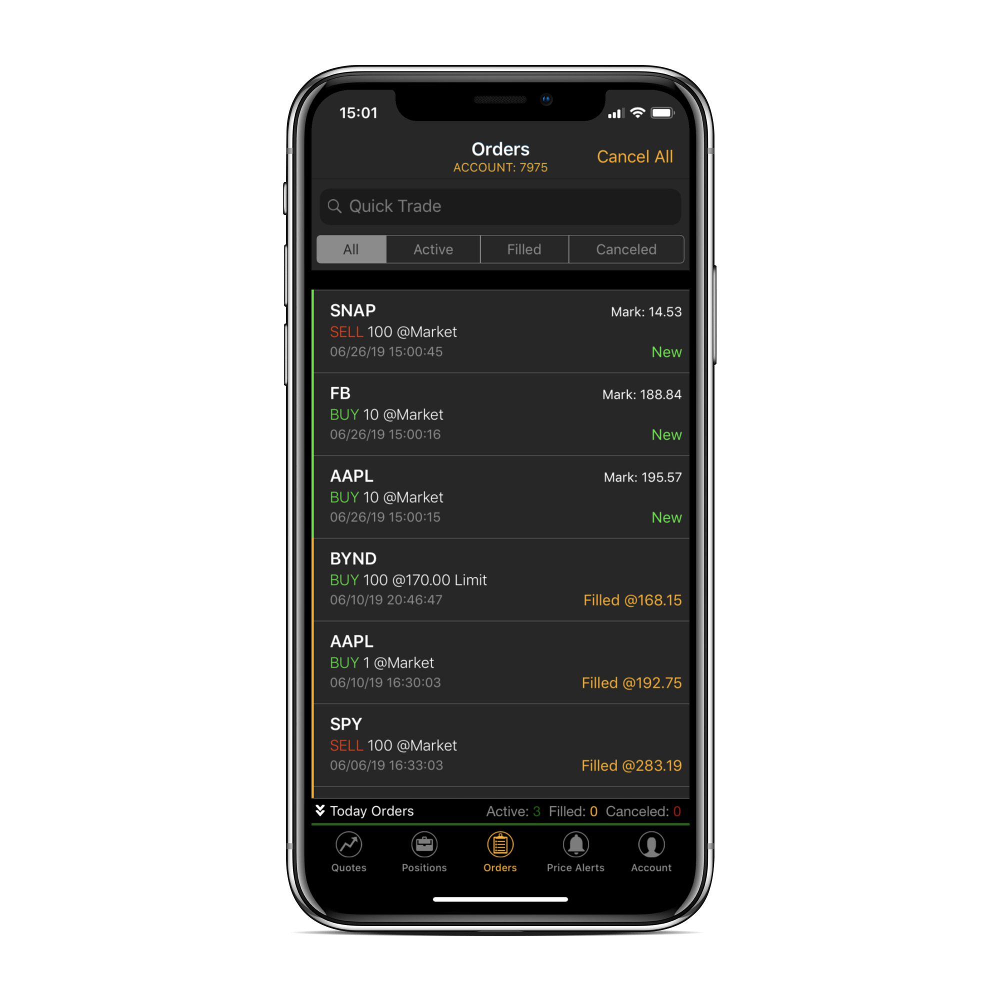
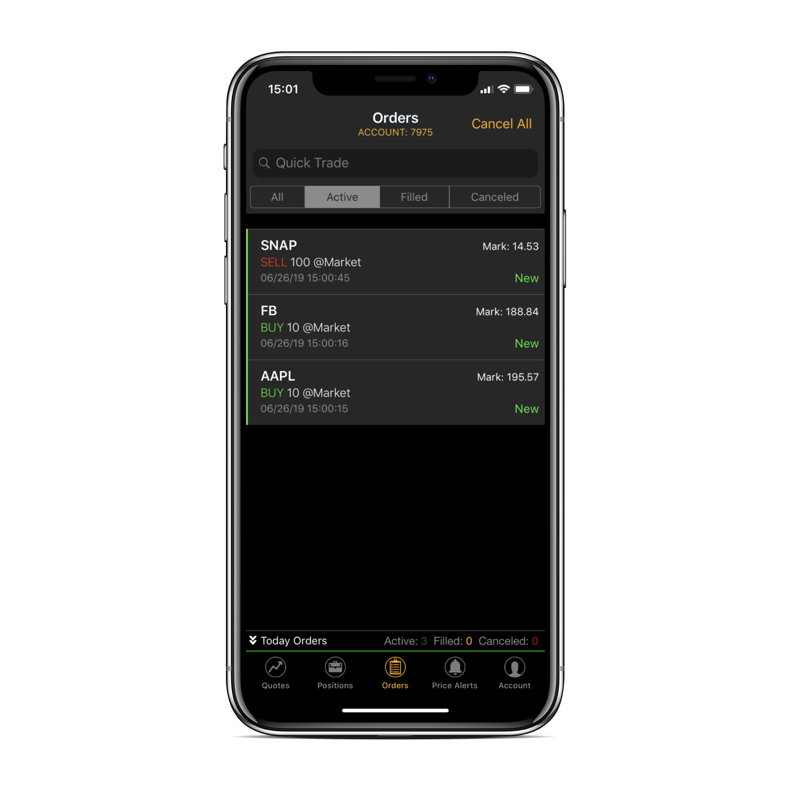
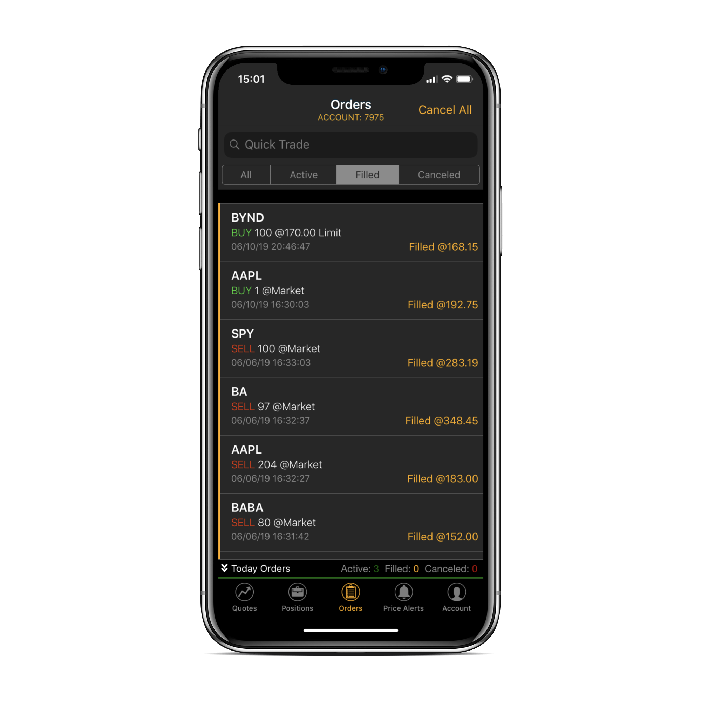
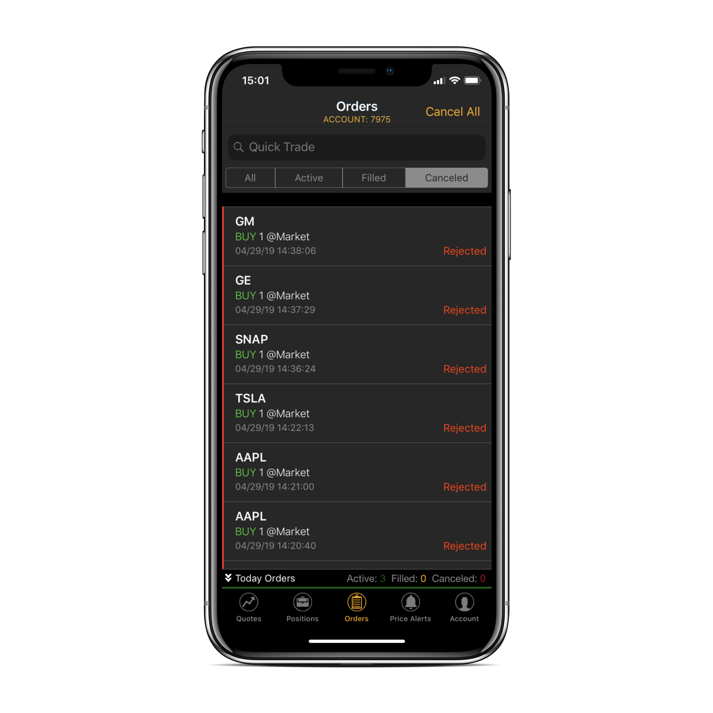
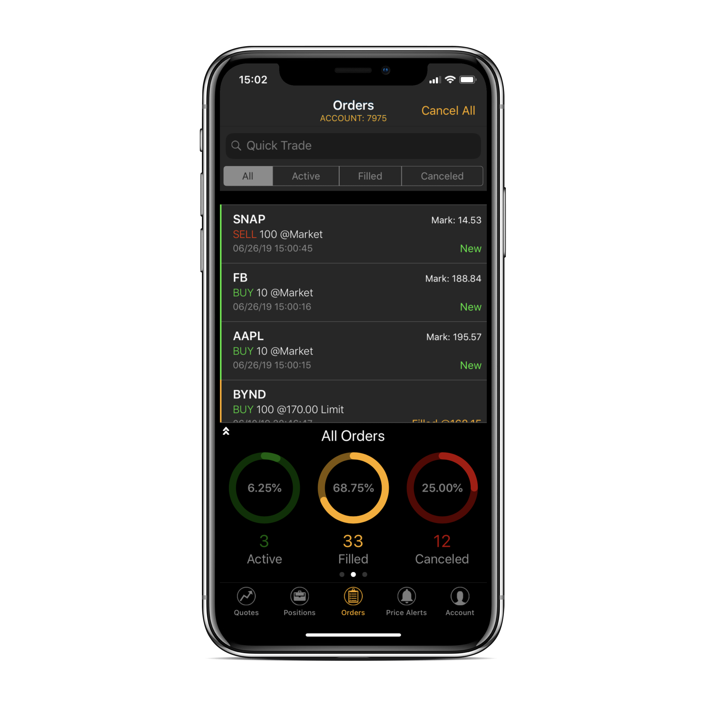
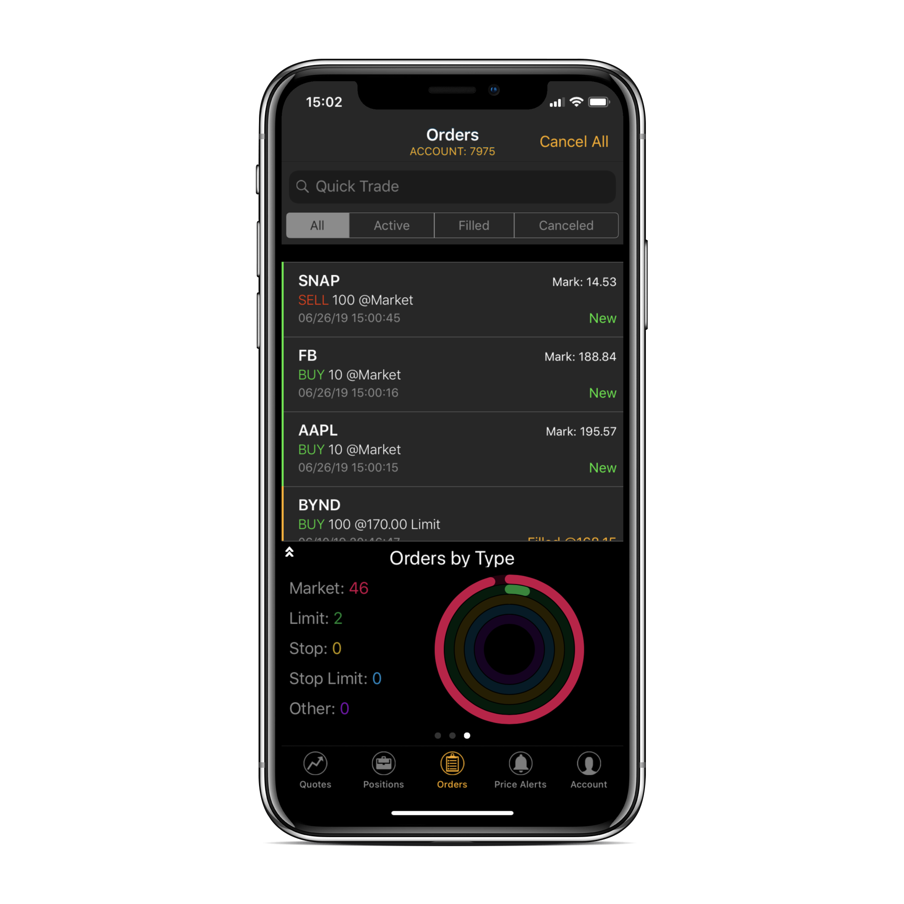
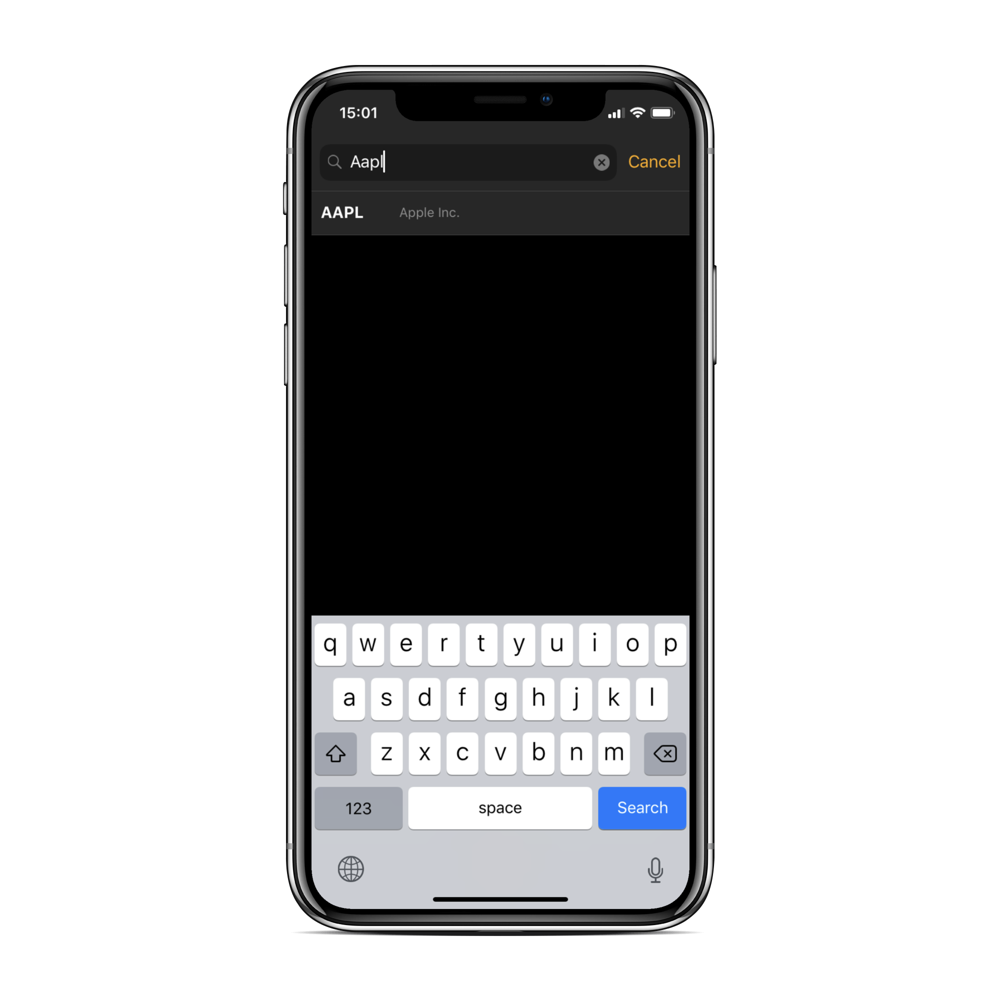
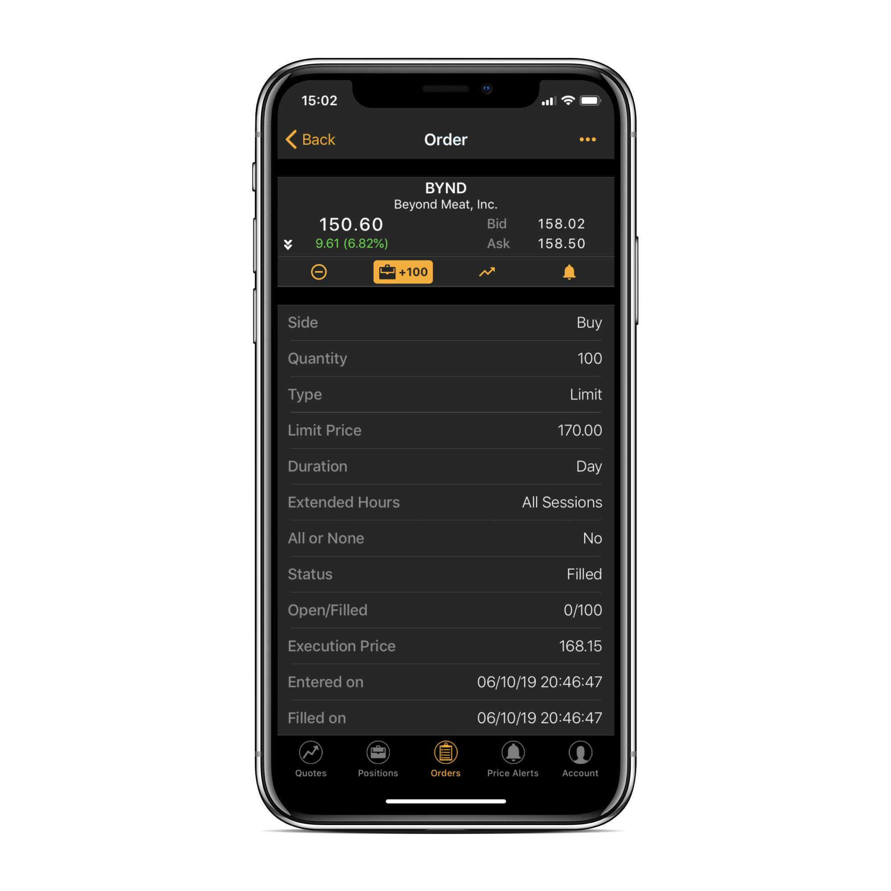
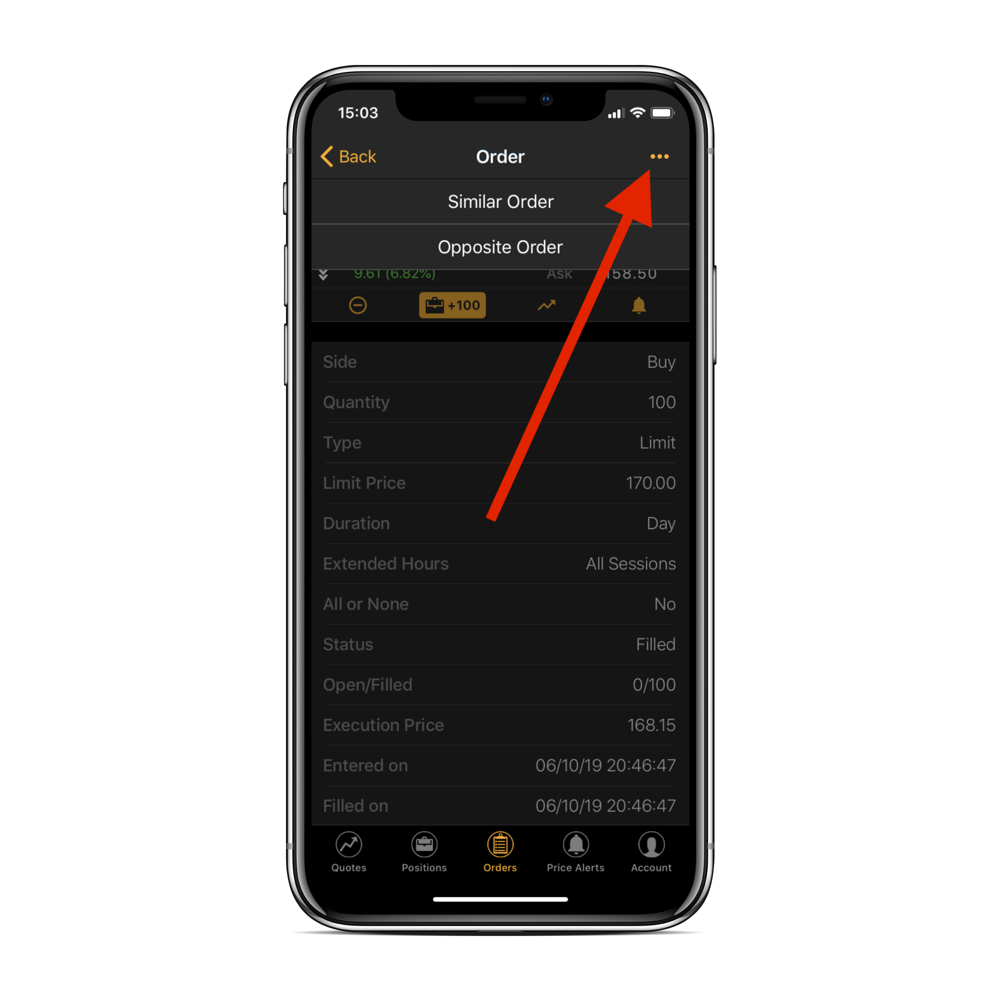
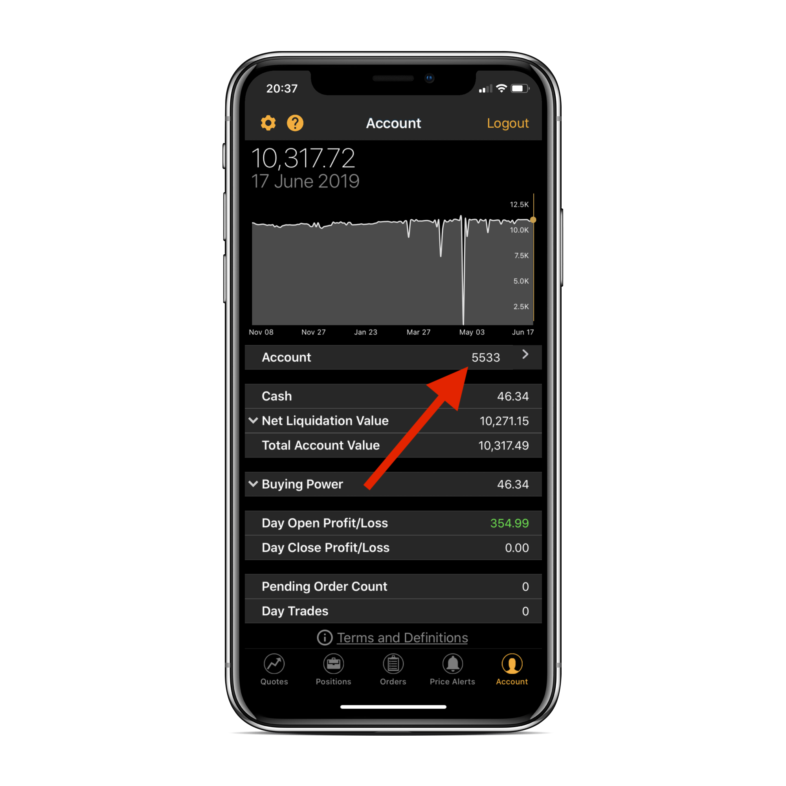

# Orders View

### Introduction

The third tab of ETNA Trader for iOS — **Orders** — is responsible for displaying the list of current orders of the current trading account: outstanding orders, filled orders, rejected, orders, etc. Here you can quickly inspect which of your orders have already been filled and which ones are under review or were rejected. 


The number of the trading account is displayed in the navigation bar under the _Orders_ label.


The layout of the tab represents a four-segment view that sorts all orders by their status:

1. **All**. This segment lists all orders of the current trading account.

2. **Active**. This segment displays only active orders, i.e. the ones that have been placed but not yet executed.

3. **Filled**. This segment displays only filled orders.

4. **Cancelled**. This segment lists cancelled orders, i.e. orders that have been cancelled by the execution venue due to some error.

### Orders Tab Layout

The Orders tab lists all orders of the specified trading account. Looking closer at each order you can view the following information about the order:

* The **ticker symbol** of the order's underlying security;
* The current **Mark** price of the security;
* The transaction **type** \(Buy, Sell, Sell Short, Buy to cover\);
* The **number of securities** transacted in this order;
* The **type of the order** \(Market, Limit, Stop Limit, etc.\);
* The **time** at which the order was placed;
* **Order status** \(New, Filled, Cancelled, etc.\).

At the bottom of the screen there's a pull-up statistics view that gives you a visual breakdown of the number of active, filled, and cancelled orders along with their their corresponding percentage of all orders.

Swiping left, you'll see a more detailed breakdown of all orders by types. On the right, each order type will be represented by an Apple Watch-style circle showing the weight of the type in the whole.

To place a new order, you can tap on the **Quick Trade** text field underneath the navigation bar and enter the required ticker symbol. Next, tap on the required security and you will be redirected to the [Trade View](quotes-view/trade-view/).

### Order Details

To view detailed information about a specific order, tap on it and you will be redirected to the order details view that displays comprehensive information about the order:

* **Side**. This is the transaction **type** \(Buy, Sell, Sell Short, Buy to cover\);
* **Quantity**. The **number of securities** transacted in this order;
* **Type**. The **type of the order** \(Market, Limit, Stop Limit, etc.\);
* **Limit / Stop price**. This is the limit, stop limit, or other price depending on the order type;
* **Duration**. Indicates the time frame in which the order will be active. Possible Values:
  1. **Day**. The order automatically expires at the end of the regular trading session if it weren't executed.
  2. **GTC** \(Good-till-Canceled\). The order persists indefinitely until it is executed or manually cancelled.
  3. **AtTheOpening**. The order should be filled at the opening of the marketplace or cancelled.
  4. **ImmediateOrCancel**. The order should be completely or partially filled immediately. If partially filled, the remaining part of the order should be cancelled.
  5. **FillOrKill**. The order should be filled immediately and entirely or cancelled right away.
  6. **GoodTillCrossing**. The order will be active until the market enters the auction phase.
  7. **GoodTillDate**. The order will be active until the date specified in the ExpireDate attribute \(unless it is executed or cancelled\).
  8. **GoodTillTime**. The order will be active until a certain time point.
* **Extended Hours**. Indicates if the order should be placed during the extended hours. Possible values:
  * **PRE** — Pre-market;
  * **POST** — After-market;
  * **ALL** — All sessions;
  * **REGPOST** — Market hours + after-market hours;
  * **PREREG** — Market hours + pre-market hours
  * **PREPOST** — pre-market hours + after-market hours;
* **All or None**. Indicates if the order should be executed in one transaction;
* **Status**. The status of the order;
* **Open / Filled**. Displays the ratio of filled securities to opened securities;
* **Execution Price**. Actual price at which the securities were transacted;
* **Entered on**. The date on which the order was placed;
* **Filled on**. This is the date on which the order was filled.

If you tap on the little ellipsis button in the upper right-hand corner, you can place a similar order or an opposite order. The opposite order is an order with the reverse side; for example, if the initial order's was to purchase 100 shares of Apple, its opposite counterpart would be to sell 100 shares of Apple.

If you wish to view the orders of a different trading account, navigate to _Account_ \(5th tab\) and tap on the account number. 

Next, tap on the required account number and go back to the Orders tab. The selected trading account's orders should now be listed.

