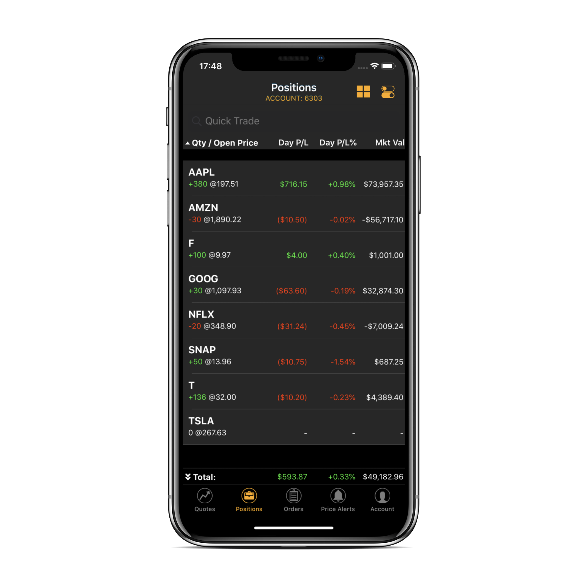
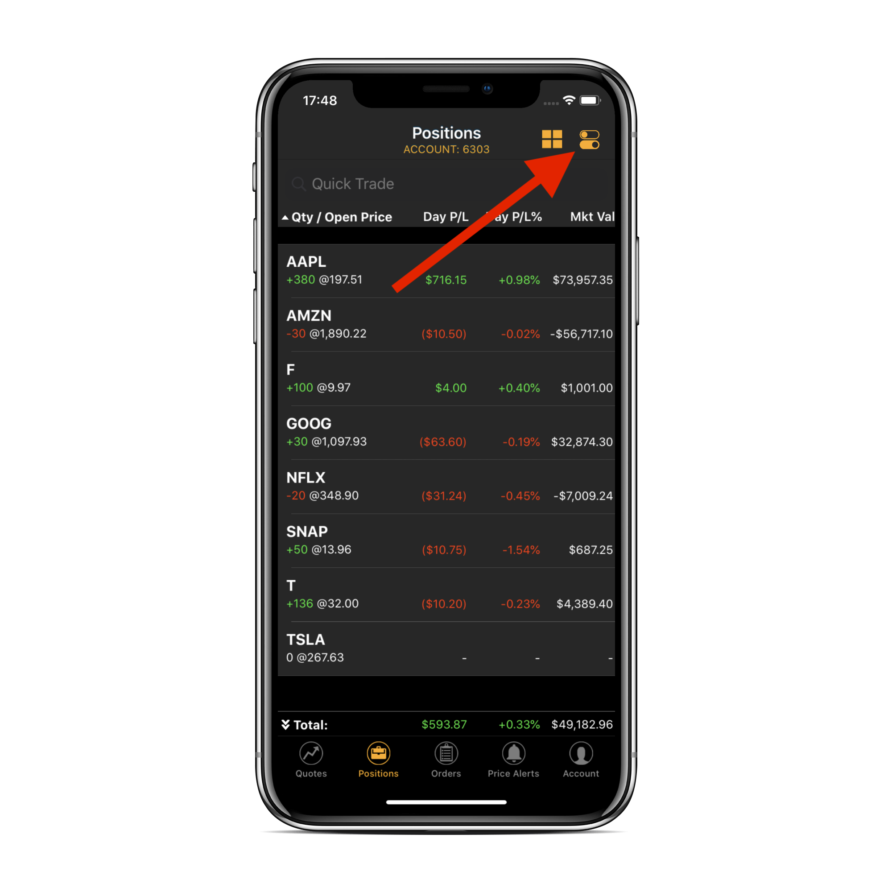
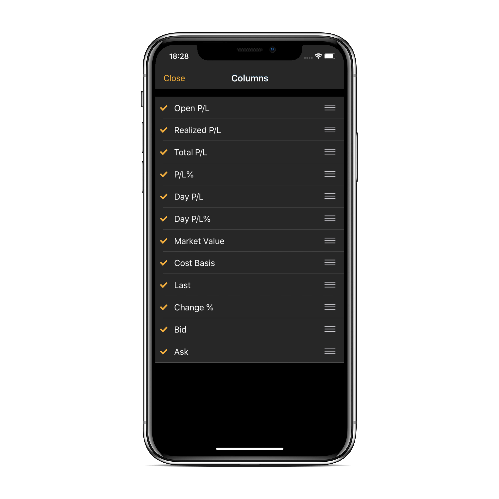
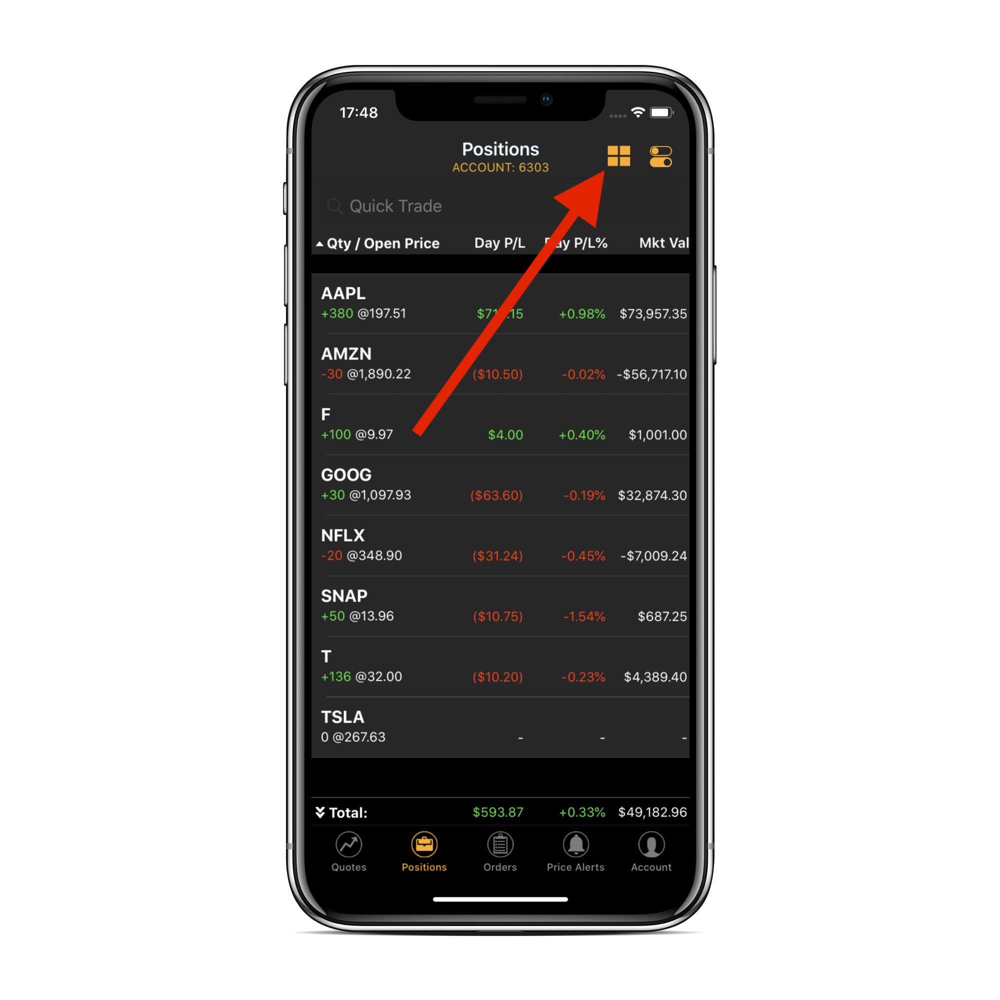

# Positions View

### Introduction

The second tab in ETNA Trader for iOS — **Positions** — is responsible for listing all outstanding positions on the current trading account. When a trader opens a new position from the [Trade View](quotes-view/trade-view/), this newly created position becomes instantly visible on the Positions view. In addition to viewing outstanding positions, this tab also enables you track the profit and loss figures for each position, their market value, and a set of other parameters.

### Exploring the Position Tab

To open the Positions tab, tap Positions in the tab bar at the bottom of the app. You will be presented with a list of all positions opened on the trading account \(the number of the account is displayed as a subtitle at the top\).

Each position contains all information pertinent to the positions, namely:

* Ticker symbol under which the position's underlying security is listed on the exchange.
* The number of securities purchased \(green\) or sold \(red\) when opening the position.
* The price at which the securities were purchased or sold.
* **Open P/L**. This is the unrealized profit and loss in the position. The profit or loss becomes realized once the position is liquidated. Calculated as:

  `P/L Open = Market Value - Average Open Price * Quantity * Contract Size`

* **P/L %**. Identical to **Open P/L** but expressed in percentage terms.
* **Day P/L**. This is the total profit or loss on the trading account as compared to the securities' closing price of the previous trading session.
* **Day P/L %**. Identical to **Day P/L** but expressed in percentage terms.
* **Mkt Val**. This is the current market value of the position.
* **R P/L**. This if the realized profit or loss of this position.
* **Cost B**. This is the total cost of this position.
* **Last**. This is the price of the last trade that was made during the regular trading hours of the previous trading session.
* **Chg %**. This is the difference between the closing price from the previous trading session and the price of the last trade. `Change = Last - PrevClose`
* **Bid**. This is the bid price — the highest price at which buyers \(i.e. bidders\) are willing to purchase the security.
* **Ask**. This is the ask price — the lowest price at which sellers are willing to sell the security.
* **Total P/L**. This is the total profit or loss on the position. Calculated as: `Total P/L = Open P/L + R P/L`

To re-arrange the order in which the above-listed parameters are listed, tap on the switch icon in the top-right corner.

In the appeared window you can select the columns that must be displayed by tapping on their names. You can also re-arrange the columns in the required order.

When done, tap **Close**.

If you want to get a more visual perspective on the profit and loss figures on all your positions, tap on the little square icon in the top-right corner.

Immediately all your positions will be switched to the tile view which displays positions as tiles, each sized based on its profit or loss. If the position is currently profitable, the tile will be colored green; otherwise it will be colored red. The bigger the profit \(loss\), the bigger the size of the tile.

This view enables you to quickly detect positions with the biggest profit and loss and analyze how different positions affect the entire portfolio. The positions with insignificant profit and loss figures are designated as _Other_.

If you wish to view the positions of a different trading account, navigate to _Account_ \(5th tab\) and tap on the account number. 

Next, tap on the required account number and go back to the Positions view. The selected trading account's positions should now be listed.

