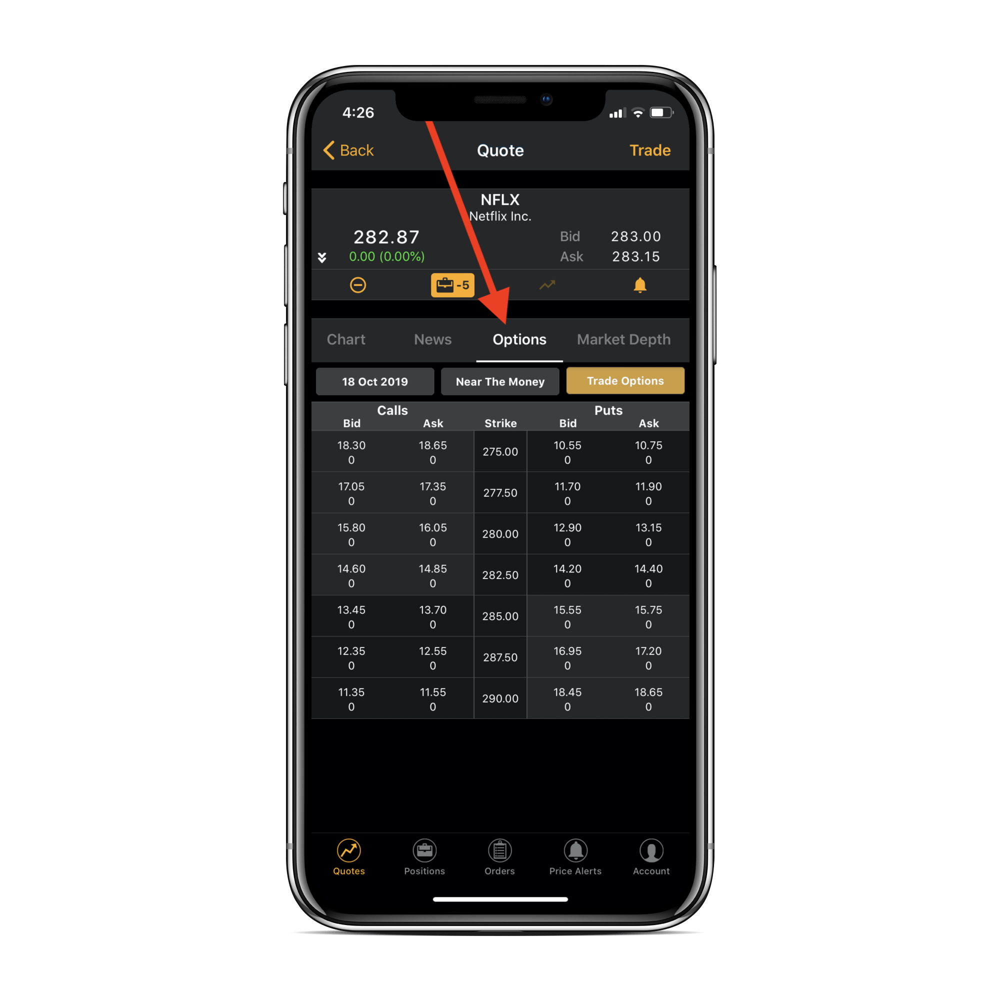
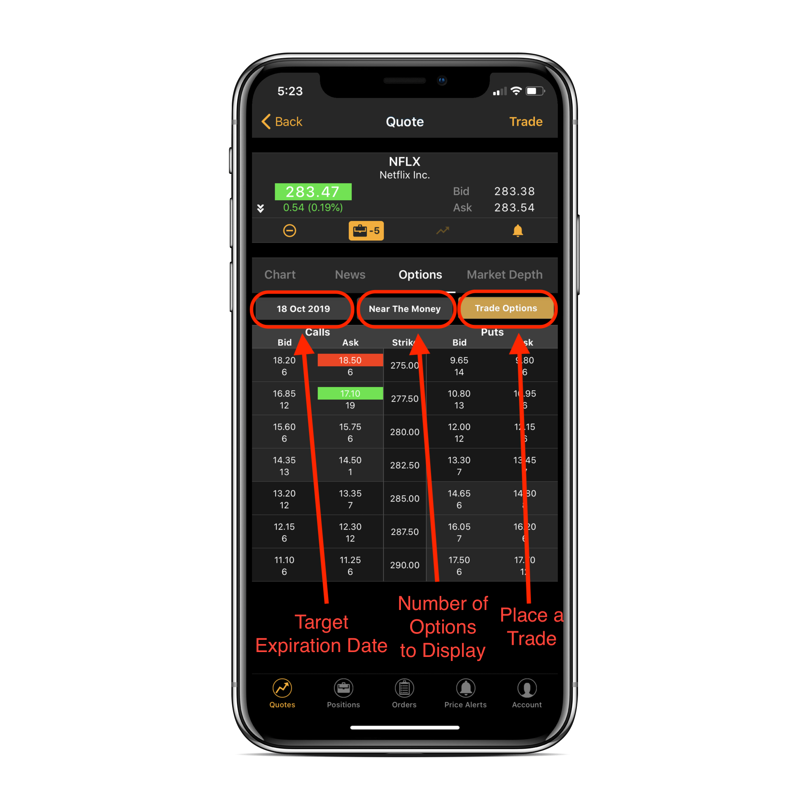
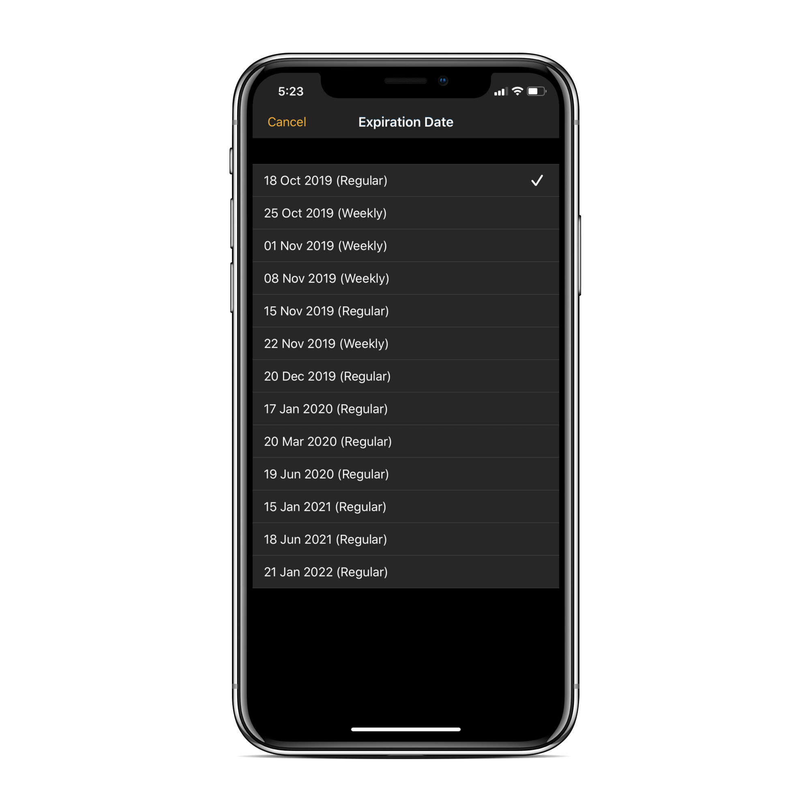
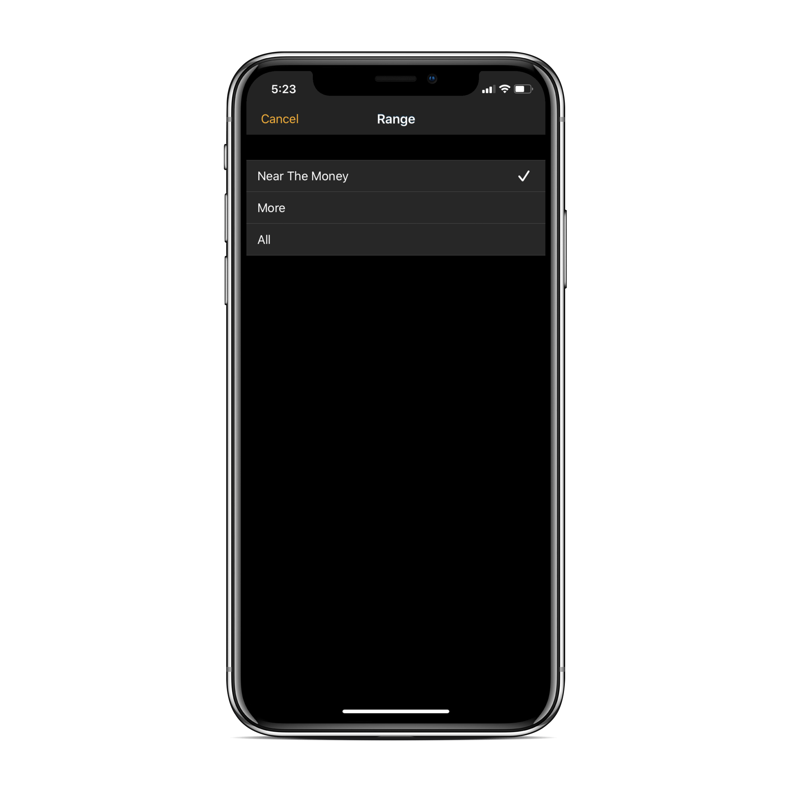
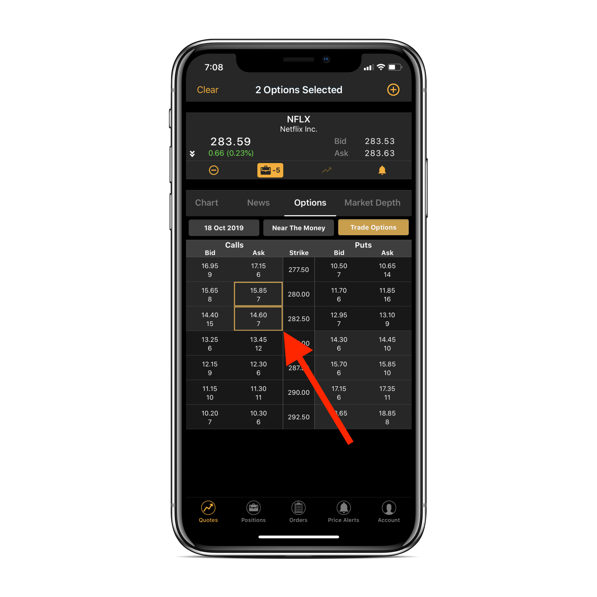
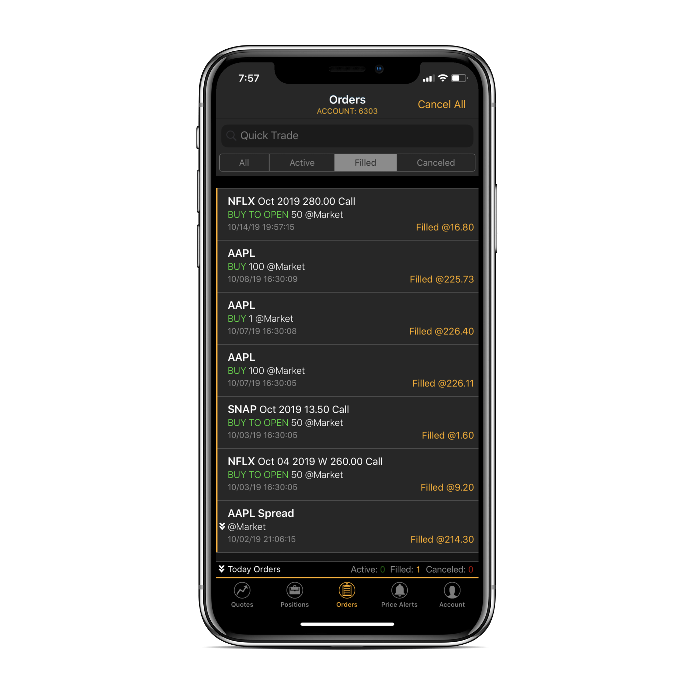
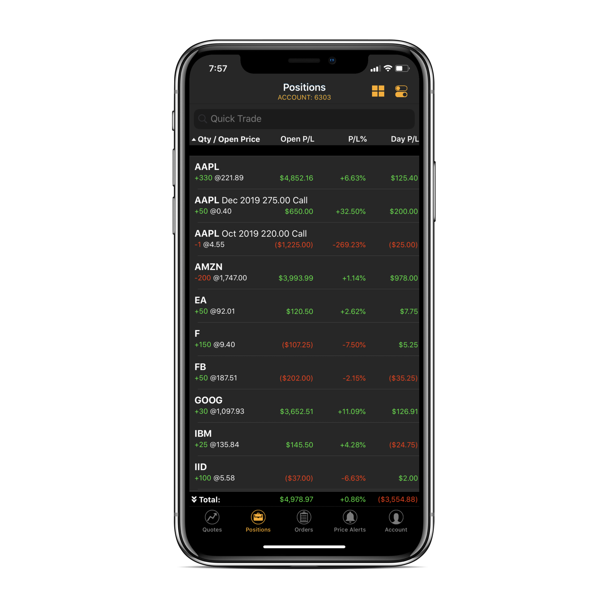

# Options Trading

### Introduction

ETNA Trader provides comprehensive options trading functionality in both its [web terminal](../../../web-terminal/user-widgets/options.md) and the iOS app. This article delves deeper into the iOS app and demonstrates how you can use it to trade options, enter into complex strategies, track and analyze your profit and loss statements, and so forth.

### Trading Options in ETNA Trader for iOS

To trade options in ETNA Trader for iOS, launch the app and navigate to the **Quotes** tab. This tab displays all watchlists of your trading account along with their corresponding securities. Next, select the required watchlist, locate the security on which you're attempting to trade options, and then tap on it.

This will bring up the Quote view that displays all information pertinent to this stock, including the current bid and ask price, chart, news, market dept, and, most importantly, **options**. Tap **Options** and shortly all options on this security will be listed.

#### Filtering Options

At the top of the **Options** sub-tab there are two filters that enables you to sort through the options by expiration date and closeness of the strike price to the current market price of the underlying security.

If you tap on the expiration date button \(leftmost\), this will bring up the view where you can select the required expiration date for options.

It's also possible to determine the number of options that must be displayed by tapping on the button in the middle \(**Near the Money**\). For instance, if you tap **More**, the app will load additional options; and if you tap **All**, the app will fetch all options with the specified underlying security.

Once the options are filtered, proceed to select options that you'd like to trade: you can select either one options or multiple options \(to enter into a complex strategy\). Once you're done, tap **Trade Options**. This will bring up the order confirmation view where you can review the information about the order and finally tap **Verify Order** if everything is properly set.

Once the order is placed and sent to the execution venue, its state can be examined on the **Orders** tab.

Once the order is filled, the newly opened position can be tracked on the **Positions** tab along with other positions in options and other security types. 

