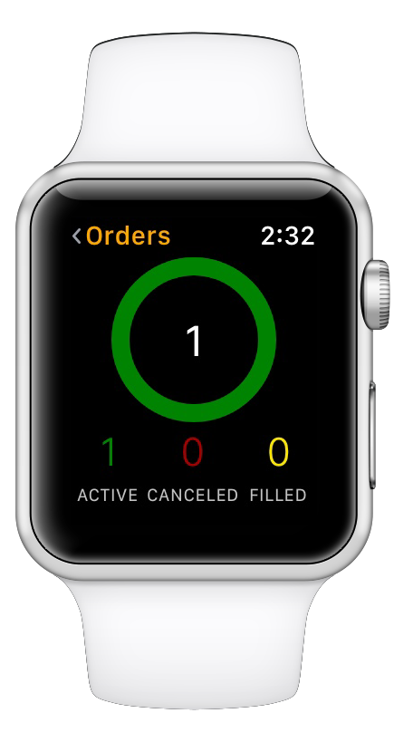
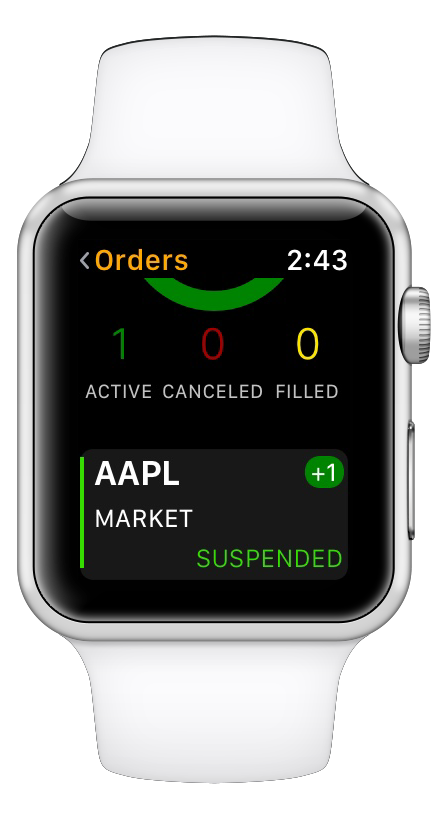

# Stock Trading

### Introduction

To place a new order transacting a stock in ETNA Trader for iOS, tap on any security in the **Quotes** view and then tap the **Trade** button in the top-right corner. This will prompt the trade view where you will proceed to specify the details of the new transaction.

.png>)

### Placing a New Trade

Once you've tapped Trade, you will be prompted with the order configuration view where you can specify the following order parameters:

1. **Side**. This is the side of the trade. The range of possible values includes: **Buy**, **Sell**, **Sell Short**, **Buy to Cover**.
2. **Quantity**. This is the number of stocks to be purchased or sold in the order. For example, if you'd like to purchase 100 shares of  the Apple stock, set the text field to 100.
3. **Type**. This is the type of the order. The range of possible values includes: **Market**, **Limit**, **Stop**, **Stop Limit, TrailingStop, TrailingStopLimit.**
4. **Price**. This is the order's target price. It will vary based on the order type: for limit order this is the limit price, for stop orders this is the stop price, etc.
5. **Duration**. This is the target duration of the order. The range of possible values is as follows: **Day** (cancelled at the end of the trading session if not executed), **GTC **(Good-till-Canceled — the order persists indefinitely until it is executed or manually cancelled).
6. **Session**. This is the target trading session. The range of possible values is as follows: Pre-market, After-market, Market hours + after-market hours, Market hours + pre-market hours, Market hours + after-market hours,  Market hours, All Sessions.
7. **Exchange**. This is the stock exchange where this order should preferably be placed.
8. **All or None**. This option indicates if the order should be filled either entirely in one transaction or not at all.

Once the order is fully configured, tap **Verify Order**. The order will be sent to ETNA's verification service to ensure that the new order complies with different validation rules and is properly configured. Tap** Place**.

Conversely, If the order was deemed to be invalid by some order validator, you will see an error message in the **Status** text box.

After the order has been successfully placed, you can observe the status of the order from the [Order view](../../orders-view.md).

### Orders on the Apple Watch

ETNA Trader for iOS features a companion Apple Watch extension that enables traders to conveniently track the status of their orders right from the wrist.

Scrolling downward will reveal all active, cancelled, and filled orders in detail.

