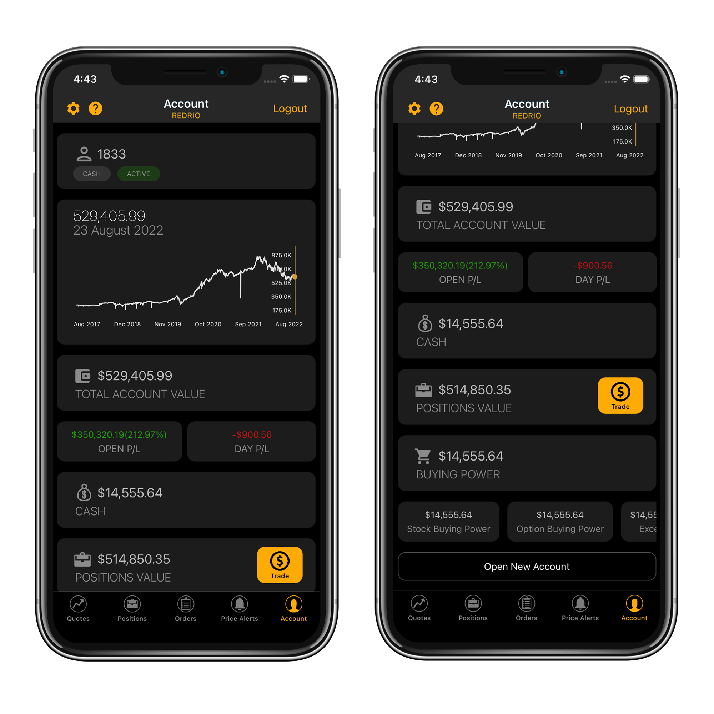
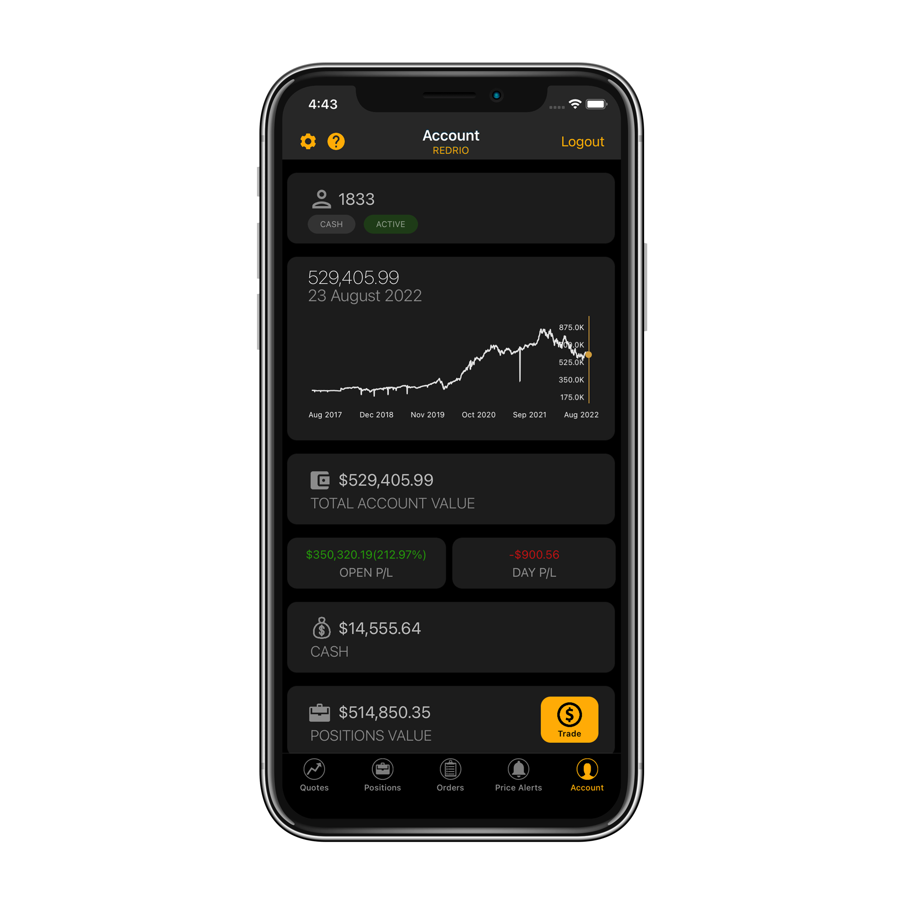
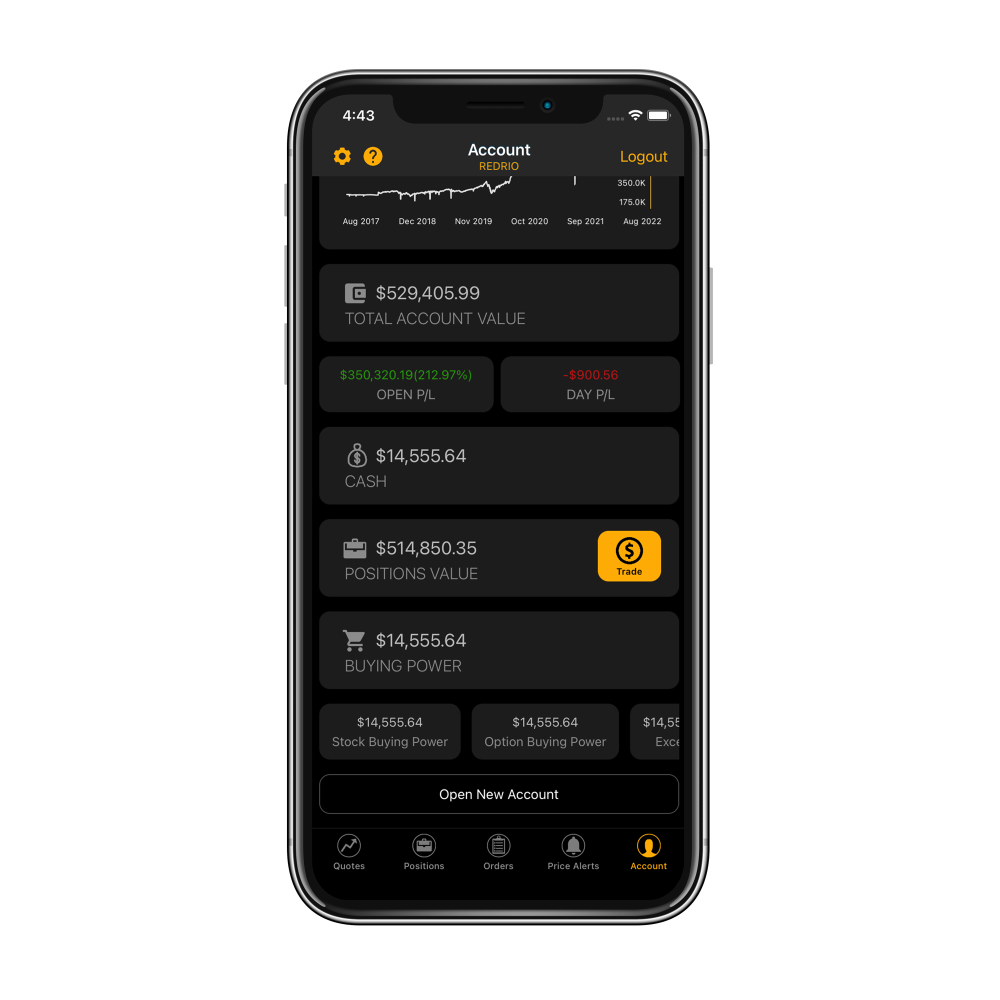

# Account View

### Introduction

The last tab of ETNA Trader Mobile — **Account** — is responsible for displaying comprehensive information about the current trading account as well as enabling you to change the app's settings. Here you can quickly glance at the current market value of the account, track the profit and loss figures, take a closer look at your current buying power, configure notifications, etc.

### Exploring the Account Tab

Once you open the Account tab, the first thing you encounter is the account value chart that displays the current market value of the trading account. Rotating the device will expand the chart to full screen, giving you a more spacious view of the historical value of the trading account.

Here you can inspect the account number, account's market value, current cash value, positions value, open profit/loss and buying power:

The next section covers the Buying Power available on the account, including:

* Maintenance Margin;
* Stock Maintenance Margin;
* Option Maintenance Margin;
* Excess;
* Day Trading Buying Power;
* Stock Buying Power;
* Option Buying Power.


You can learn in-depth about these terms in our dedicated article on [trading accounts](https://brokerhelp.etnatrader.com/administrator-guide/glossary/trading-accounts).


### Configuring Settings

The app's settings can be configured on a dedicated screen by tapping on the little gear icon in the top-right corner.&#x20;

In the appeared pop-up window you can configure the following settings:

* Default Order Settings:
  * Order type (Market, Limit, Stop, etc.);
  * Duration (Day, Good-till-Cancelled, etc);
  * Order route (the preferred execution venue);
  * All or None (whether or not the order should be executed in one transaction).
* Default Order Quantity:
  * Stocks (default number of stocks);
  * Options (default number of options);
  * Spreads (default number of spreads);
* Strike Range (for options):
  * Near The Money (upper and bottom limits in dollars);
  * Similar to **Near the Money** but with higher upper limits and lower bottom limits.

Scrolling downward, you can configure notifications settings. Use these toggles to enable different types of notifications for different types of transactions:

* Native notifications;
* SMS notifications;
* Email notifications.

The last three options enable you configure the login mode, toggle various themes, and select the quote flashing mode.&#x20;
