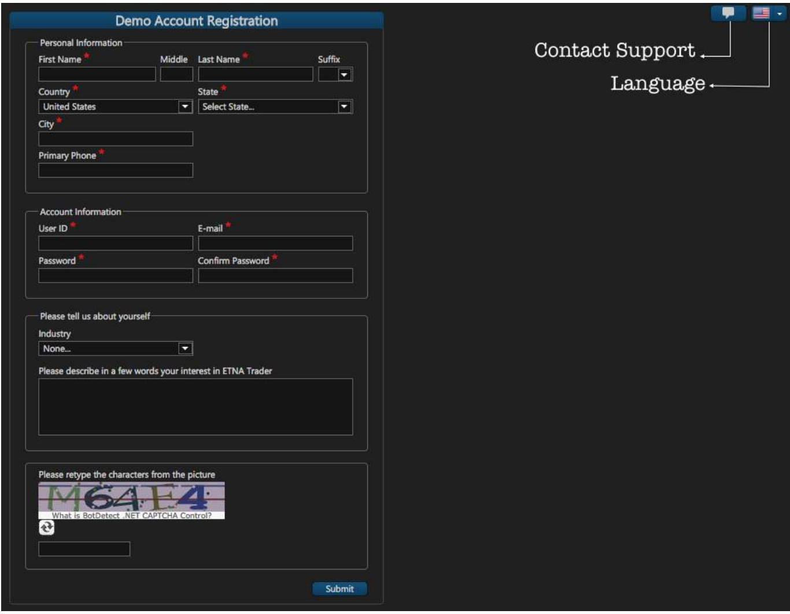
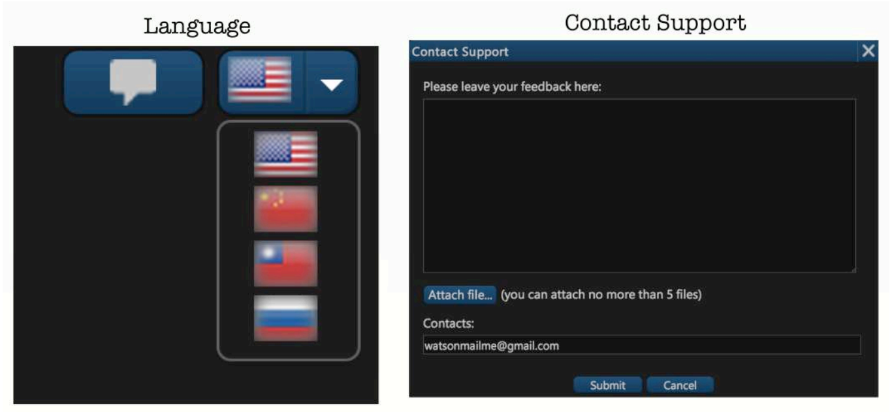

# Getting Started

### Platform Navigation

#### Demo Subscription 

* **Demo Account Registration.** The first step to create a demo account is to fill and complete the Demo Account Registration form. If you have already created a demo account, you can just log in to the platform by entering your username and password. 
* **Contact Support**: If you have queries about the signup or you would like to send your feedback about the platform, you can do so by simply clicking on contact support located in the upper right side. You can also use Contact Support anytime while using the platform in case you have any question you might not find in this user guide. ETNA Trader Contact Support allows you to give us your feedback wordily and visually, through attaching up to 5 files to support your message and make sure that the end user and ETNA's team are at the same page and visually seeing the same point.
* **Language**: ETNA Trader provides users with multilingual support. You can change languages of your ETNA Trader terminal and the changes will take effect right away, without the need to restart the program again. ETNA Trader showcases four languages in the demo, but we can always integrate more languages to the platform based on the user's desired language he wants to be integrated in ETNA Trader's terminal.

### Getting Started

Once you complete and submit all the information in the account registration window, a message will pop up confirming the successful completion of your registration along with a brief note of the demo's account offers.

