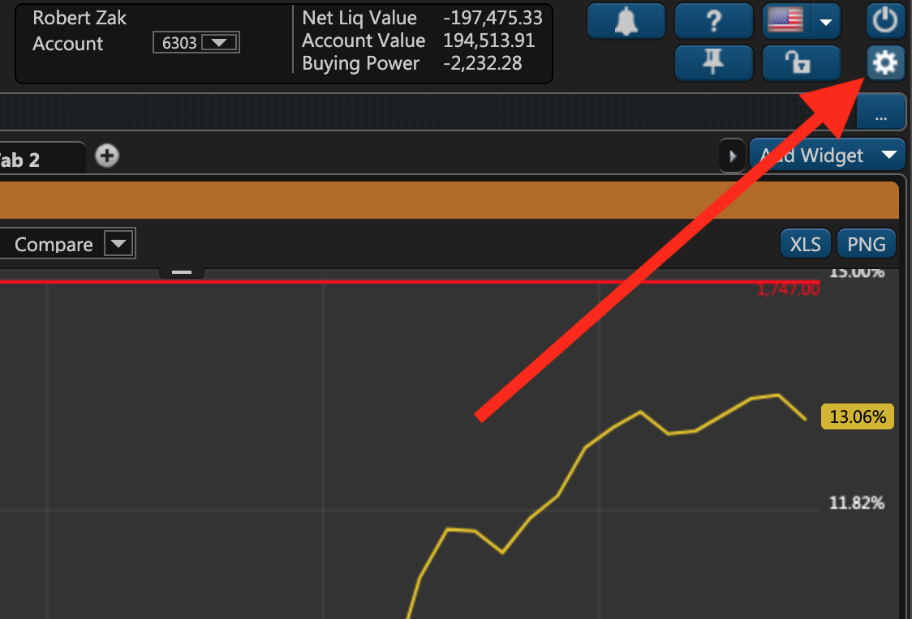
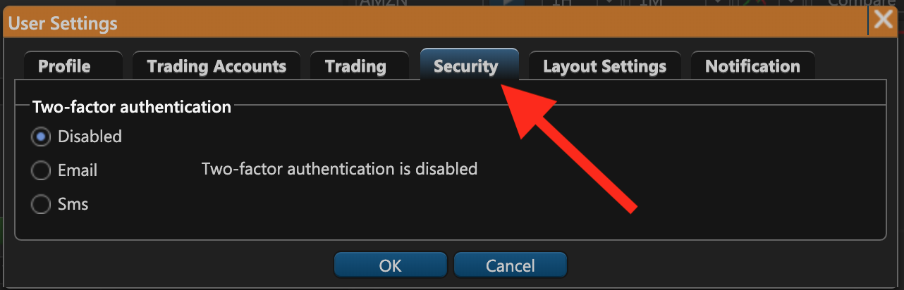
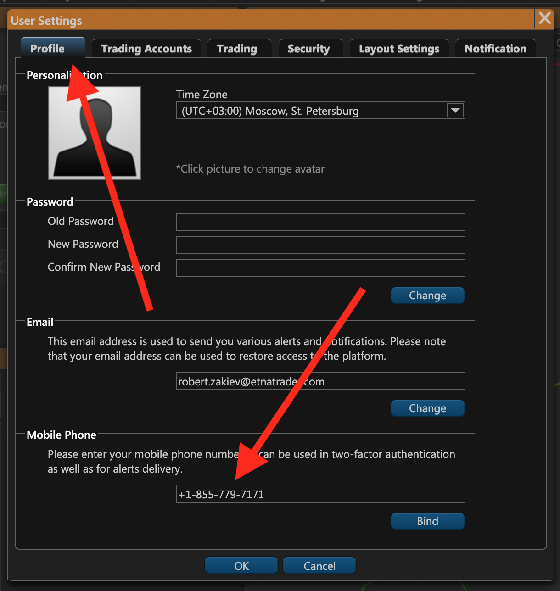
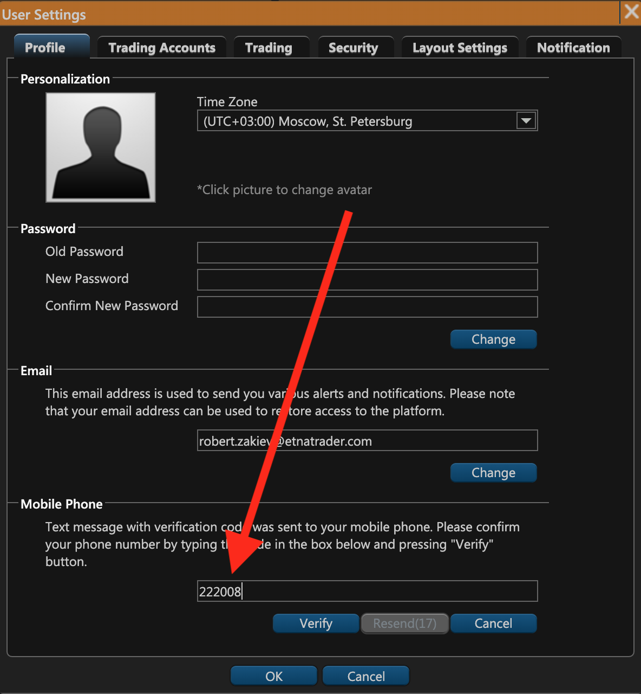
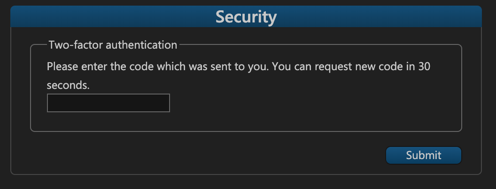
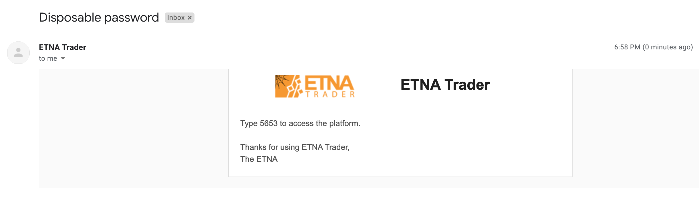

# How to Enable Two-Factor Authentication

### Introduction

Two-factor authentication \(2-FA\) is essential for ensuring safety and inviolability of your trading account in ETNA Trader. Although ETNA Trader does enable brokers to define password requirements and expiration dates, it's recommended that traders protect their accounts with 2-FA to ensure maximum security for their financial assets. With 2-FA enabled, the probability of an intruder seizing control of your account decreases dramatically. 

For traders' convenience, ETNA Trader can send confirmation codes either by SMS or by Email.

### Enabling 2-FA in ETNA Trader

To enable two-factor authentication, open ETNA Trader's web terminal, log in, and then click on the little gear icon in the top-right corner.

Navigate to the **Security** tab and select the required verification code delivery method: **Email** or **SMS**.

If you select **Email**, the verification code will be sent to the email address specified during sign-up. 

Alternatively, if you select **SMS**, the verification code will be sent to your phone number. In this case you'll also have to specify the number of the **Profile** tab:

And to verify that you are in fact the owner of this number, a verification code will be sent to your number. Enter the code and this phone number will successfully be bound to your account.

Once you're done configuring 2-FA, click **OK**, and from now whenever you attempt to log into ETNA Trader, you will have to specify the verification code sent to you by the selected delivery method.

### Entering the Verification Code

With 2-FA enabled, logging into ETNA Trader will require you to specify the verification code in addition to the password.

Depending on your preferred delivery method, the code will be sent either by SMS:

Or by email:

Once the authentication code is entered — if it's correct — you will successfully be re-directed to ETNA Trader's web terminal.

