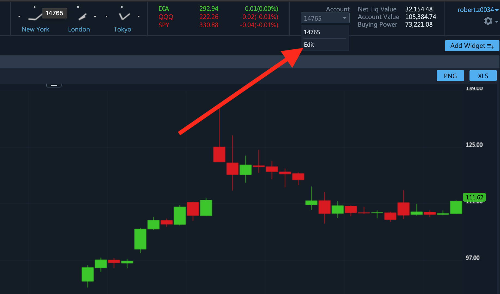
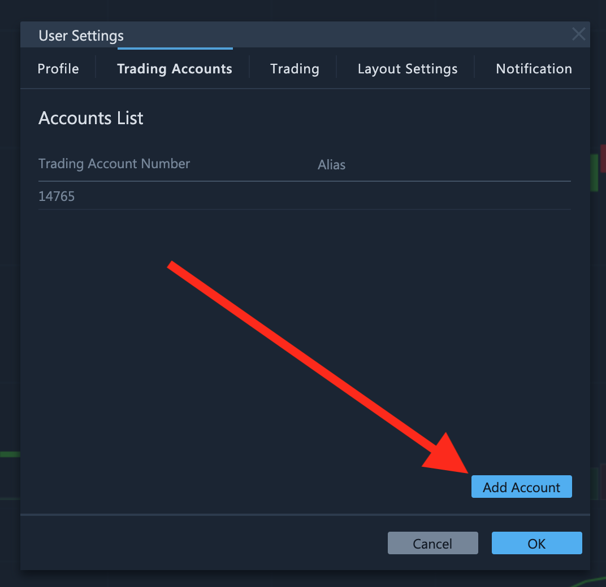
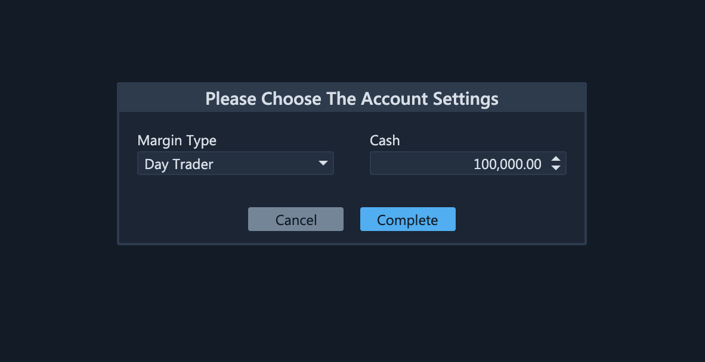
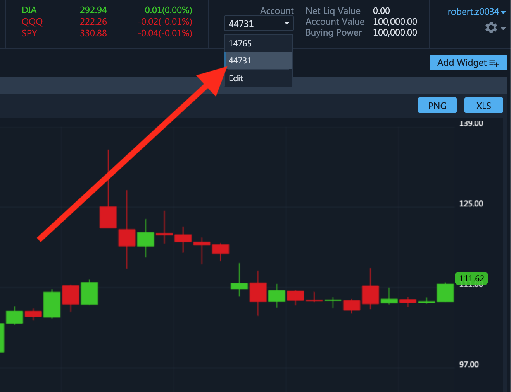
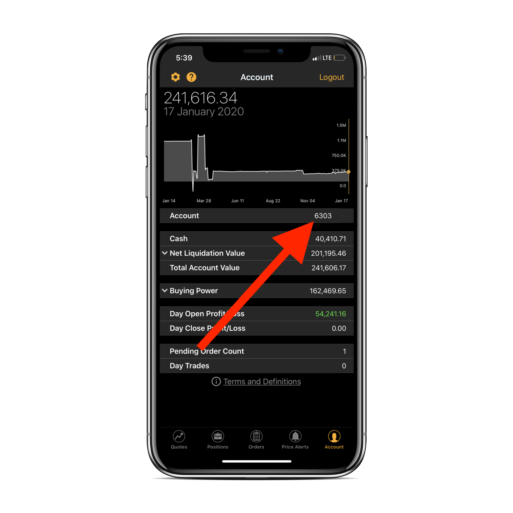
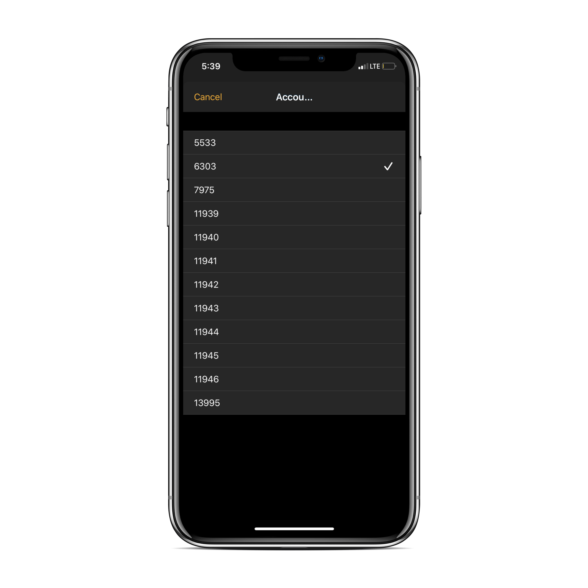

# How to Create a New Trading Account

### Introduction

From time to time traders need to create a new trading account to test a new strategy or reset their current trading account. A new trading account will have an initial deposit, no orders and no positions, thereby enabling the trader to start anew.


ETNA Trader enables traders to own several trading accounts.


### Creating a New Trading Account

To create a new trading account, navigate to ETNA Trader's web terminal. In the header, expand the drop-down menu containing the list of your trading accounts and click **Edit**.

In the appeared pop-up window, open the Trading Accounts sub-tab and then click **Add Account**. 

This will take you to a new tab where you can configure the new trading account. Select the required account type \(Margin, Cash, or Day Trader\), specify the initial deposit and then click **Complete**.

Next, go back to the web terminal and select the newly created trading account in the same drop-down menu. 

Now you can proceed to use the new trading account to open new positions, deposit and withdraw funds, etc.

### Switching the Account in Mobile Apps

After switching trading accounts in the web terminal, perform the same operation in the mobile app. Go the **Account** tab and then tap on the number of the current trading account.

Identify the new trading account and then tap on it.

