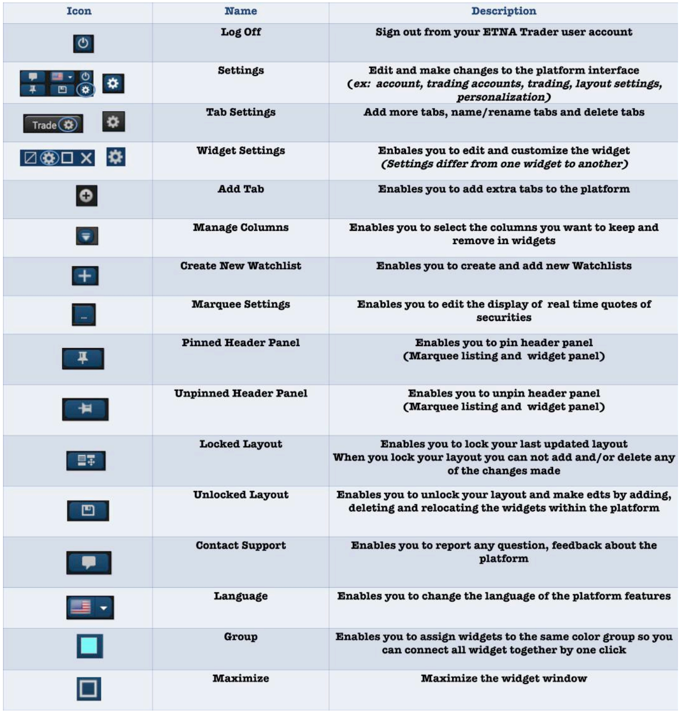
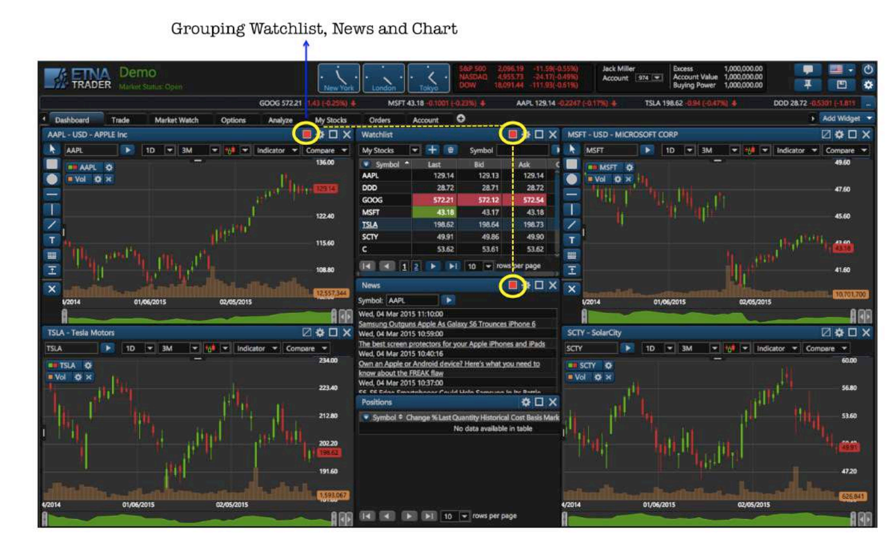

# Platform Layout

### Getting Started with the UI

ETNA Trader is loaded with icons and symbols that when clicked on, they give you the chance to customize and personalize the interface of the platform as if it's created to meet your specific needs and preferences. So, before we dive into the platform, we would like to give you a quick rundown of each icon, what they are and why they exist. Check this partial cheat sheet.

### Dashboard

ETNA Trader has an easy-to-navigate dashboard. Users can group Watchlist with News feed and chart. Connecting the three widgets together allows users to check the latest news and chart of the security automatically once the symbol is typed.

### Account Page

Account page contains the name and account number\(s\) of the user. In the account information, you will see that you have access to 1M in virtual currency to test your trading skills with, as you see in the graphic below. There are different types of other widget tabs such Trade, Market watch, analyze and more. 

You can also delete tabs of widgets you don't currently need to use for your trades. 

You can add more tabs by clicking the plus \(+\) symbol, rename it and reorganize the order of your tabs by dragging them either forward or backward. 

By clicking on The Header Panel tab you can either pin or unpin the Marquee Settings bar and the Widget bar.

### User Settings

User settings enable you to customize your layout, update the time zone, personal information, trading options as well as add your own picture. User settings contains four parts: Account, Trading, Layout Settings, and Personalization.

#### Account Tab

#### Trading Tab

#### Layout Settings

### Marquee Settings

ETNA Trader's Marquee streams security information in the most flexible real-time quote displays. With ETNA Trader's Marquee, you can combine real-time data of securities in a variety of customizable displays. The content of Marquee can be customized in three different models:

1. **Positions**. Marquee that shows updated quotes of all the symbols you traded and opened positions in.
2. **Watchlist**. Marquee that shows updated quotes of the three different types of securities: Stocks, Forex or Indices.
3. **Custom**. Customize marquee that shows updated quotes of your specifically preferred symbols.

### Tabs

ETNA Trader's interface is designed to make it easy for users to find features, place and organize widgets as they want. Each tab is customizable and can contain any component the user chooses from our widget list. By scrolling the drop-down menu of "Add Widget", click on the picked widget and it will be automatically added to the tab menu. You can also create and add extra tabs and label them to break down your trading tasks into simple actions.

### Group Settings

ETNA Trader allows you to group your watchlist with other widgets, such as news, charts, stock info and more. When all widgets are grouped together by the same tag color, that would make your terminal more efficient and practical for trading. You can just click on the ticker symbol of the company in your watchlist to view real-time chart, news, stock info and more about the company, all with one tap.

