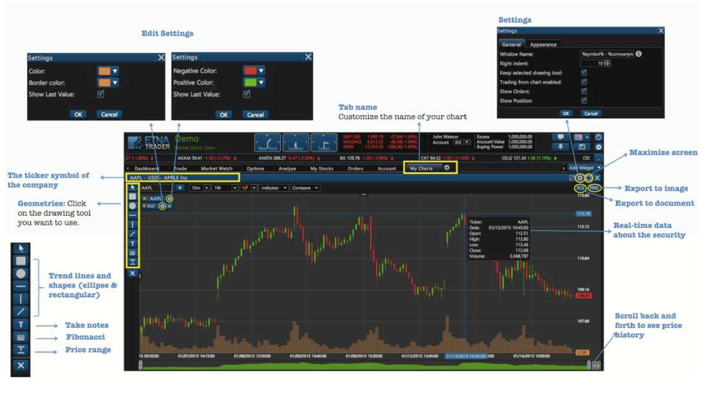
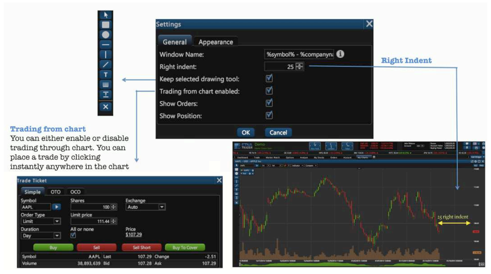
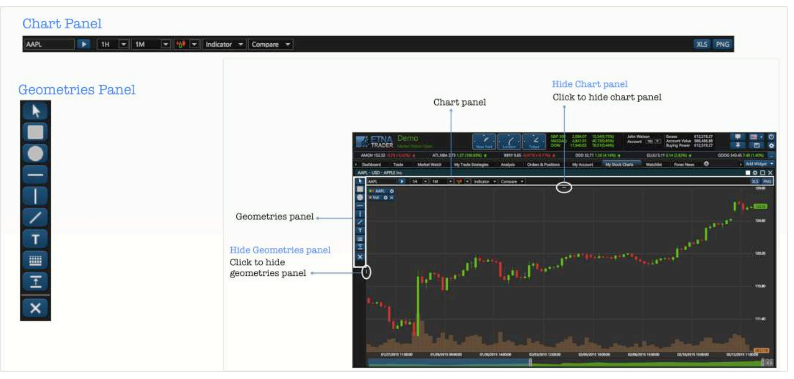
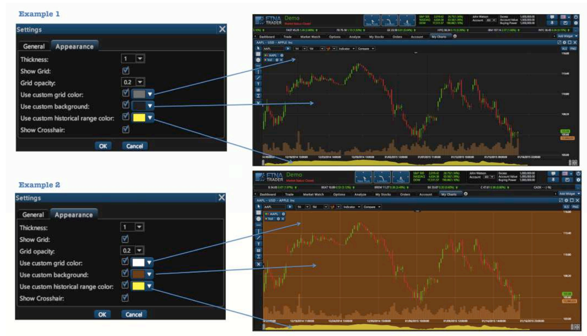
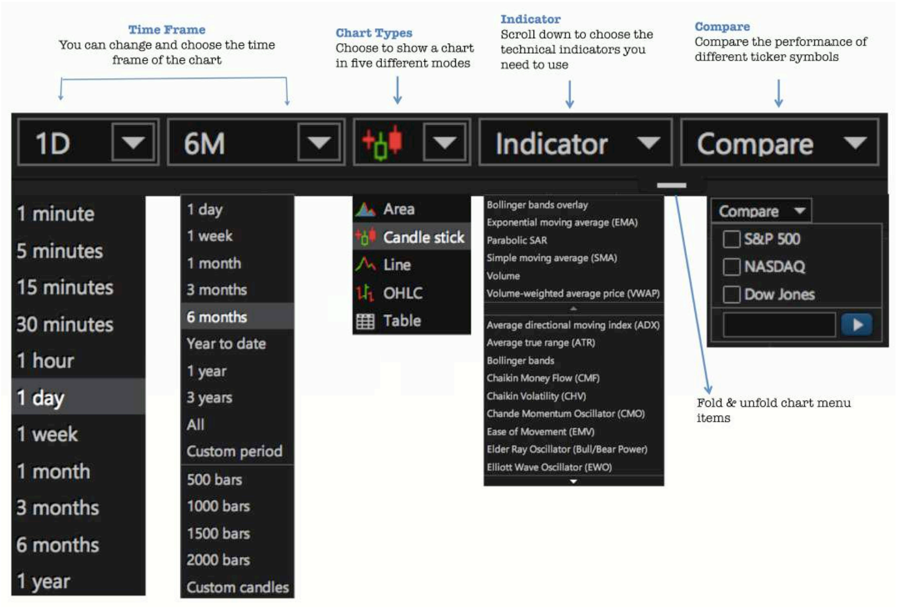
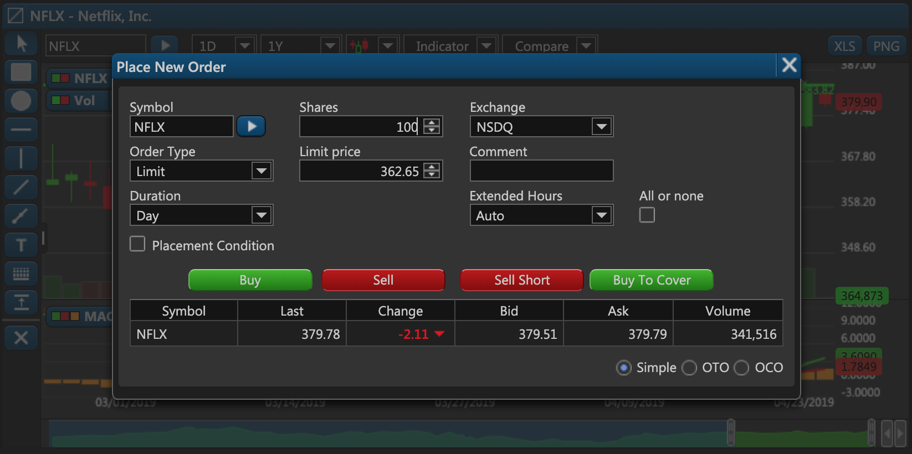

# Chart

### Exploring the Chart Widget

In order to view the market from nearly every conceivable angle, ETNA Trader offers different chart types that stream up-to-date data. From candlesticks to bar, every chart type updates data automatically as it unfolds. 

You can also choose to show a chart in four different modes:

* Line;
* Bar;
* Candle Sticks;
* OHLC \(Open-High-Low-Close\).

The drawing tools menu allows the user to select from a number of different drawing tools. Drawing tools overlap the price data and can be used to mark-up the charting area. Drawing tools include Fibonacci, trend lines, support or resistance \(price range\) and text notes.

### Chart Geometric Panels

Users have the option to hide and unhide both chart and geometries panels as it shows in the following posts:

### Chart Customization

The charting menu bar shows different options that can be expanded and used to select the time frame, chart type, technical indicators, apply comparisons to other securities, and draw different trend lines and shapes. The chart also provides access to many other features and settings, including being able to trade from the charts, change the style/ appearance of chart and the time frame as well as add technical analysis tools.

### Trade Shortcut in Charts

In ETNA Trader, the Chart widgets provides a quick shortcut to place a new order. When viewing a chart for the desired security, simply double-click on a particular candle and the order placement window will pop up.

On this widget you can specify the required type of the order, the limit price, and then click Buy/Sell/Sell Short/Buy To Cover.

