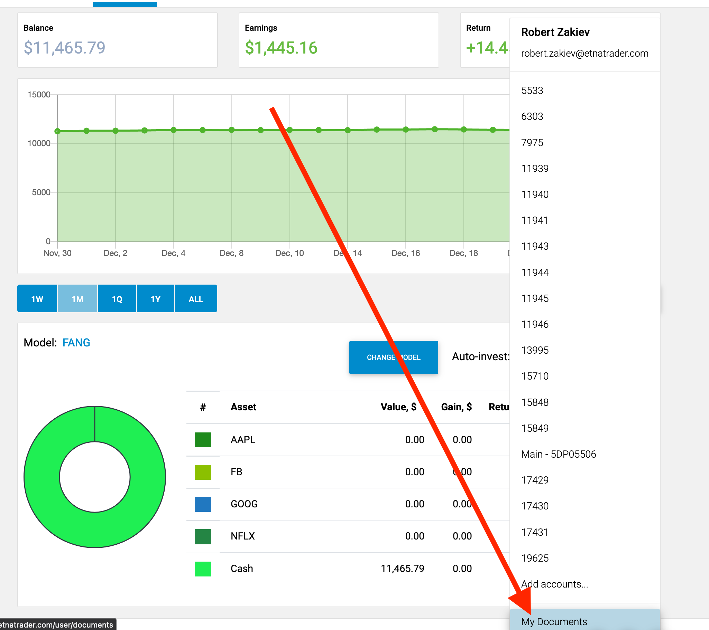
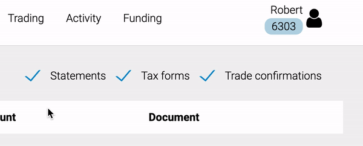

# Document Retrieval

### Introduction

ETNA Trader provides a special UI for retrieving traders' personal documents like account statements, tax forms, and trade confirmations. This UI is available only through the [Digital Advisor](../digital-advisor/), so traders will have to use that platform to retrieve the documents \(their credentials from the professional web terminal will work there\). To navigate to the documents page, open the Digital Advisor, click on the username in the top-right corner, and, in the appeared drop-down menu, click **My Documents**.

### Accessing Documents

The documents pages contains three columns: 

1. **Date**. This is the date on which the document was generated.
2. **Account**. This is the ID of the trading account at the clearing firm.
3. **Document**. This is a clickable link to the document itself.

Furthermore, there are three filters at the top of the page that facilitate the search for specific document types:

