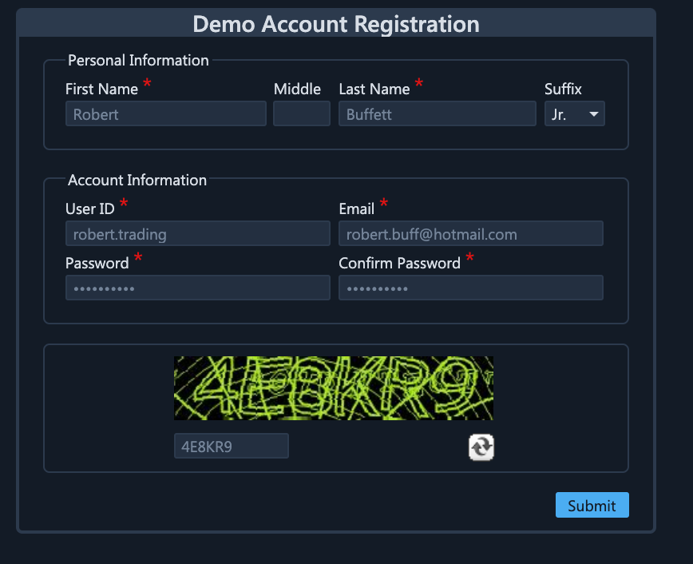
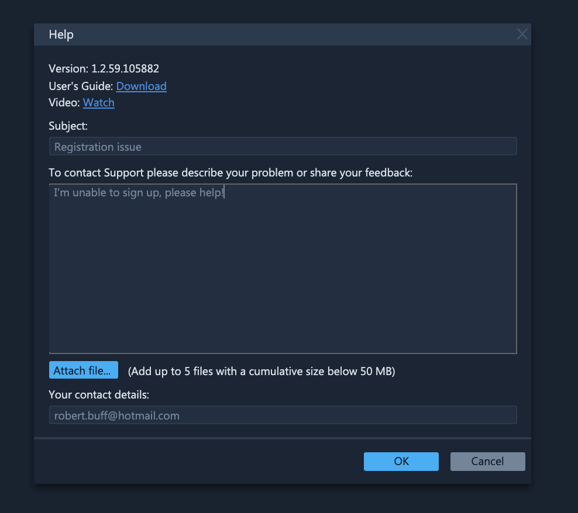
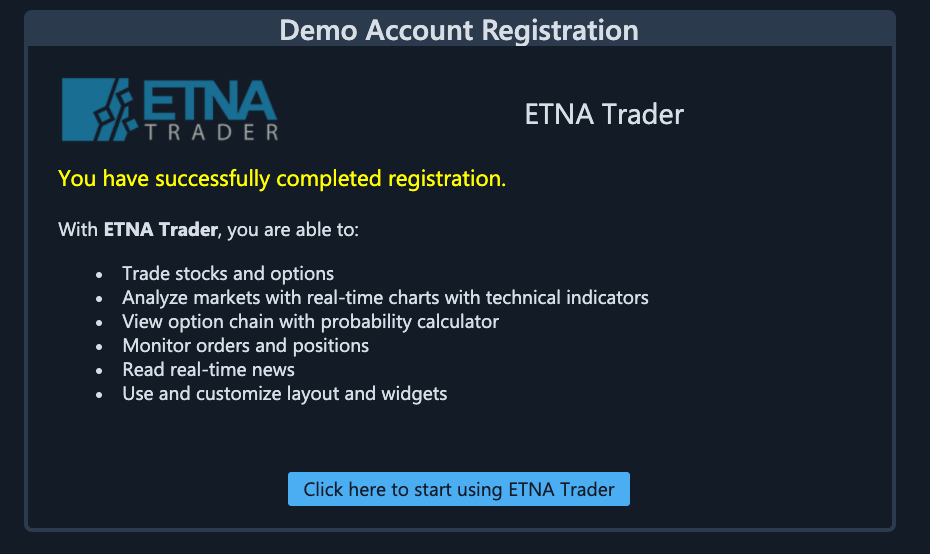

# Getting Started

### Registration Form

The first step in getting started with ETNA Trader is to register as as new user. In order to do that, quickly fill out out the following online form:


Parameters marked by a red asterisk are mandatory. Registration form will not be completed without them.


The [demo environment](http://demo.etnatrader.com/User/LogOn?ReturnUrl=%2f) offers simulated trading functionality that entirely replicates real trading, except that no real funds are being risked. If you already created a demo account, just log into the platform by entering your username and password.

### **Contact Support**

If you have any questions or feedback about the platform, please click  **contact support** located in the top right corner. 

When using "Contact Support"  form please describe your question in as many details as possible and/or attach up to 5 files to illustrate your question.  

### **Language Settings**

ETNA Trader provides users with multilingual support. Pick a language of your preference and changes will take effect right away, without the need to refresh the page. 

Currently there are five languages available in the platform:

1. English
2. Japanese
3. Chinese Manadarin
4. Chinese Cantonese
5. Spanish \(mobile only\)
6. Russian

It is possible to add additional languages. If you are interested in adding a new language, please [contact support](https://www.etnasoft.com/contact-support/).

### Registration Confirmation

Once you complete and submit your online registration form, you will receive an email message confirming the successful completion of your registration. This note will also contain links to Tech Support and other useful information. Please save this message as you may want to use this information later. 

Press  "**Click here to start using ETNA Trader** " and you will be re-directed to the web trader dashboard.

