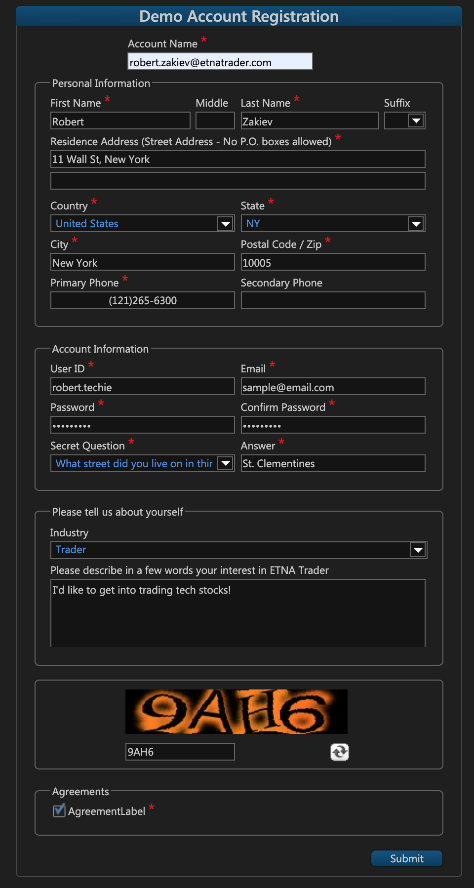
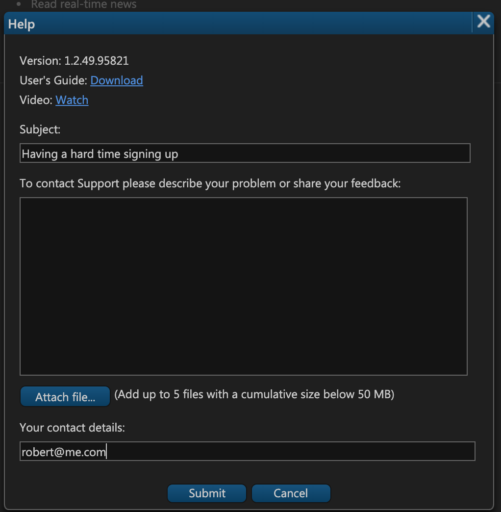
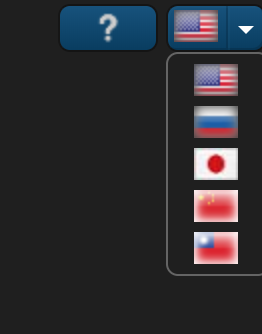
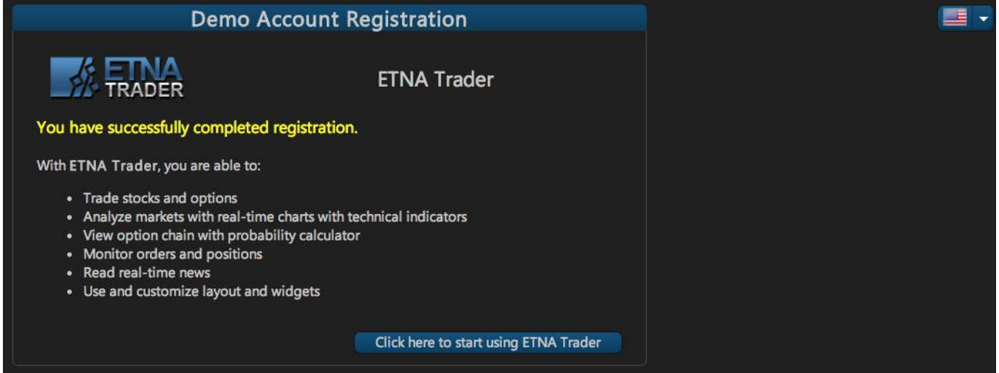

# Getting Started

### Introduction

The first step in getting started with ETNA Trader is to sign up for the platform. Our demo environment offers full-fledged paper trading functionality that entirely replicates real trading, except that no real funds are being risked. If you have already created a demo account, you can just log in to the platform by entering your username and password.


Parameters marked by a red asterisk are mandatory and without them registration will not be completed.


### **Contacting ETNA's Support Team**

If you have queries about the signup or you would like to send your feedback about the platform, you can do so by simply clicking on contact support located in the top-right corner. You can also use this feature anytime while using the platform in case you have a question about the platform. ETNA Trader Contact Support allows you to give us your feedback wordily and visually, through attaching up to 5 files to support your message and make sure that the end user and ETNA's team are at the same page and visually seeing the same point.

**Language**: ETNA Trader provides users with multilingual support. You can change languages of your ETNA Trader terminal and the changes will take effect right away, without the need to reload the page. ETNA Trader showcases five languages in the demo environment, but we can always integrate more languages into the platform at the request of the users.

### Finishing Up

Once you complete and submit all the information in the account registration window, a message will pop up confirming the successful completion of your registration along with a brief note of the demo's feature set. 

Click on **Click here to start using ETNA Trader** and you will be re-directed straight to the trading terminal.

