# Platform Layout

### How to set up a layout?

ETNA Trader features  a customizable widget-based user interface. Personalize trading dashboards to meet you trading style. Here is a quick rundown of icons and settings used in the platform with their meanings and purpose. 

<table>
  <thead>
    <tr>
      <th style="text-align:center">Icon</th>
      <th style="text-align:center">Name</th>
      <th style="text-align:center">Description</th>
    </tr>
  </thead>
  <tbody>
    <tr>
      <td style="text-align:center">
        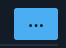
      </td>
      <td style="text-align:center">Marquee Settings</td>
      <td style="text-align:center">Configure marquee settings for different data sets.</td>
    </tr>
    <tr>
      <td style="text-align:center">
        
      </td>
      <td style="text-align:center">Settings</td>
      <td style="text-align:center">Configure global settings, changes the language, lock the layout, contact
        the support team.</td>
    </tr>
    <tr>
      <td style="text-align:center">
        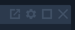
      </td>
      <td style="text-align:center">Widget Settings</td>
      <td style="text-align:center">Enables you to edit and customize the widget, including isolating widgets
        in separate windows and maximizing the size of widgets.</td>
    </tr>
    <tr>
      <td style="text-align:center">
        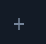
      </td>
      <td style="text-align:center">Add a Tab</td>
      <td style="text-align:center">Enables you to add an extra tab to the layout.</td>
    </tr>
    <tr>
      <td style="text-align:center">
        

        

          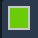
        

      </td>
      <td style="text-align:center">Group</td>
      <td style="text-align:center">Enables you to group widgets by color and thereby synchronize data among
        them.</td>
    </tr>
    <tr>
      <td style="text-align:center">
        

        

          
        

      </td>
      <td style="text-align:center">Widget Modification</td>
      <td style="text-align:center">Rename or remove the target watchlist or add a new one.</td>
    </tr>
  </tbody>
</table>### Trading Dashboard

Web Trader Platform features rich functionality, yet easy-to-navigate user interface. Users can group  widgets by color; for example, the **Watchlist** widget can be linked with the **News**, and the **Chart** widget. Connecting the three widgets together allows users to check the latest news and the chart of the selected security automatically once the symbol is typed.

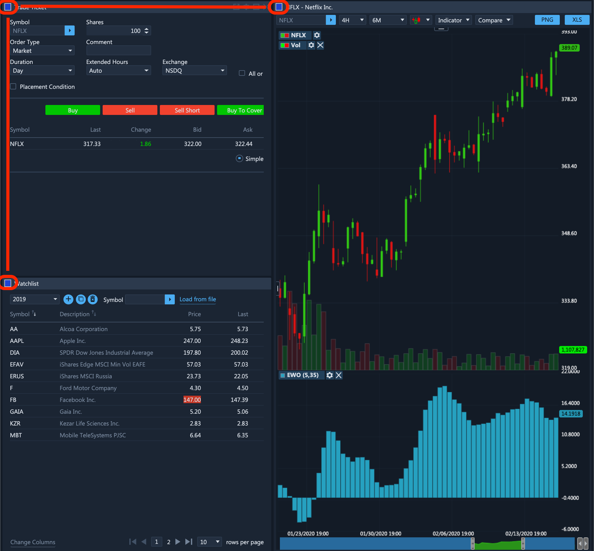

### Account Page

The **Account** tab contains the name and account number\(s\) of the user. In the account information, you will see that you have access to $1 million in virtual currency to test your trading skills with — as you see in the graphic below. There are different types of other tabs like **Trade**, **Market** **watch**, **Analyze**, and more. It's also possible to delete tabs you don't currently need to use for your trades.

You can add more tabs by clicking on the plus \(+\) symbol, rename them, and also reorganize the tab order by dragging them either forward or backward.

By clicking on The Header Panel tab you can either pin or unpin the Marquee Settings bar and the Widget bar.

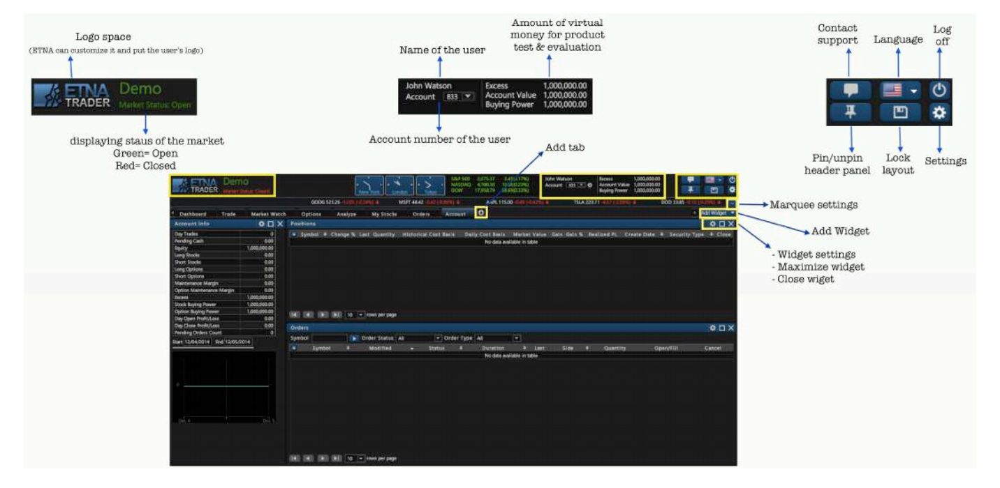

### User Settings

User settings enable you to customize your layout, update the time zone, personal information, trading options as well as add your own picture. User settings are split into four tabs: Account, Trading Accounts, Trading, Security, Layout Settings, and Personalization.

#### Account Tab

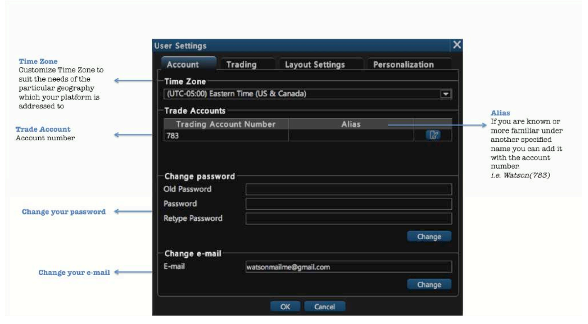

#### Trading Tab

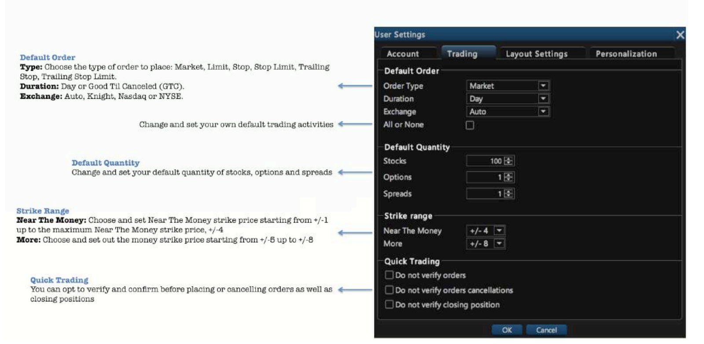

#### Layout Settings

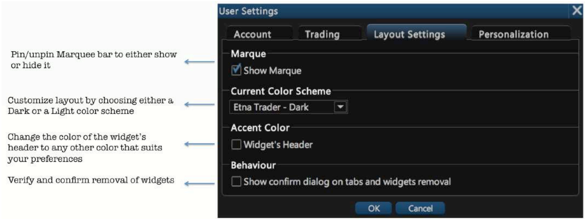

### Marquee Settings

ETNA Trader's Marquee streams security information in the most flexible real-time quote displays. With ETNA Trader's Marquee, you can combine real-time data of securities in a variety of customizable displays. The content of Marquee can be customized in three different models:

1. **Positions**. Marquee that shows updated quotes of all the symbols you traded and opened positions in.
2. **Watchlist**. Marquee that shows updated quotes of the three different types of securities: Stocks, Forex, or Indices.
3. **Custom**. Customize marquee that shows updated quotes of your specifically preferred symbols.

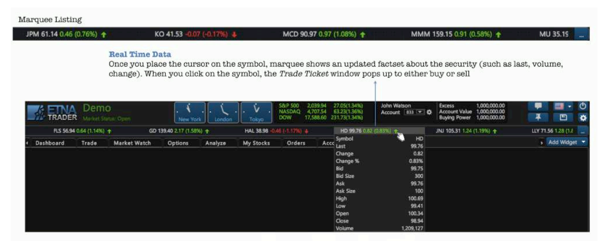

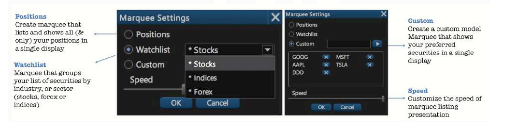

### Tabs

ETNA Trader's interface is designed to make it easy for users to find features, place and organize widgets as they want. Each tab is customizable and can contain any component the user chooses from our widget list. By scrolling the drop-down menu of "Add Widget", click on the picked widget and it will be automatically added to the tab menu. You can also create and add extra tabs and label them to break down your trading tasks into simple actions.

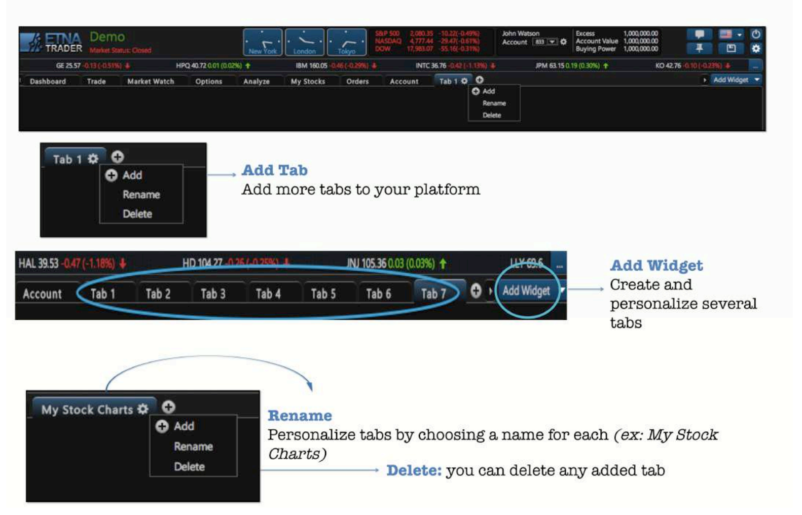

### Group Settings

ETNA Trader allows you to group your watchlists with other widgets like **News**, **Chart**, **Security Info** and more. When all widgets are grouped together by the same tag color, that would make your terminal more efficient and practical for trading. You can just click on the ticker symbol of the company in your watchlist to view real-time chart, news, stock info and more about the selected company, all with one tap.

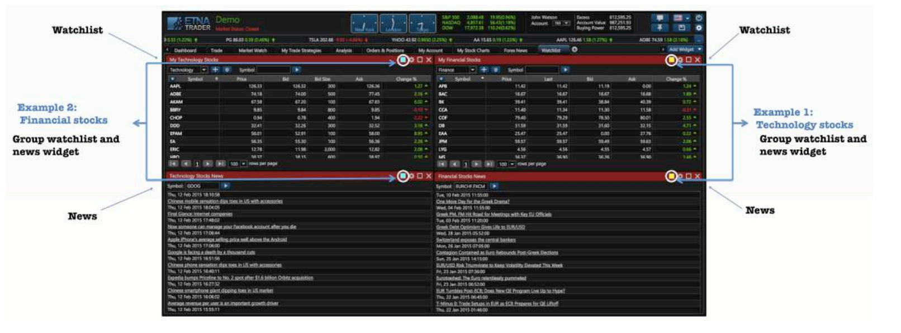

