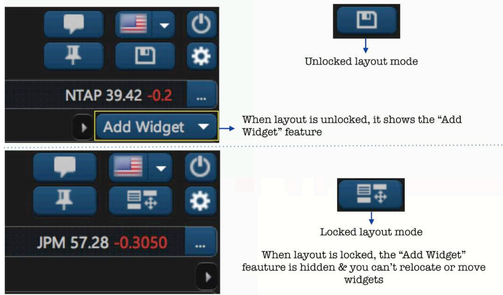
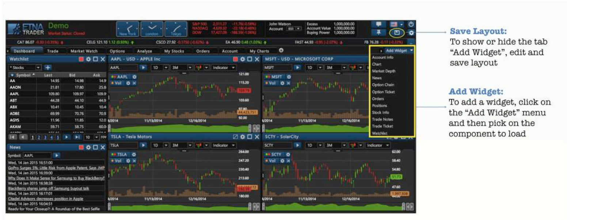

# User Widgets

### Introduction

ETNA Trader comes with a variety of widgets that you can use to get the most productive trading experience. The purpose of the **Add Widget** tab is to ensure that there is a UI element through which you can always have easy access to all trading tools. ETNA Trader's widgets appear on the right-hand side of the platform and are always there no matter what tab is currently opened. If you don’t want them taking up space, you can always collapse them by clicking **Save Layout**.

