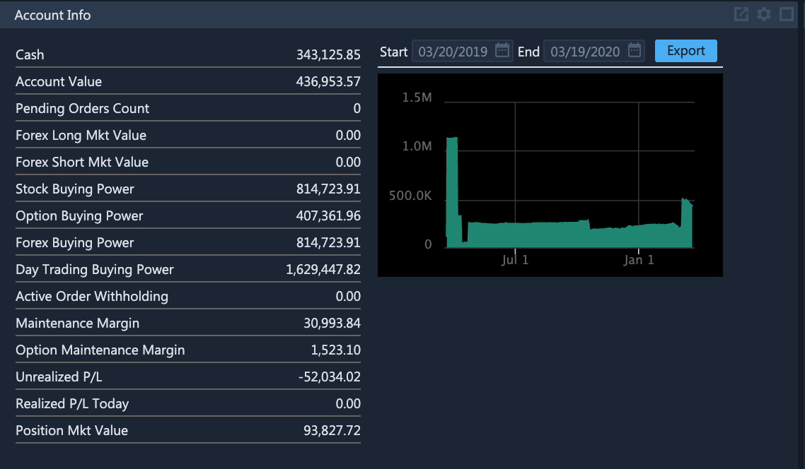

# Account Information

### Account information

ETNA Trader's account information is designed to display the user's real-time information on all trading activities, account value, buying power as well as a set of other parameters. It also displays various information about the total profit or loss on the account. To view this information, add the **Account Info** widget to your dashboard.

### Account Value Chart

The chart on the right displays the trading account's value for a certain period. Specify the starting date, the end date, and the account value for the period will be graphed. To export the chart data in the Excel \(.xlsx\) format, click **Export**.

### Cash

Cash indicates the amount of funds that the account's user has deposited themselves or borrowed from the broker. You can think of it as the net balance of the account: if equity exceeds liabilities — Cash is positive; if equity is lower than liabilities — Cash is negative.

For example, if you crate a new trading account, its Cash parameter is initially equal to $0. After every deposit, Cash increases by the deposited amount — if you deposit $100, it'll increase from $0 to $100.

Now let's investigate how opening new positions affects Cash. Suppose your Cash is equal to $200 and you want to purchase $800 worth of Apple stock \($200 is your own money and the remaining $600 are margin debt\). The applicable commission for this transaction is $3.75 and it has to be included in the order cost — so you'll only be able to purchase $796.25 worth of stocks while the remaining $3.75 will be charged for the commission. In total, your Cash will be decreased by $800 and will be equal to —$600. In addition to negative Cash, your account will also have $796.25 worth of Apple stock.


Cash is a base parameter that is retrieved daily from the clearing firm. Throughout the trading session it is dynamically re-calculated whenever a new transaction is made.


### Account Value

Account value represents the sum of the available Cash and the aggregate market value of all long and short positions.

$$
AccountValue = Cash + Market Value
$$

### Pending Order Count

Pending Order Count indicates the number of current outstanding orders \(the ones that are yet to be executed\).

### Stock Buying Power

This is the gross number of stocks that can be purchased on this trading account, adjusted for the available margin debt.

$$
StockBuyingPower = Excess / MarginRate
$$

### Option Buying Power

This is the gross number of options that can be purchased on this trading account.

$$
OptionBuyingPower = Excess
$$

### Day Trading Buying Power

Day trading buying power is a critical indicator that represents the amount of funds that the user can spend to open new positions. At the beginning of every trading session, this value is retrieved from the clearing firm. Throughout the trading session, Day Trading Buying Power fluctuates based on the performed trades — it decreases with each new long position and it increases with each position closing \(only for `Day Trader` accounts\). If the account type is not `Day Trader`,  day trading buying power will not be updated during the trading session..

It's calculated differently for stocks and options. For stocks, when you open a new long position, Day Trading Buying Power decreases according to the following formula:

$$
DayTradingBuyingPower -=  OrderCost * 4 * MarginRate + Commission * 4
$$

where:

| Parameter | Description |
| :--- | :--- |
| OrderCost | This is the cost of the order calculated as the order price multiplied by the number of purchased securities. |
| 4 | Because brokers let their users borrow up to three times as much money to finance positions, the buying power of the entire account has to be decreased by the position cost multiplied by four \(1 is the user's funds and 3 is the margin debt\). |
| MarginRate | This is the fraction of funds that the user must contribute if they're using margin debt. |
| Commission | This is the commission that was applied to this order. |


Please note that the cost of the margin debt provided by the broker is not taken into account when calculating Day Trading Buying Power.


### Option Maintenance Margin

This is the minimum amount of equity that must be maintained on the trading account in order to cover the existing option positions.

### Maintenance Margin

Maintenance margin represents the minimum amount of equity that should be maintained in a margin account to comply with FINRA's regulations.

### Unrealized P/L

Unrealized PL is **Open Profit/Loss** and it represents the amount of unrealized profit or loss for all positions.

### Realized P/L Today

Realized P/L Today is **Realized Profit/Loss Today** and it represents the amount of realized profit or loss during the current trading session.

### Market Value \(or Net Liquidation Value\)

Market Value is the market value of all positions in all asset classes and is equal to the sum of four other parameters:

1. stockLongMarketValue — the aggregate market value of all long positions in stocks.
2. stockShortMarketValue — the aggregate market value of all short positions in stocks.
3. optionLongMarketValue — the aggregate market value of all long positions in options.
4. optionShortMarketValue — the aggregate market value of all short positions in options.

$$
MarketValue = stockLongMarketValue + stockShortMarketValue +
$$

$$
+ optionLongMarketValue + optionShortMarketValue
$$

