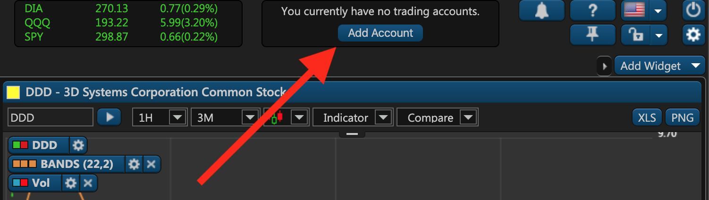
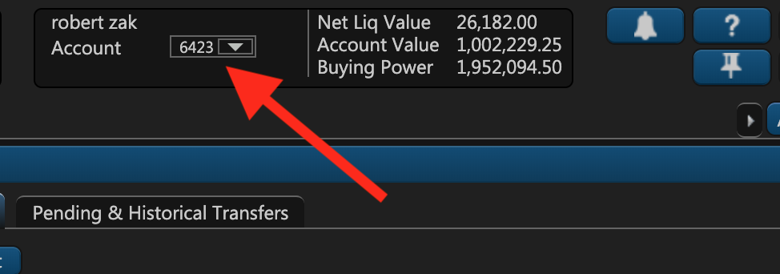
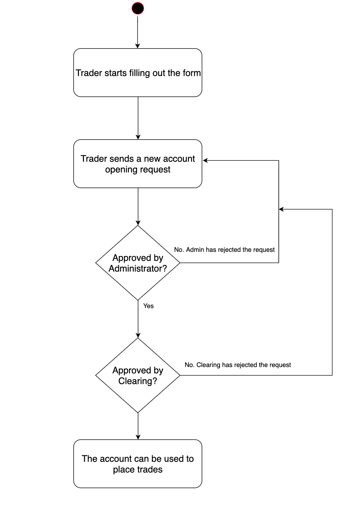
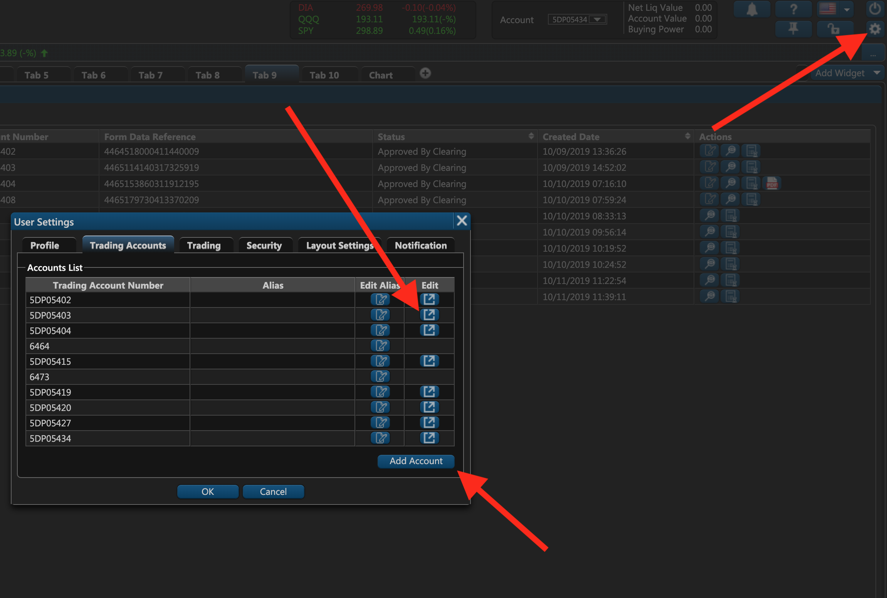
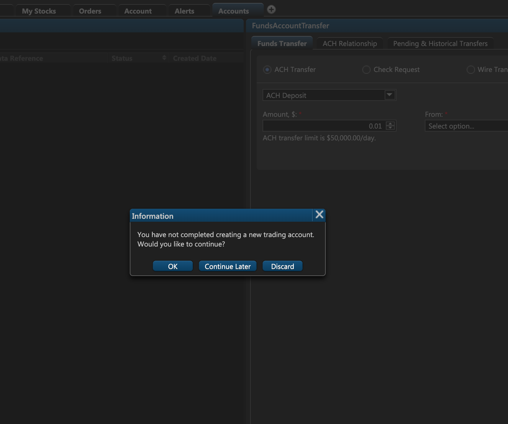

# Account Onboarding

### Introduction

ETNA Trader offers native trading account onboarding for all traders. After a trader performs initial sign-up, they're immediately prompted to open a new trading account. During the process, the trader fills out all of the necessary information about their identity, employment, liquid net worth, affiliation with corporate entities, and so forth. Afterward, the filled out form is sent to the clearing firm that might either approve or reject the account opening request. If the request is approved, the trader might proceed to deposit funds into their trading account and then start placing trades.

### Opening a New Trading Account

Once a trader has signed up for ETNA Trader, they will be immediately re-directed to the web terminal without having an active trading account \(which will be indicated in the header\). To create a new account, they should click **Add Account**.

Shortly after the trader will be re-directed to the account opening form that contains fields required by the broker's clearing firm. The trader should fill out this form entirely, specifying his/her preferred account type, investment experience, expected return, liquid net worth, affiliation with corporate entities, holding of a public office, etc.

Once the form is filled out, it will take some time for it to be processed and then it'll be sent for review to one of the broker's administrators. The administrator can either reject the filled out form — in which case the trader will have to correct it, or it can be approved — in which case the form will be sent to the clearing firm for further approval. In turn, the clearing firm will itself review the form and approve it if the provided information is valid. If the information is invalid, the form will be rejected and either the administrator or the trader will have to correct the form before sending it once again to the clearing firm.

Once the trading account has been opened, the trader can sign in to the web terminal and use the newly created account to start trading.

### Account Opening Request Workflow

The following diagram demonstrates the workflow of opening a new account:

### Trading Account Management

If a trader needs to open another account or manage their current accounts, they can click on the little gear icon the header of the web terminal. This will bring up the user management window where the trader can add a new account by clicking **Add Account**. In order to modify an existing account, the trader should click on the Edit **icon**.

If the trader has not completed an account opening request, they will be prompted to continue filling out the form whenever they sign in:

