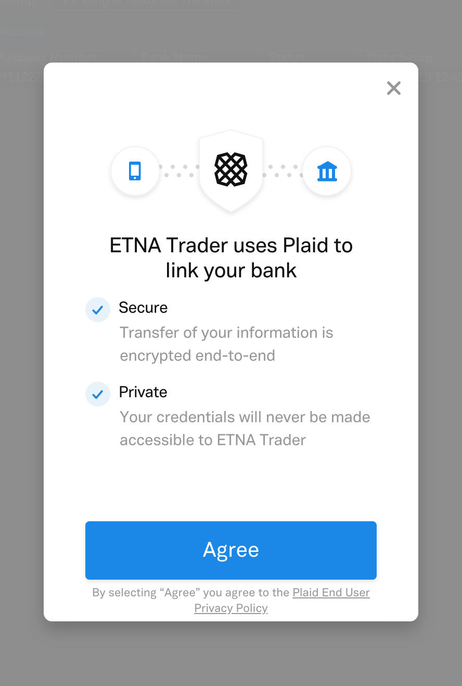
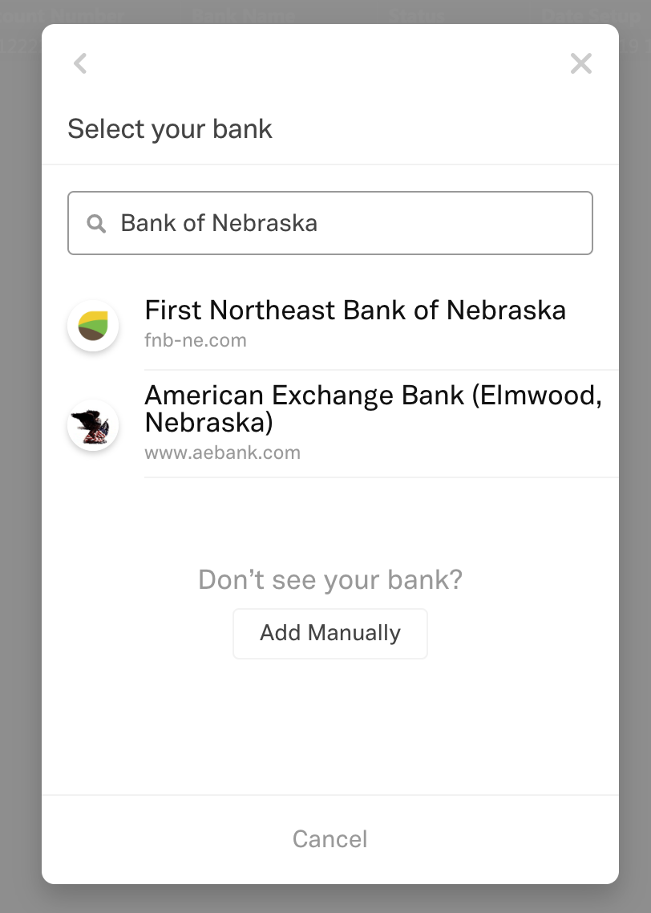
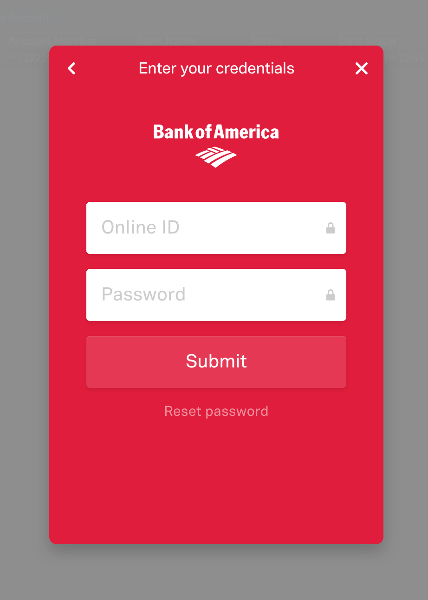
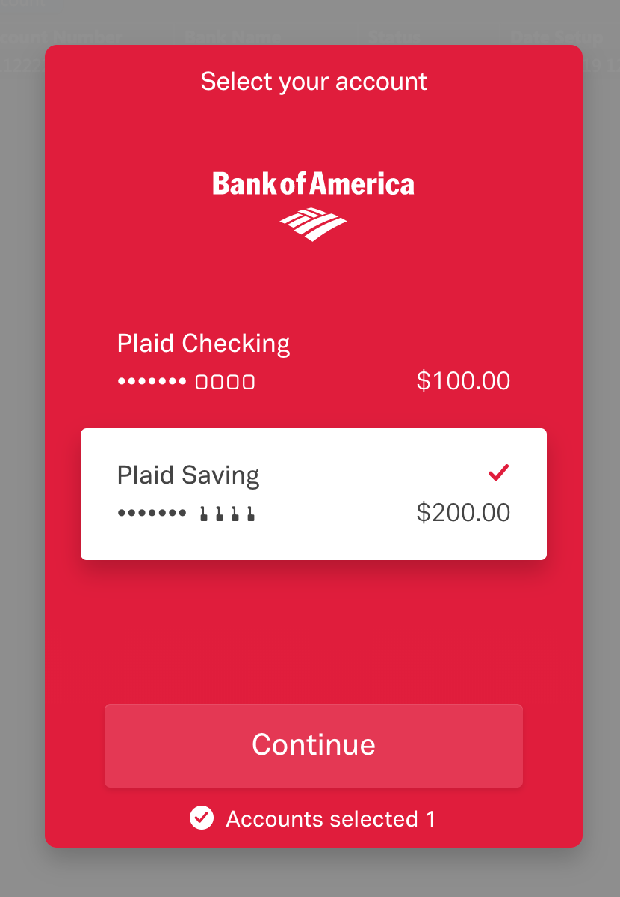
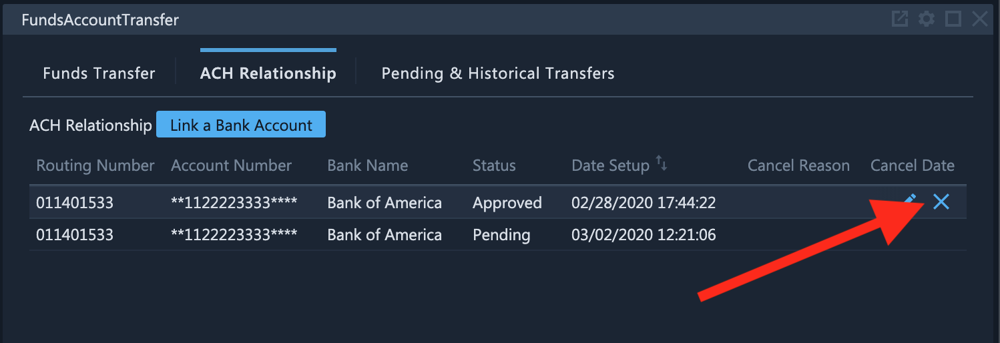
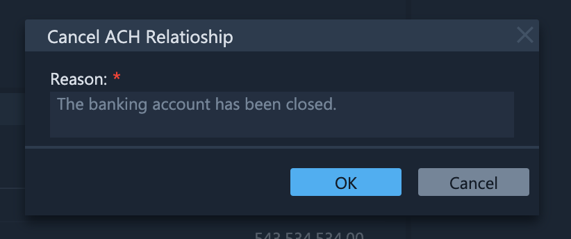
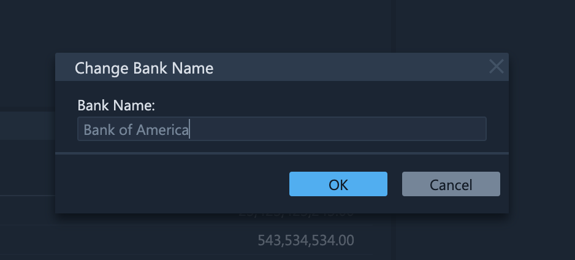
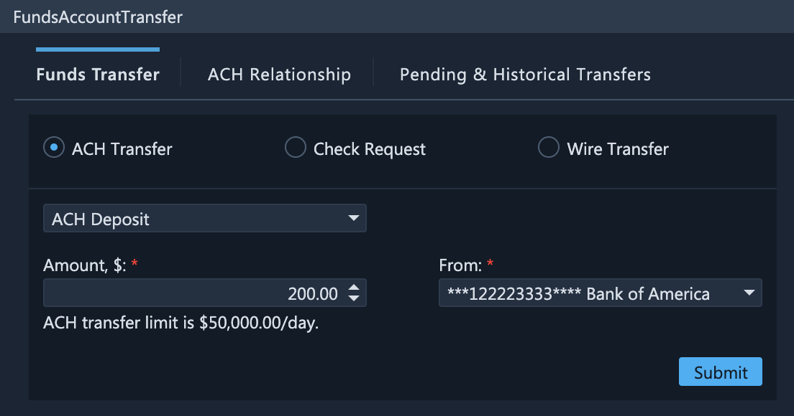

# ACH Transfers

### Introduction

ACH transfers facilitate deposits and withdrawal of funds to/from your trading accounts. To perform such transfers, you first need to establish an ACH relationship with one of your bank accounts. Once this relationship is established, you will be able to quickly deposit or withdraw funds without having to repeatedly specify you banking information.

### Creating ACH Relationships

To create a new ACH Relationships, navigate to the **Funds Account Transfer** widget and open the **ACH Relationship** sub-tab. Click **Link a Bank Account**.

.png>)

This will bring up the ACH relationship establishment page. Click **Agree**.

Next, select your bank from the list of the most frequently used banks.

If your bank is not visible, you can search for it by entering its name in the **Search** field.

Afterward you will be prompted to log into your bank.

Next, select the required account from which funds will be withdrawn and into which funds will be deposited, and then click **Continue**.

In a short while the ACH relationship will be established and you will be able to see it on the **ACH Relationship** sub-tab. The linking process is complete and now you can proceed to transfer funds from your banking account into your brokerage account.

### Managing ACH Relationships

To remove an existing ACH relationship, click on the cross icon in the **Actions** column.

In the appeared pop-up window, specify the reason for removing the ACH relationship and then click **Save**.

ACH relationships can be renamed at any time by clicking on the **Edit** icon in the **Actions** column.

### Depositing and Withdrawing Funds

To deposit or withdraw funds, go back to the **Funds Transfer** tab. At the top, select the **ACH Transfer** radio button. Next, select the preferred transaction type: **ACH Deposit** or **ACH Withdraw**. Specify the required amount of funds to be transferred (in USD), select the newly added banking account, and finally click **Submit**.

### Monitoring ACH Transfers

Once you've submitted a deposit or withdrawal request, its state will change to **Submitted**, meaning that it's currently under review by an administrator. Once they approve the request, its state will change to **FundsPosted** — i.e., the funds have been transferred and are now waiting for clearance. The final state of the request is **Complete** — i.e., the funds have been cleared and can be used to place trades.
