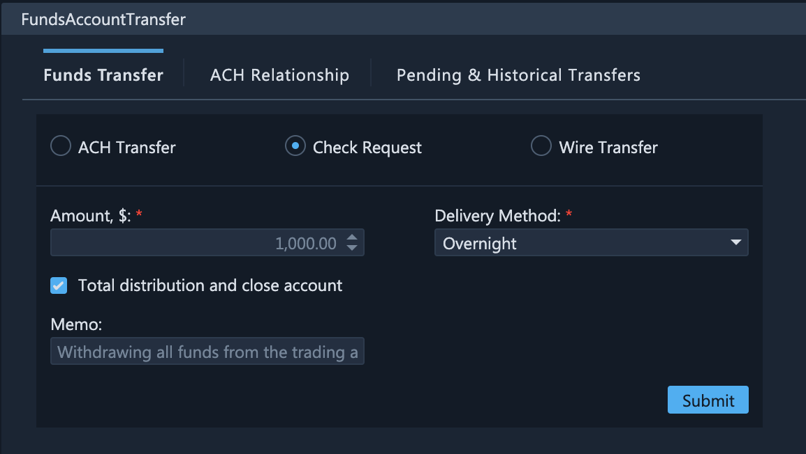

# Check Transfers

### Withdrawing Funds with Checks

In addition to ACH transfers, ETNA Trader also enables traders to withdraw funds from their trading account by means of a check. In this case a check with the specified sum will be sent to the address specified by you in the account opening form \(the one you filled out when opening the trading account\).


Check transfers are relevant only for withdrawing funds.


To withdraw funds using checks, select **Check Request** on the Funds Transfer tab. Specify the amount to be withdrawn \(in USD\). If you would like to withdraw all funds altogether and close the account, select the **Total distribution and close account** checkbox. Specify the memo if necessary, and the select the preferred delivery method:

* Standard;
* Overnight;
* Saturday;
* Overnight to Broker;
* Print at firm.

Once you're done, click **Submit**, and the check will shortly be sent.

