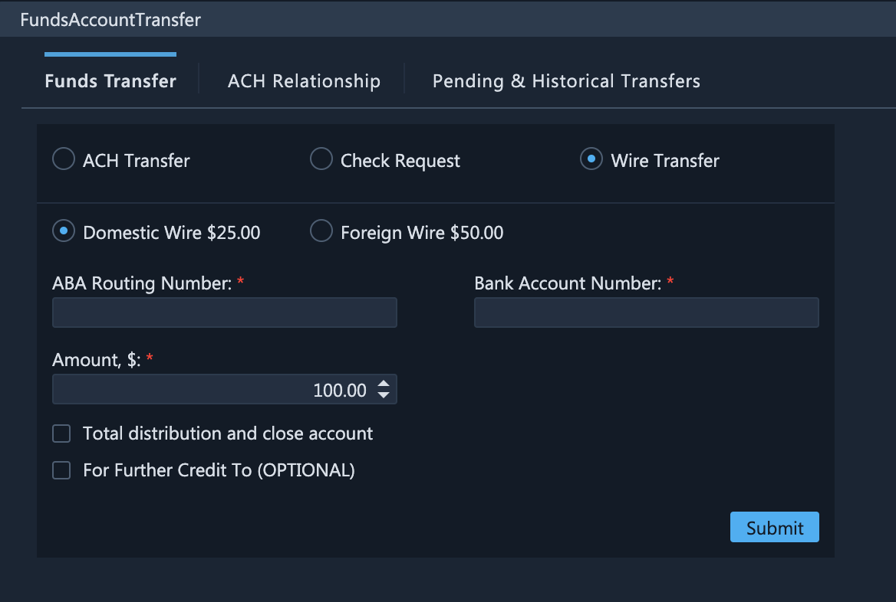
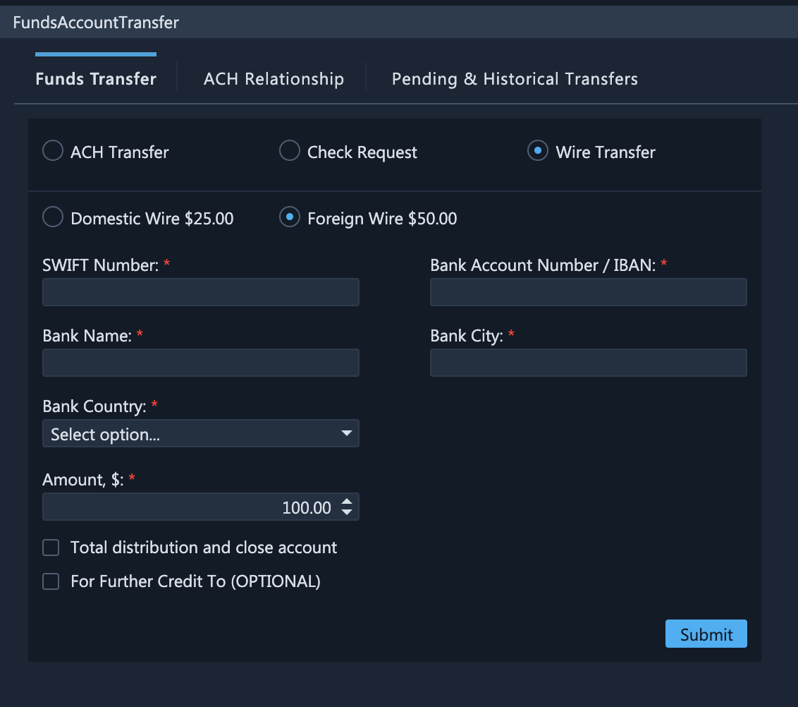
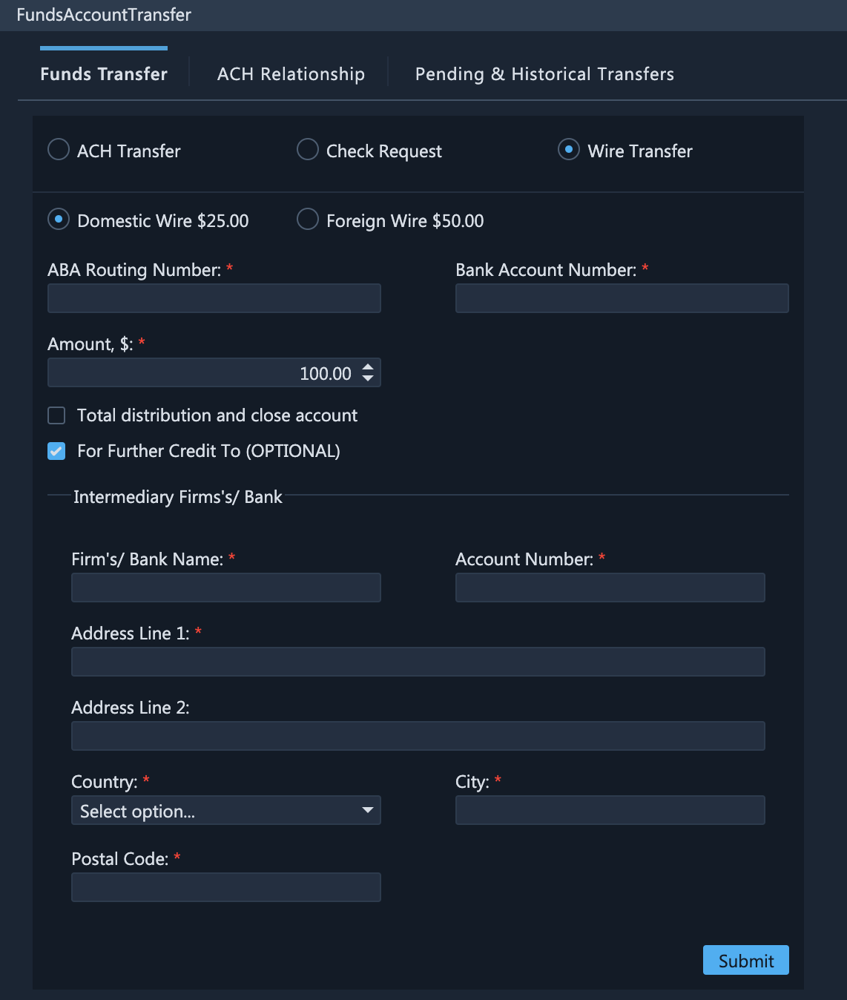

# Wire Transfers

### Withdrawing Funds Using Wire Transfers

In addition to ACH transfers and check transfers, ETNA Trader also provides traders with the ability to withdraw funds from their trading accounts by means of wire transfers. Specifically, the funds could be withdrawn via either a domestic wire or a foreign wire.


Check transfers are relevant only for withdrawing funds.


To withdraw funds using wire transfers, select **Wire Transfer** on the **Funds Transfer** tab. Next, specify the amount to be withdrawn (in USD). If you would like to withdraw all funds altogether and close the account, select the **Total distribution and close account** checkbox.

Alternatively, you can withdraw your funds via a foreign wire by selecting the **Foreign Wire** radio button. Whereas domestic wire transfers cost $25, foreign wires cost $50.

Optionally, you can make a **For Further Credit** payment by selecting the corresponding checkbox at the bottom. In this case you will also have to specify additional information about the intermediary bank.

Once you're done, click **Submit**, and the transfer will be passed to an administrator for review. Once it's approved, withdrawal of funds will be initiated.

