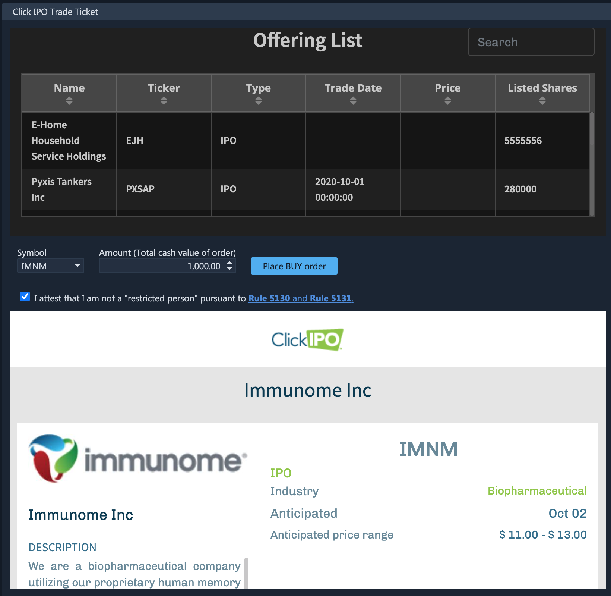

# Click IPO

### Integration with Click IPO

ETNA Trader supports full native Integration with [Click IPO](https://clickipo.com/how/) which enables traders to participate in all upcoming initial public offerings with just a few clicks. For this purpose the platform features a separate widget called **Click IPO Trade Ticket** that enables traders to participate in initial public offerings.

Let's delve deeper into the implementation the top there is a table listing all upcoming IPOs; moving downward there are two text fields where traders can specify the target company's ticker symbol and the maximum amount of funds to be spent on the securities \(the quantity will be calculated automatically\). At the very bottom there's a brief overview of the company, including its prospectus, anticipated price range, IPO date, and the list of underwriters.

Click **Place BUY Order** and the order will be sent. 


Unlike regular orders that have the **New** status, orders sent to ClickIPO have the **Pending New** status by default.


### Click IPO Risk Rules

#### Prevention of Order Placement Before Trading Commencement

It's worth mentioning that Click IPO orders cannot be modified. Attempting to do so will prompt the following message:


`Click IPO orders are forbidden from modification. Instead, please cancel the existing order and then place a new order with updated parameters.`


Instead of modifying an existing order, cancel the existing one and then proceed to place a new one with the updated parameters.

