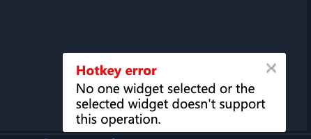

# Hotkeys

### Introduction

ETNA Trader provides rich shortcut functionality to users who'd like to streamline their trading routine with hotkeys. If you need to buy a security or cancel all active orders with a single press of a key — ETNA Trader enables you to configure shortcuts for such events. The range of actions that can be mapped to keyboard keys is determined by the broker along with the default mappings. However, traders can always map their own keys to the default range of events by means of the **Hotkeys** widget.

### Configuration of Hotkeys

This widget lists all of the existing shortcuts which can be modified or even removed. To create a new hotkey, click **Add**.

In the appeared pop-up window, specify the following parameters:

* **Shortcut**. This is the key combination that will trigger the associated action.
* **Action**. Expand the drop-down menu and select one of the actions created by the broker.
* **Parameters**. These are the parameters that are associated to the action. 

### Troubleshooting with Hotkeys

Some hotkeys require the presence of specific widgets for proper execution; for example, hotkeys related to placing orders require the **Orders** widget being present on the screen. Otherwise the following error will pop up in the bottom-right corner:

