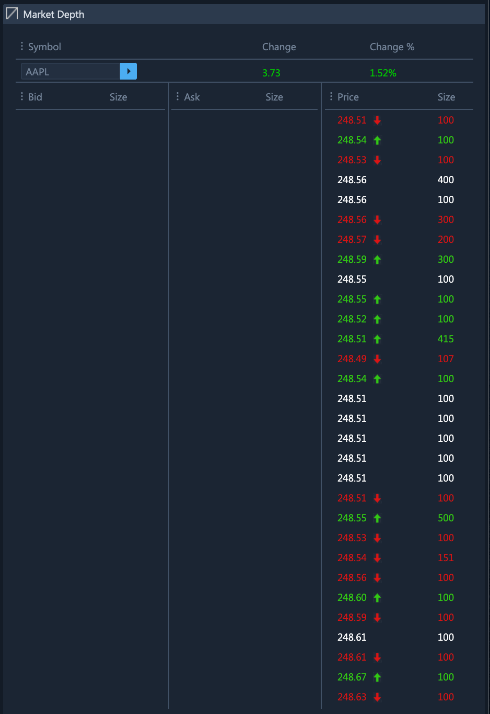

# Market Depth

### Exploring the Market Depth Widget

ETNA Trader's **Market Depth** widget enables traders to inspect the current market depth of a specific security. Specifically, it displays the following information:

* Equity order book;
* Quote for selected symbol;
* Details about the order stream for the specified selected symbol.

Optionally, you can link this widget by color with other widgets. For example, if you link **Market Depth** with **Chart** — whenever you inspect the market depth for a specific security, its chart will automatically be loaded up. The opposite is also true: when loading up a chart for a specific security, its market depth will consequently be displayed.

