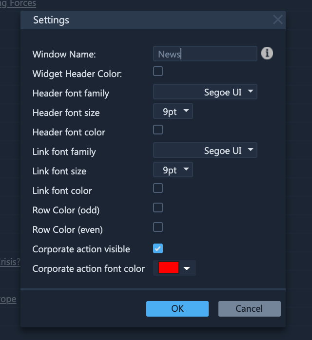

# News

### Exploring the News Widget

ETNA Trader's news widget gives you live streaming headlines from different online news sources. If there is an important news story in business, around the world, it will probably going to show up in the Live News tape. You can click on the headline to get the full story. You can also link your watch list with the news feeds, so that every time you want to know the latest news about a security, you can just click on it from the watch list to see updated news headlines.

The News widget can be customized by clicking on the little gear icon in the widget's toolbar. Specifically, you can customize the interface of your news feeds.

