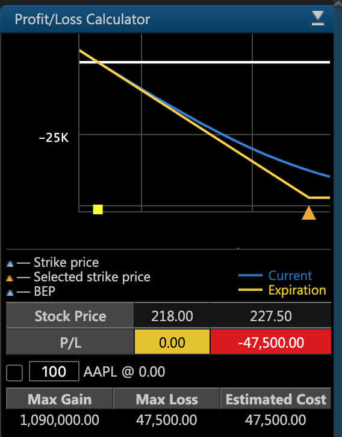

# Options

### Trading Options in ETNA Trader

Option is a contract in which a party that owns the option has the right \(but not obligation\) to purchase \(Call\) or sell \(Put\) a specific asset at a pre-defined \(strike\) price within a specific time frame. The counter party in this transaction is the writer of the option that in exchange for a premium agreed to purchase or sell the asset. Both the writer and the owner of the option make opposite bets on the price of the underlying asset: if its market price is better than the strike price, the owner of the option realizes a profit; if the strike price is better, the writer of the options realizes a profit.

ETNA Trader features powerful option trading functionality that enables traders to buy and sell call and put options as well as enter into complex strategies. By default, all widgets related to options trading are available on the **Options** tab of ETNA Trader's Web Terminal.

There are two widgets that deal with options: 

1. **Option Ticket**. This widget enables traders to purchase options and enter into complex strategies.
2. **Option Chain**. This widget enables traders to conveniently explore various options with different expiration dates, determine the probability of the underlying asset reaching a specific 

### Greeks

Various sophisticated hedging strategies are used to neutralize or decrease the effects of risk when taking a position in an option.

### Calls and Puts

There are two types of options: calls and puts. Furthermore, there are four types of participants in options markets depending on the position they take: 

1. Buyers of calls;
2. Sellers of calls; 
3. Buyers of puts; 
4. Sellers of puts.

### Intrinsic value and Time

One of the columns of the _Option Chain_ widget is entitled **Mark** and it contains the current mark price of the option. Please note that this column is available only for Call and Put options.

 As you hover over the column with the option's strike price, the following pop-up will be prompted:

The pop-up contains two parameters:

1. **Intrinsic**

\*\*\*\*$$Intrinsic = StockMark - Strike$$ ****

The `Intrinsic` parameter is calculated as the difference between the underlying security's mark price and the option's strike price.

   ****2. **Time**

\*\*\*\*$$Time = Option Mark - Intrinsic$$ ****

The `Time` parameter is calculated as the difference between the option's mark price and the **Intrinsic** parameter.

### Probability Calculator

In option trading, it's critical to estimate the probability of the underlying security reaching the target price range. For this purpose, ETNA Trader provides traders with the so-called probability calculator.

It can be revealed by clicking on the following button in the top-right corner of the _Option Chain_ widget:

The probability calculator features a group of sliders that traders can adjust to determine the probability of the underlying security's price reaching the target price range:

1. **Price**. Use this slider to set the initial price of the security. By default, it's set to the last closing price, but traders can change it anytime if the plan to trade options only if the underlying security's price reaches a certain level.
2. **Price 1**. Use this slider to set the lower bound of the target price range.
3. **Price 2**. Use this slider to set the upper bound of the target price range.
4. **Custom Volatility**. Use this slider to set a custom volatility \(expressed in percentage terms\).
5. **Days to Expiration**. Use this slider to set the number of days until the expiration of the option.

Once all five sliders are set, ETNA Trader will automatically calculate the probability of the underlying security's price reaching the target price range using log-normal distribution:

The first three row display the probability of the underlying security's price:

1. Remaining **Below** the target price range;
2. Reaching the target price range;
3. Remaining above the target price range.

The last five rows display the probability of the underlying security's price **hitting**:

1. The lower bound of the target price range;
2. The upper bound of the target price range;
3. Both the lower and the upper bounds of the target price range;
4. Either the lower or the upper bound of the target price range;
5. Neither the lower or the upper bound of the target price range.

### Profit/Loss Calculator

Above the probability calculator there is a profit and loss calculator that enables traders to view the projected profit or loss of selected options depending on the price of the underlying security at expiration date.

For example, suppose you select a call option on AAPL with a strike price of $225. The current ask price of the option is $0.78. Since this is a standard option with 100 securities, the final price of the option will be $78.

Now let's imagine that at expiration date, the market price of AAPL is equal to the strike price \($225\). Because the option expired, the trader has the right to purchase AAPL at $225 and then instantly sell it at the same price on the market. Obviously this transaction makes no financial sense and the trader can simply choose not to buy the stock at all. But the trader also spent $78 on buying the option — and at expiration date this sum becomes the trader's incurred loss.

Let's consider a different scenario. If the market price of AAPL at expiration date is $225.78, the trader will lose $78 on the option itself; however, they can compensate the loss by buying 100 shares of AAPL from the option's writer at $225 and selling them at the market price of $225.78, pocketing the difference of $22'578 - $22'500 = $78.

The projected profit and loss can be inspected in the Profit/Loss calculator on the right of the Option Chain widget.

By the same logic, if the market price of AAPL at expiration date is higher than the sum of the strike price and the option's cost basis, the difference will be the trader's profit.

#### Profit/Loss Chart

Taking a closer look at the Profit/Loss chart, the y-axis represents the projected profit or loss when using the selected option strategy while the x-axis represents the price of the underlying security.

#### Choosing Strategies

ETNA Trader enables traders to buy and sell Put and Call options with different expiration dates and strike prices. To the left of the **Strike** column there are **Call** options; to the right — **Put** options.

To **buy** a Call or Put option, select the following checkbox until the green letter **B** appears. To sell a Call or Put option, select click on it twice until the red letter S appears. Optionally, specify the target number of options to be purchased. 


Notice how the chart on the right dynamically adjusts as you select different options.


