# Options

### Trading Options in ETNA Trader

Option is a contract in which a party that owns the option has the right \(but not obligation\) to purchase \(Call\) or sell \(Put\) a specific asset at a pre-defined \(strike\) price within a specific time frame. The counter party in this transaction is the writer of the option that in exchange for a premium agreed to purchase or sell the asset. Both the writer and the owner of the option make opposite bets on the price of the underlying asset: if its market price is better than the strike price, the owner of the option realizes a profit; if the strike price is better, the writer of the options realizes a profit.

ETNA Trader features powerful option trading functionality that enables traders to buy and sell call and put options as well as enter into complex strategies. By default, all widgets related to options trading are available on the **Options** tab of ETNA Trader's Web Terminal.

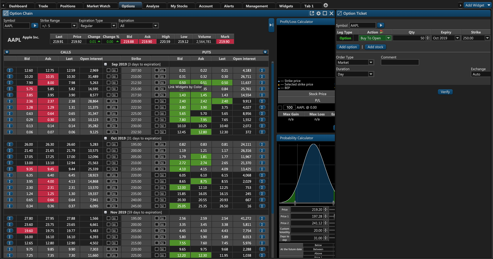

There are two widgets that facilitate trading with options:

1. **Option Ticket**. This widget enables traders to purchase options and enter into complex strategies.
2. **Option Chain**. This widget enables traders to conveniently explore various options with different expiration dates, determine the probability of the underlying asset reaching a specific price, inspection of options' greeks as well as the profit/loss calculator.

### Option Chain Widget

Let's delve deeper into the Option Chain widget and examine its various aspects. The uppermost segment of the Option Chain widget contains the text field for the underlying security's ticker symbol as well as several drop-down menus for filtering options:

* **Strike Range**. Use this drop-down menu to determine the number of options that must be displayed. For example, if you select 4, Option Chain will find an option with the strike price that is closest to the current price of the underlying security and then display two options with the strike price above and two options with the strike price below the found option's strike price.
* **Expiration Type**. Use this drop-down menu to find options with a specific expiration type.
* **Expiration Date**. Use this drop-down menu to select options with a specific expiration date. 

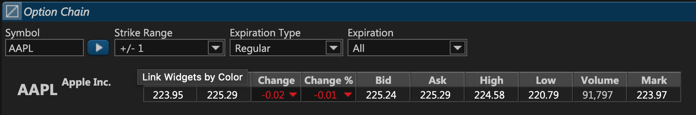

Moving downward, there's a table split into two segments: one for Call \(left\) and the other for Put \(right\) options. The middle column represents the strike price of the options. There are also columns containing the bid, ask, last price of the option, and the current open interest.

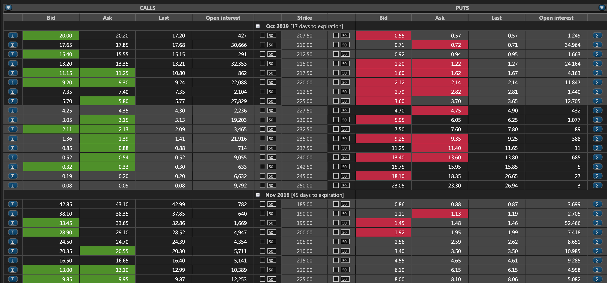

#### Greeks

To the left of Call options and to the right of Put options there's a small blue sigma button that prompts options' greeks. Greeks measure different factors that affect the price of an option.

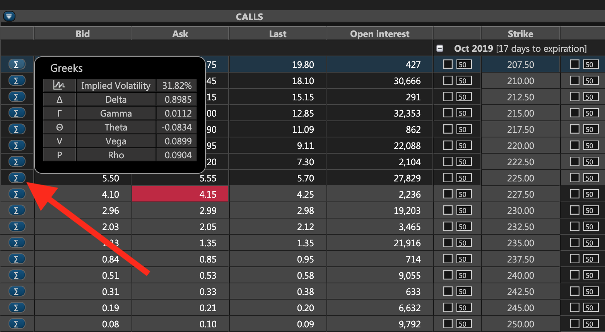

### Intrinsic value and Time

One of the columns of the _Option Chain_ widget is entitled **Mark** and it contains the current mark price of the option. Please note that this column is available only for Call and Put options.

As you hover over the column with the option's strike price, the following pop-up will be prompted:

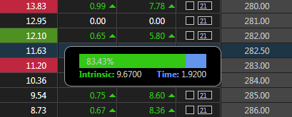

The pop-up contains two parameters:

1. **Intrinsic**

* For in-the-money Call options:

\*\*\*\*$$Intrinsic = |StockMark - Strike|$$\*\*\*\*

*  For in-the-money Put Options**:**

$$Intrinsic = |Strike - StockMark|$$

* For out-of-the-money options:

$$Intrinsic = 0$$

The `Intrinsic` parameter is calculated as the difference between the underlying security's mark price and the option's strike price. For out-of-the-money options, `Intrinsic` is equal to 0.

   ****2. **Time**

\*\*\*\*$$Time = Option Mark - Intrinsic$$ ****

The `Time` parameter is calculated as the difference between the option's mark price and the **Intrinsic** parameter \(or vice versa\).

### Probability Calculator

In option trading, it's critical to estimate the probability of the underlying security reaching the target price range. For this purpose, ETNA Trader provides traders with the so-called probability calculator.

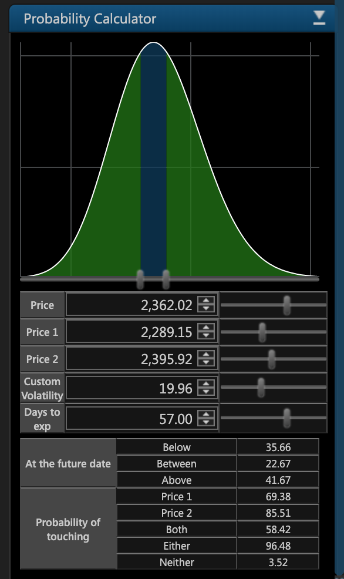

It can be revealed by clicking on the following button in the top-right corner of the _Option Chain_ widget:

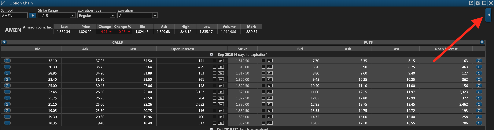

The probability calculator features a group of sliders that traders can adjust to determine the probability of the underlying security's price reaching the target price range:

1. **Price**. Use this slider to set the initial price of the security. By default, it's set to the last closing price, but traders can change it anytime if the plan to trade options only if the underlying security's price reaches a certain level.
2. **Price 1**. Use this slider to set the lower bound of the target price range.
3. **Price 2**. Use this slider to set the upper bound of the target price range.
4. **Custom Volatility**. Use this slider to set a custom volatility \(expressed in percentage terms\).
5. **Days to Expiration**. Use this slider to set the number of days until the expiration of the option.

Once all five sliders are set, ETNA Trader will automatically calculate the probability of the underlying security's price reaching the target price range using log-normal distribution:

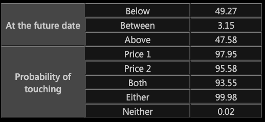

The first three row display the probability of the underlying security's price:

1. Remaining **Below** the target price range;
2. Reaching the target price range;
3. Remaining above the target price range.

The last five rows display the probability of the underlying security's price **hitting**:

1. The lower bound of the target price range;
2. The upper bound of the target price range;
3. Both the lower and the upper bounds of the target price range;
4. Either the lower or the upper bound of the target price range;
5. Neither the lower nor the upper bound of the target price range.

### Profit/Loss Calculator

Above the probability calculator there is a profit and loss calculator that enables traders to view the projected profit or loss of selected options depending on the price of the underlying security at expiration date.

For example, suppose you select a call option on AAPL with a strike price of $225. The current ask price of the option is $0.78. Since this is a standard option with 100 securities, the final price of the option will be $78.

Now let's imagine that at expiration date, the market price of AAPL is equal to the strike price \($225\). Because the option expired, the trader has the right to purchase AAPL at $225 and then instantly sell it at the same price on the market. Obviously this transaction makes no financial sense and the trader can simply choose not to buy the stock at all. But the trader also spent $78 on buying the option — and at expiration date this sum becomes the trader's incurred loss.

Let's consider a different scenario. If the market price of AAPL at expiration date is $225.78, the trader will lose $78 on the option itself; however, they can compensate the loss by buying 100 shares of AAPL from the option's writer at $225 and selling them at the market price of $225.78, pocketing the difference of $22'578 - $22'500 = $78.

By the same logic, if the market price of AAPL at expiration date is higher than the sum of the strike price and the option's cost basis, the difference will be the trader's profit.

The projected profit and loss can be inspected in the Profit/Loss calculator on the right of the Option Chain widget.

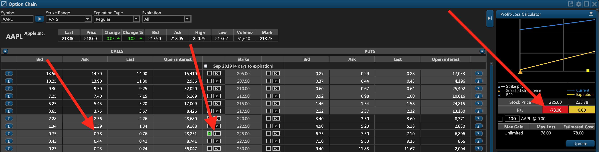

#### Profit/Loss Chart

Taking a closer look at the Profit/Loss chart, the y-axis represents the projected profit or loss when using the selected option strategy while the x-axis represents the price of the underlying security.

The yellow line represents the projected profit or loss over a variety of prices: the orange triangle marks the price point of the underlying security at which this option will generate the maximum loss; the yellow square marks the breakeven price of the underlying security. 

The blue line represents the value of the option depending on the price of the underlying security \(yellow line\).

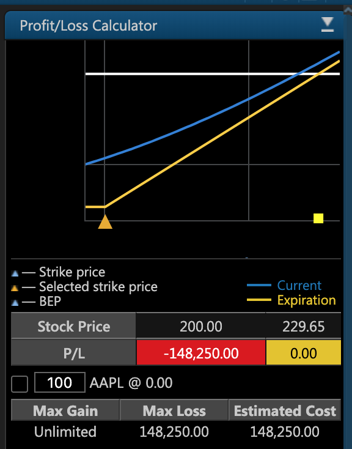

#### Choosing Strategies

ETNA Trader enables traders to buy and sell Put and Call options with different expiration dates and strike prices. To the left of the **Strike** column there are **Call** options; to the right — **Put** options.

To **buy** a Call or Put option, select the following checkbox until the green letter **B** appears. To sell a Call or Put option, select click on it twice until the red letter S appears. Optionally, specify the target number of options to be purchased. 


Notice how the chart on the right dynamically adjusts as you select different options.


### Option Ticket

The second widget that enables option trading is _Option Ticket_. This widget enables traders to purchase or sell options, trade the underlying security, enter into complex strategies, and configure different aspects of the order like its type, duration, etc.

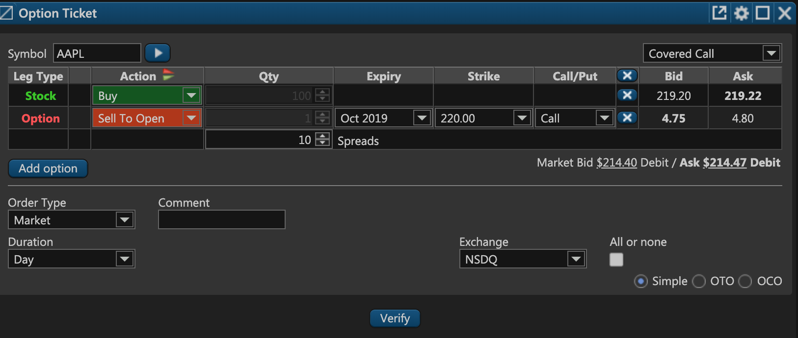

At the top there's a text field where the trader must specify the ticker symbol of the underlying security. Moving downward there's a leg-configuration table where they can trade the underlying security or different options:

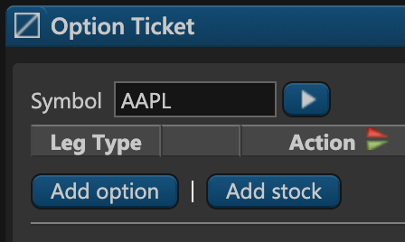

In the top-right corner there's a drop-down menu that provides a list of option trading strategies to choose from.

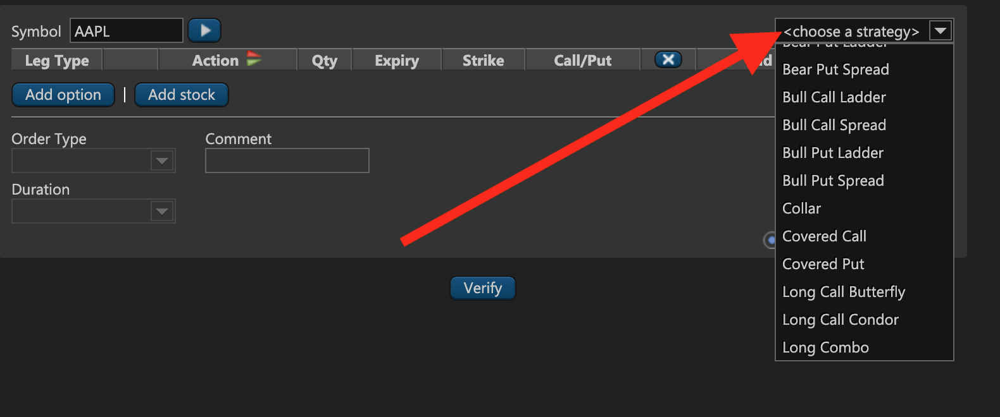

For example, if the trader selects the popular covered call strategy, Option Ticket will automatically add a long position in the underlying security and a sell-to-open position in a call option. Alternatively, traders can add the legs of a trade themselves, selecting the required expiration date, target strike price, option type \(Call or Put\), etc.

At the bottom traders can determine the required order type, duration of the order, and they can even configure a complex _One-Triggers-the-Other_ or _One-Cancels-the-Other_ order. 

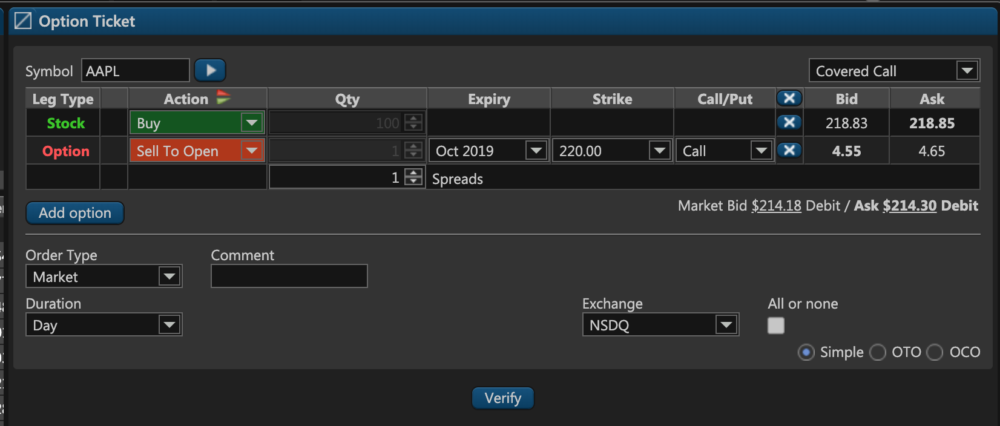

#### Debit and Credit for Limit Orders

If you attempt to enter into a strategy where you simultaneously buy and sell a security, you can also specify a limit price for the entire order. This limit price will indicate the amount of money that you will either receive \(Credit\) from the order or spend on the order \(Debit\). For example, if you sell an option for $100 and simultaneously buy a stock for $80, you will **receive $20** \(Credit\). Conversely, if you sell an option for $70 and buy a stock for $120, you will be **charged $50** \(Debit\). The debit and credit can be limited to ensure that the order will be executed only when either the debit or the credit is equal to a specific amount.

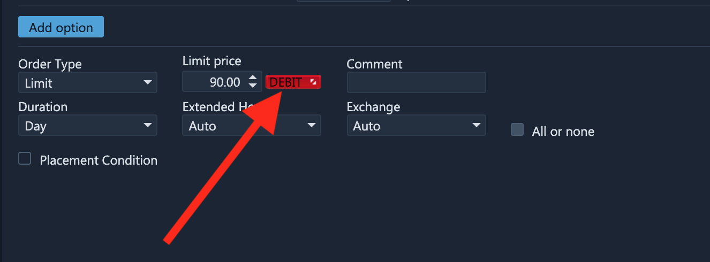

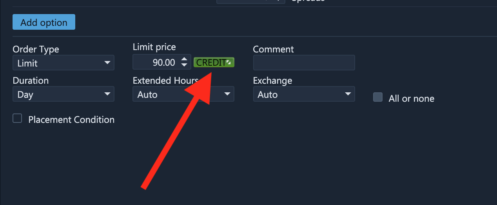

Once the order is entirely configured, the trader should click **Verify**. This will prompt the order verification window that enables the trader to examine the order and all of its parameters once again before sending it to the execution venue. If everything is correct, the trader should click **Trade**, and the order will be placed.

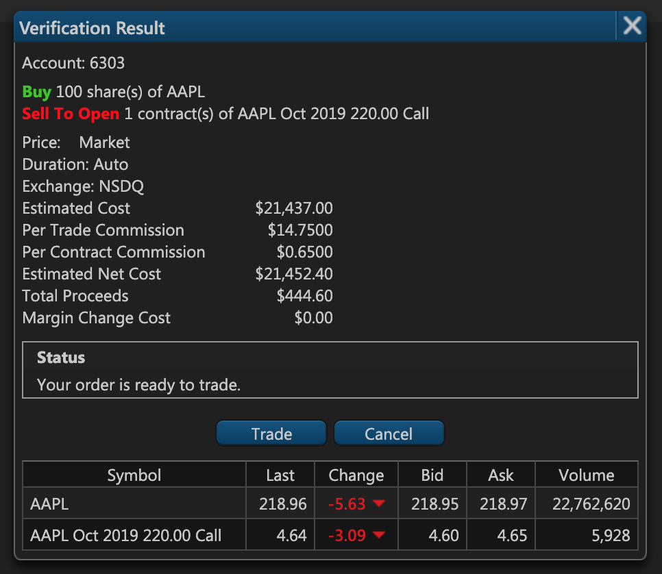

Once the order is filled, it can be inspected from the **Orders** widget and the resultant position will be displayed on the **Positions** widget:

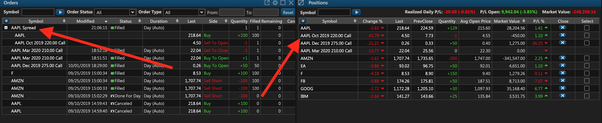

#### Options Trading in ETNA Trader for iOS:



### Video Overview

Feel free to watch our video overview that demonstrates how to trade options in ETNA Trader Web as well as in our mobile apps:



