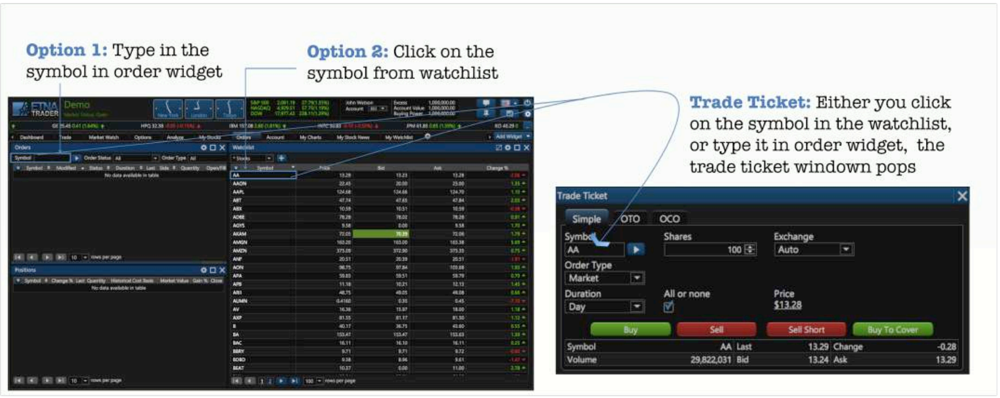
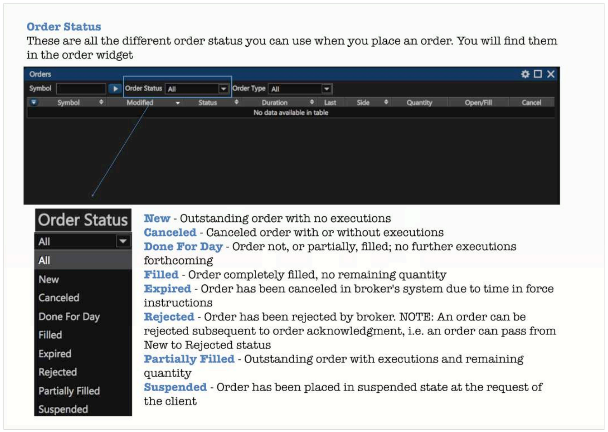
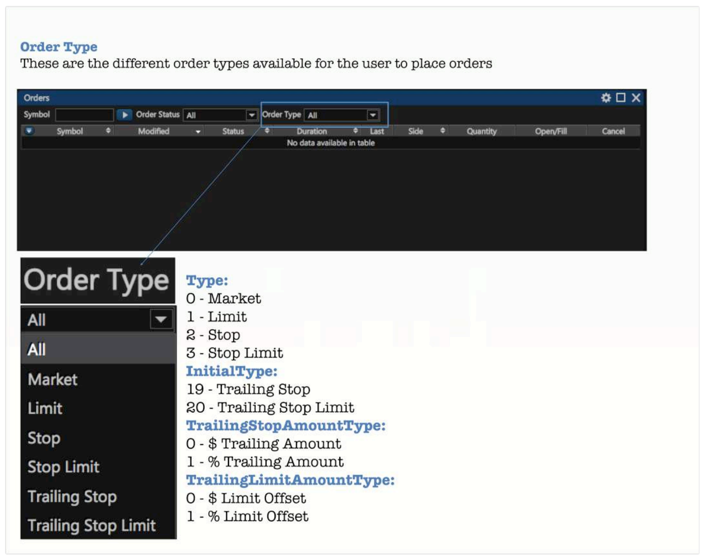
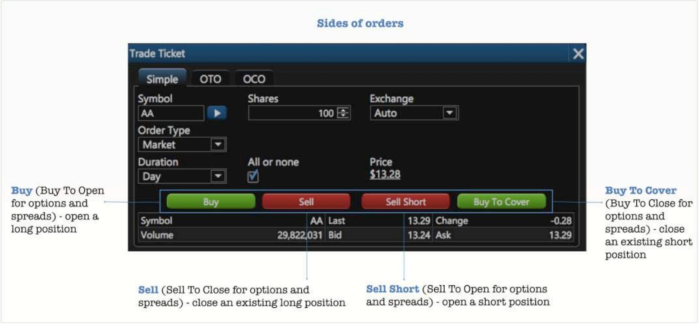
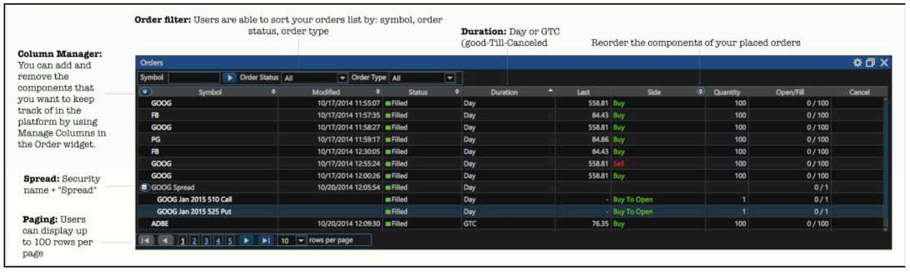
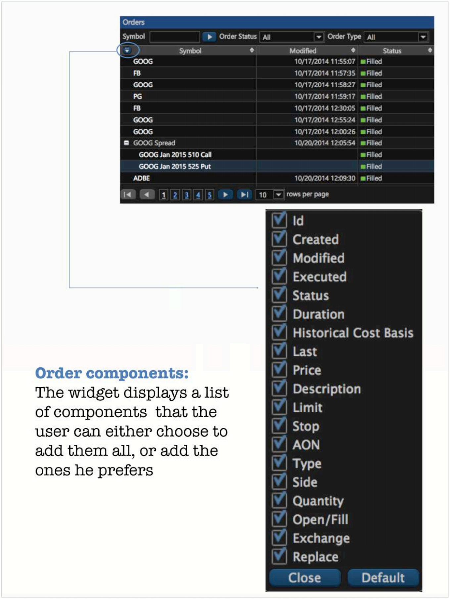
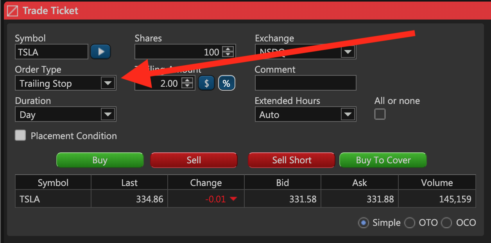
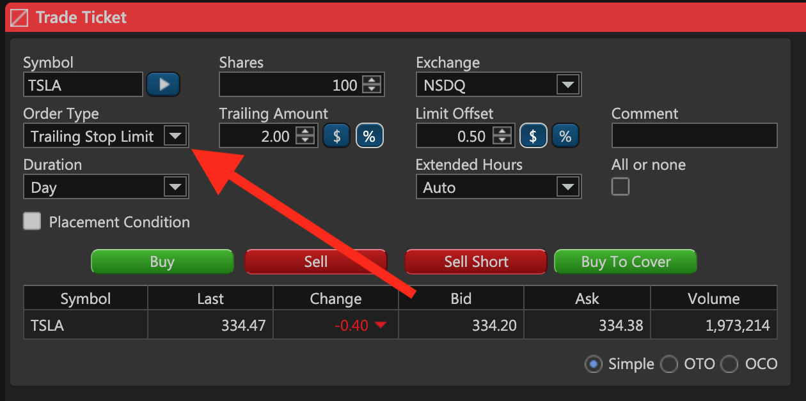
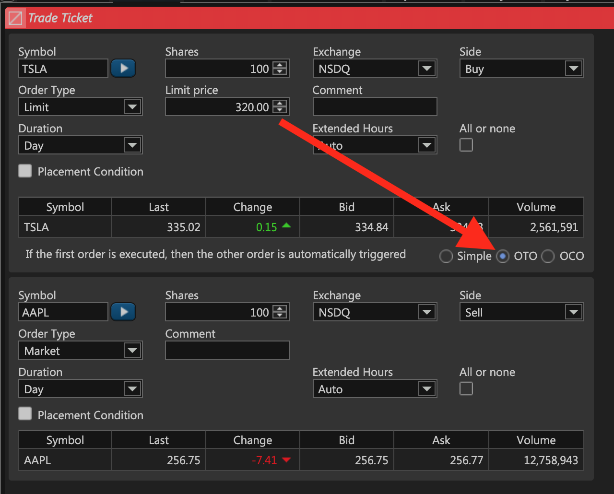
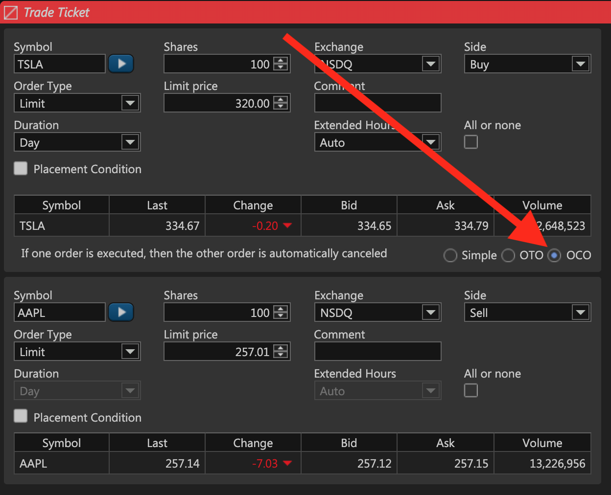

# Orders

### Exploring the Orders Widget

Before you start conquering the world of trading, ETNA Trader gives you the chance to users to trade with virtual money for product evaluation, trading educational or to test their trading strategy to experience the full range of ETNA Trader's trading capabilities in a real-time market environment, without risking any of your own money. All customers will start with USD 1,000,000 of paper trading. You can use all ETNA Trader's order types, trade all securities available in your demo account. Every trade entered into your ETNA Trader's paper trading account will not actually execute on any exchange or settle at a clearing house. However, the price of your executions will be determined by real market prices and sizes.

### Placing a New Order

There are two ways to create an order on ETNA Trader's platform:

1. **Option 1**. Type in the symbol in the box in the upper left side of the order widget.
2. **Option 2**. Click on the symbol from your watchlist.

### Order Statuses

### Order Types

Users can set the type of order they want to place from Trade Ticket, Option Ticket widgets, or popups trade ticket when they click on the symbol from the watchlist or a chart.

### Order Placement

### Order Duration

**Duration** means how long an order will remain active. Users can set their preferred duration from Trade Ticket, Option Ticket widgets or popups trade ticket when they click on the symbol from the watchlist or a chart. 

1. Day - A day order automatically expires at the end of the regular trading session if it has not been executed. 
2. GTC - Good-till-Canceled - An order that lasts until it's completed or canceled.

### Orders Widget Features

1. **Column Manager.** Users can add or remove columns they need. 
2. **Order filter.** Users are able to sort your orders list by: symbol, order status, order type.
3. **Last added order** will be shown even if you set a filter that isn't suitable for a new added order.

### Placing Algo Orders

ETNA Trader provides traders with a set of algorithmic order types like the trailing stop, trailing stop-limit, one-cancels-the-other, one-triggers-the-other, etc. Orders of these types can be configured and placed from ETNA Trader Web, mobile apps, and the [web API](../../../web-api/trading-api/).

Let's review each of these order types and demonstrate how they can be placed.

#### Trailing Stop

Trailing stop order is an order that enables traders to lock in the profit by setting a dynamically calculated stop price which moves with the market price. That way a trader can let their profits continuously increase but, if the price drops by more than the specified dollar/percentage amount, the positions will be sold at the market price, thus protecting the trader from further price drops.

An order of this type can be selected in the **Trade Ticket** widget, in the **Order Type** drop-down menu. To the right of the order type you can specify the amount by which the stop price should trail the market price as well as the trailing amount type \(percentage or dollar\).

#### Trailing Stop Limit

Trailing stop-limit orders are similar to trailing stop orders with the exception of the price at which the position will be closed. Whereas trailing stop orders will close the position at the market price, trailing stop-limit orders will close the position at the limit price defined by the trader.

Trailing stop-limit orders can also be selected in the **Trade Ticket** widget, in the **Order Type** drop-down menu.

There are two parameters that must be indicated when configuring a trailing stop-limit order:

1. Amount by which the stop price should trail the market price as well as the trailing amount type \(dollar or percentage\).
2. The amount by which the limit \(execution\) price should be offset in relation to the stop price. For example, if the stop price happens to be $15 and the offset is 2%, the limit price will be set to $14.7 and at this price the position will be closed.

#### One-Triggers-the-Other Order Type

One-Triggers-the-Other \(OTO\) is a type of conditional order in which execution of one order automatically triggers the other one. Each of the two orders has to be provided as a separate leg. An OTO order can be configured by changing the order type at the bottom 

In this case, if the limit order to purchase the Tesla stock gets executed, the second market order to sell the Apple stock will automatically be placed.


In One-Triggers-the-Other orders, the first leg cannot be a market order.


#### One-Cancels-the-Other Order Type

One-Cancels-the-Other is a type of conditional order in which execution of one order automatically cancels the other one. Each of the two orders has to be provided as a separate order leg.

In this case, if the limit order to purchase the Tesla stock gets executed, the second limit order to sell the Apple stock will automatically be cancelled.


In One-Cancels-the-Other orders, both legs cannot be market orders.


