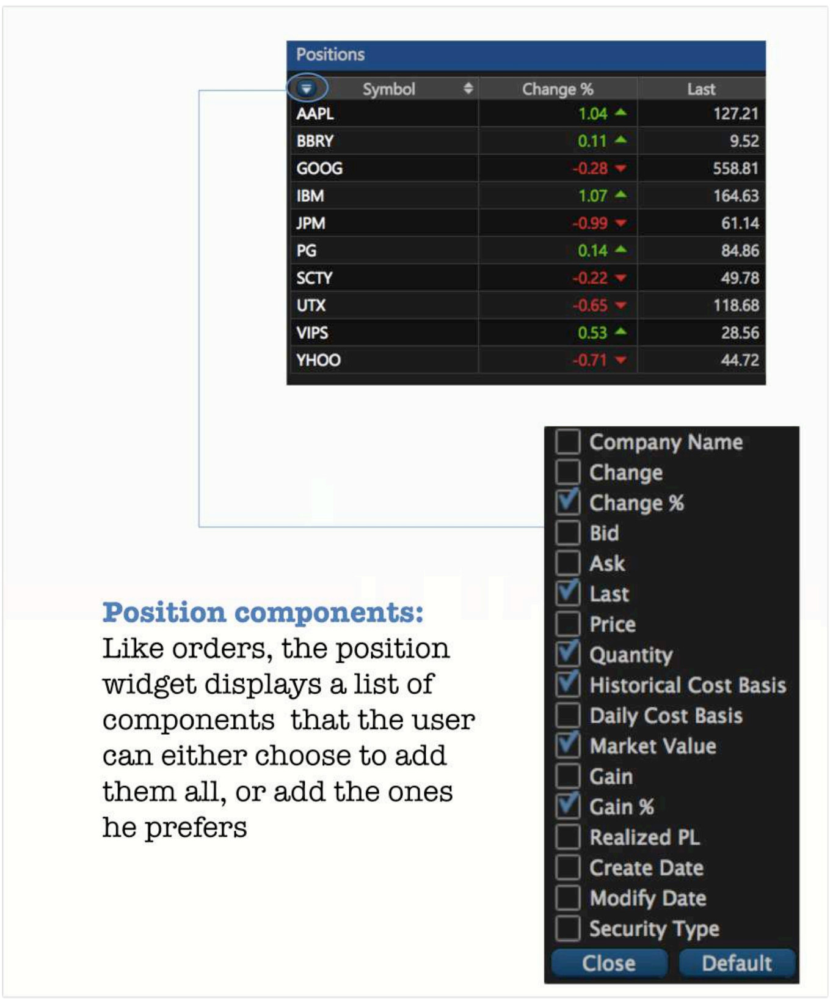
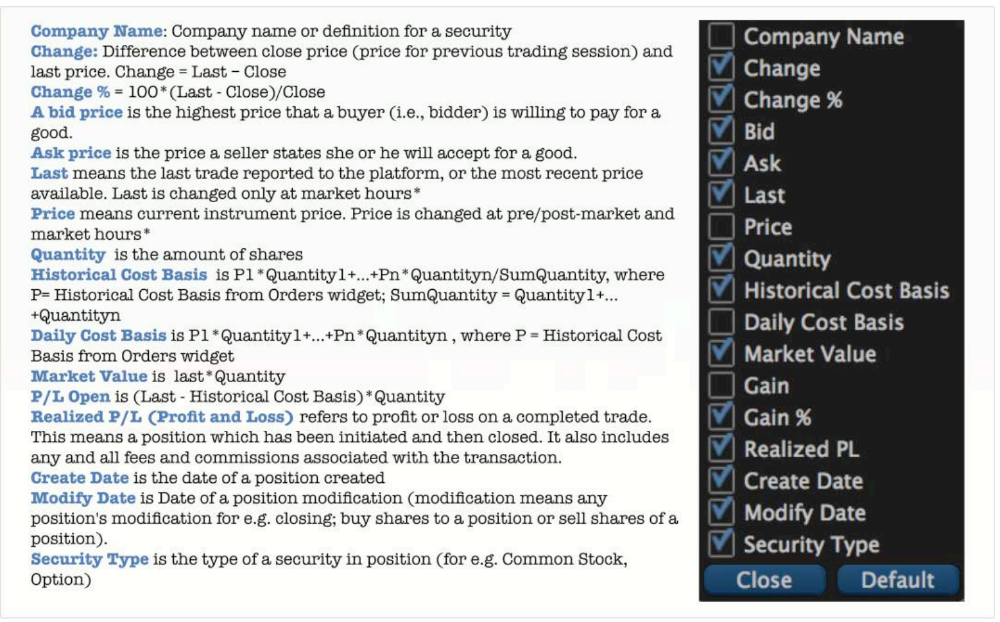

# Positions

### Exploring the Positions Widget

Once an order is placed in the market, the user will be able to see it on the position widget. Users can manage the components they want to see in their position widget.

### Positions Widget Features

1. **Column Manager**. With Column Manager you can add/remove columns that you are needed. 
2. **Related orders**: With related orders the user can see every transaction \(each order which formed a position\) in a position. You can switch it on in the Settings popup. 
3. **Closed position**: will be displayed until a new trading session starts \(Clearing imitation\).

