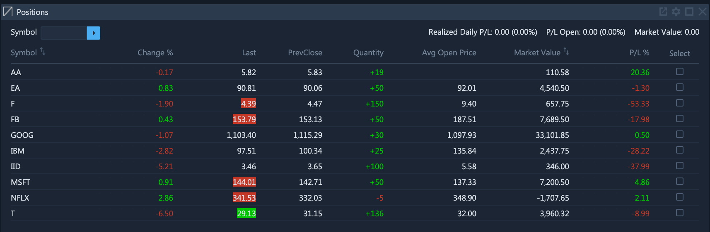
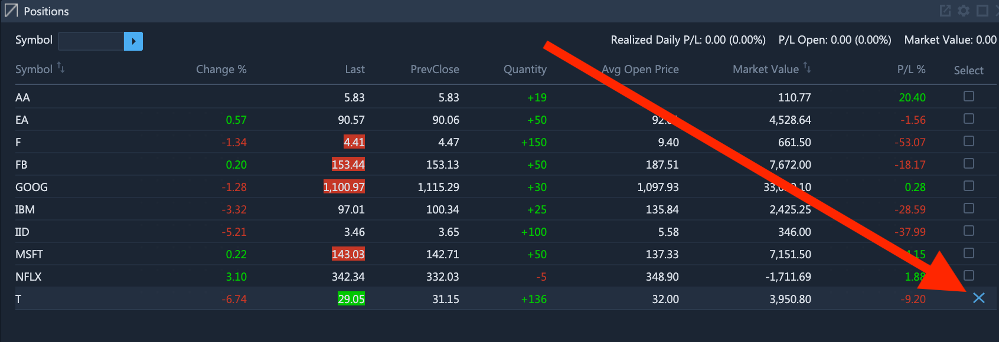
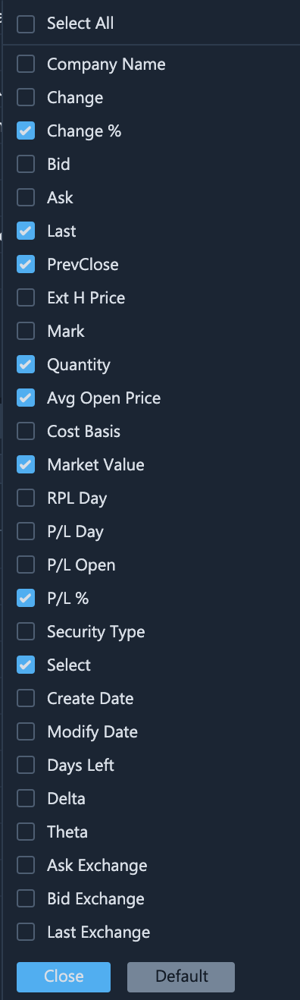

# Positions

### Exploring the Positions Widget

Once an order is placed in the market, the user will be able to see it on the **Positions** widget. Here traders can examine the current profit or loss on all their positions and also trade securities from their positions by clicking on the ticker symbol.

Specifically, the profit or loss on each position can be examined from the `P/L %` column. If this column is not visible, perhaps you it is hidden, in which case you can reveal it [this way](positions.md#column-management).


The profit or loss on a closed position is displayed only throughout the trading session in which it was closed. During subsequent trading sessions, the profit or loss on closed positions will no longer be displayed.


### Closing Positions

To close an existing position, hover the mouse over the cross button and then click on it.

### Column Management

The default selection of columns displayed in the **Positions** widget is determined by ETNA Trader. However, you can always add or conceal certain columns by clicking **Change Columns**.

In the appeared pop-up window, select the columns that you would like to add and also deselect the columns that you would like to remove from the widget. To restore the default layout, click **Default** in the bottom-right corner. To display all columns at once, select the **Select All** checkbox at the very top.

Once done, click **Close** and the layout of the **Positions** widget will be updated, reflecting the newly made changes.

