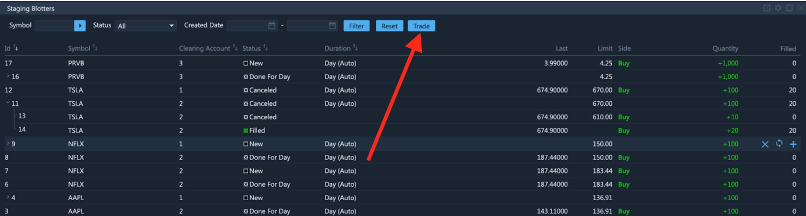
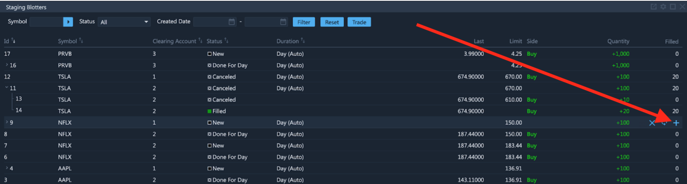

# Staging Blotter

### Overview

ETNA Trader enables users to split a large order into a batch of smaller orders so as to not affect the security's price. Suppose a trader would like to place an order worth $10 million. In an illiquid stock, such order may significantly move the price, and potentially cause substantial losses. To avoid this scenario, ETNA Trader enables traders to split large orders into smaller ones via the `Staging Blotter` widget. To create a new order, simply click `Trade`:

Next, fill out the large order's parameters. Note that this order itself will never be executed.

Next, proceed to create smaller order by clicking on the `+` icon:

