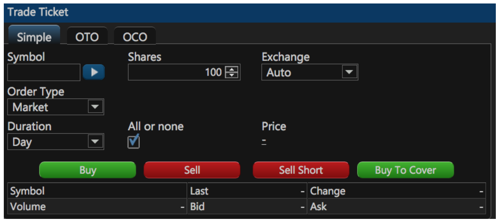
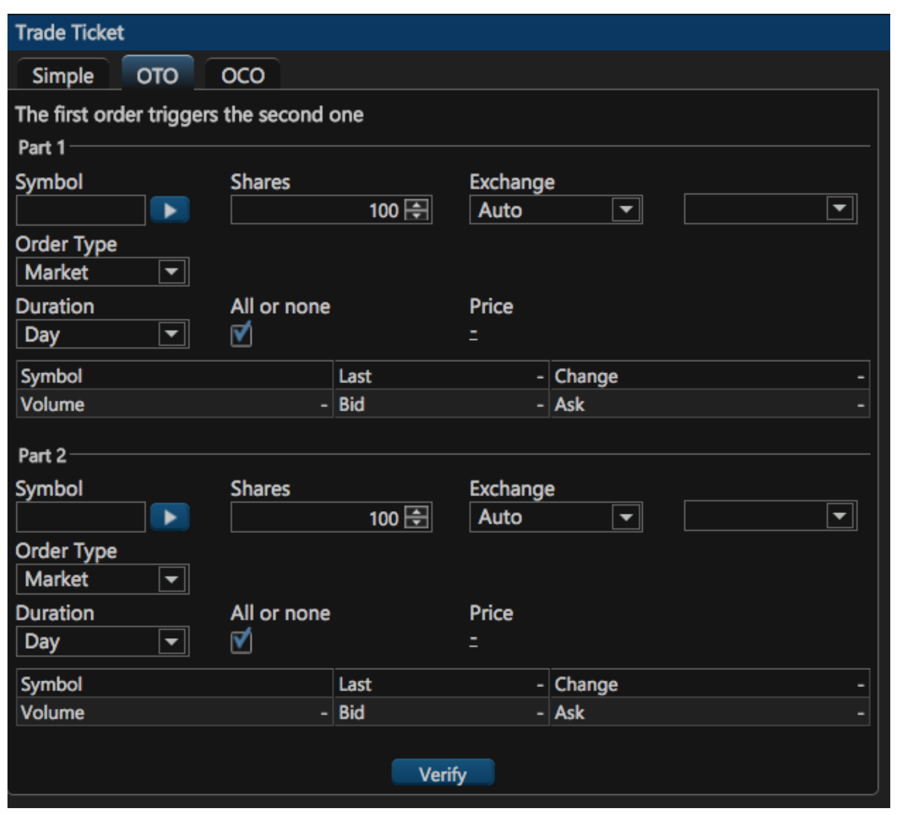
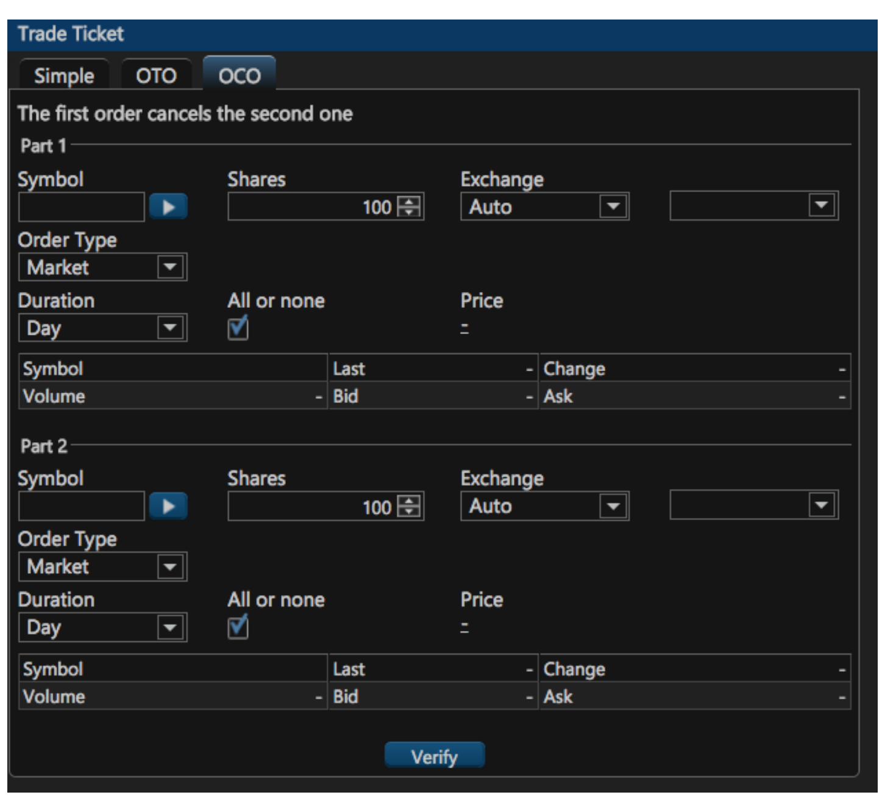

# Trade Ticket

### Exploring the Trade Ticket Widget

By using the Trade Ticket widget, you can place three types of trades: Simple, OTO or OCO. To place an order, you enter the symbol name, number of securities, the exchange market \(auto, Nasdaq, NYSE, KNIGHT\), order type \(Market, Limit, Stop, Stop Limit, Trailing Stop, Trailing Stop Limit\) and the duration of the trade: Day or Good Till Canceled. You can place your order right after you finish filling the entries of the ticket.

### Trade Types

#### Simple

This is the regular trade in which securities are purchased, sold, sold short, or bought to cover.

#### OTO \(One Triggers the Other\)

A one triggers the other orders involves two orders—a primary order and a secondary order. The primary order may be a live order at the marketplace. The secondary order, held in a separate order file, will be triggered automatically once the primary order gets executed.

#### OCO \(One Cancels the Other\)

A one-cancels-the-other order \(OCO\) combines a stop order with a limit order on an automated trading platform. When either the stop or limit level is reached and the order executed, the other order will be automatically canceled.

