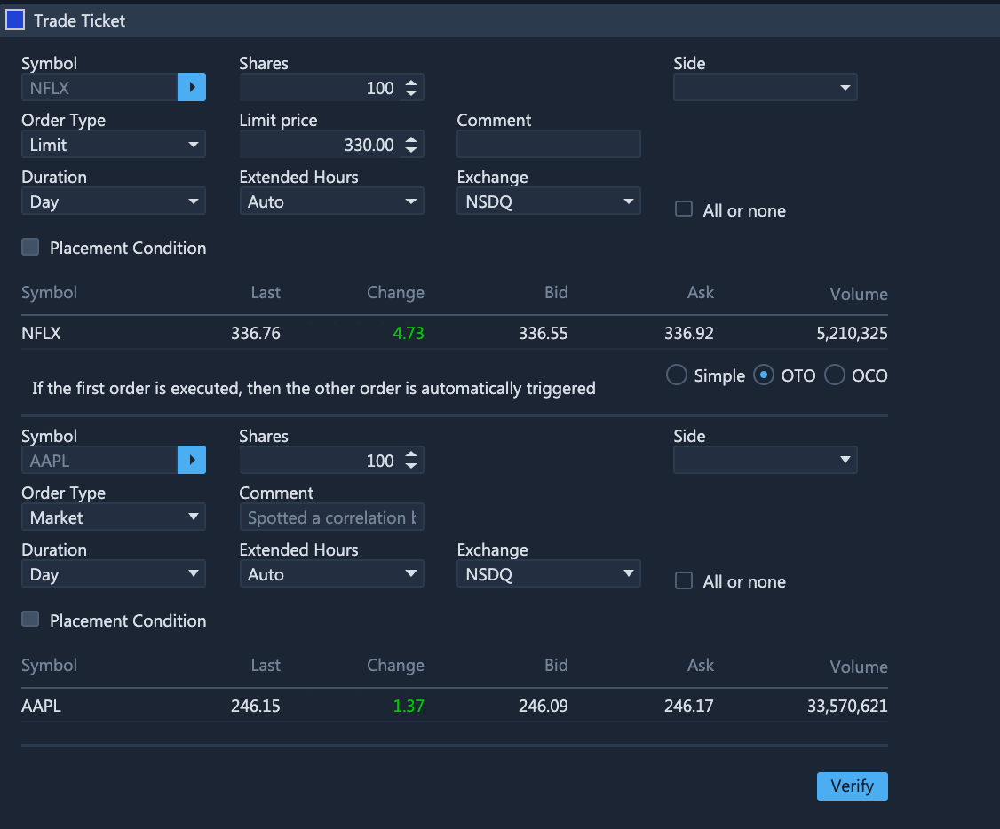
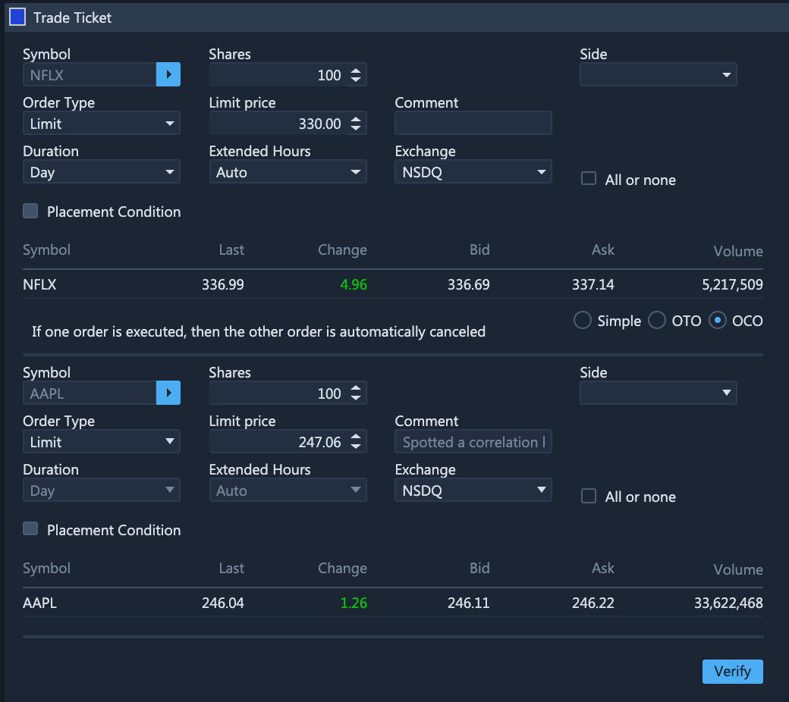

# Trade Ticket

### Exploring the Trade Ticket Widget

By using the Trade Ticket widget, you can place three types of trades: Simple, OTO or OCO. To place an order, you enter the symbol name, number of securities, the exchange market \(auto, Nasdaq, NYSE, KNIGHT\), order type \(Market, Limit, Stop, Stop Limit, Trailing Stop, Trailing Stop Limit\) and the duration of the trade: Day or Good Till Canceled. You can place your order right after you finish filling the entries of the ticket.

### Trade Types

#### Simple

This is the regular trade in which securities are purchased, sold, sold short, or bought to cover.

#### OTO \(One Triggers the Other\)

A one triggers the other orders involves two orders—a primary order and a secondary order. The primary order may be a live order at the marketplace. The secondary order, held in a separate order file, will be triggered automatically once the primary order gets executed.

#### OCO \(One Cancels the Other\)

A one-cancels-the-other order \(OCO\) combines a stop order with a limit order on an automated trading platform. When either the stop or limit level is reached and the order executed, the other order will be automatically canceled.

### Price Types and Order States

Whenever a new order is placed, be it a limit or a stop order, it is important to consider which price will trigger the execution of the order and at which price it'll eventually be executed. The following table outlines which price types will serve as references for triggering and execution of various order types:

| Event | Buy order | Sell orders |
| :---: | :---: | :---: |
| Triggering of **Limit** orders | **Ask** | **Bid** |
| Triggering of **Stop** orders | **Last** | **Last** |
| Order Execution | **Ask** \(if there's no Ask price, the order will be filled at the Last price\) | **Bid** \(if there's no Bid price, the order will be filled at the Last price\) |


If you use the [Chart](../chart.md) widget for order placement, bear in mind that charts are built using the **last** price.


