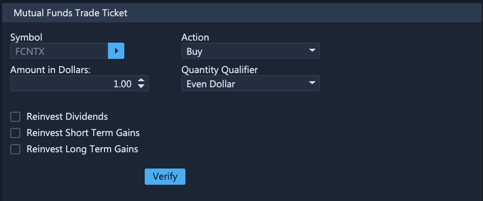
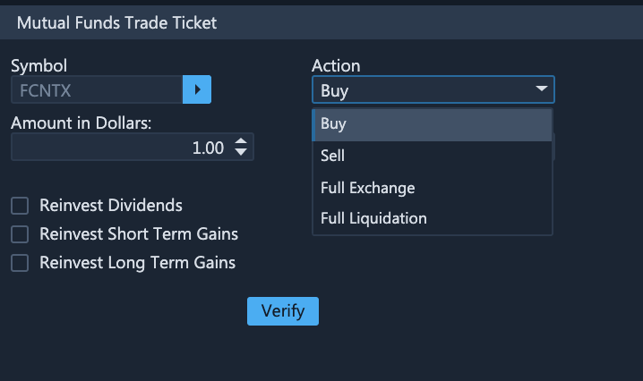
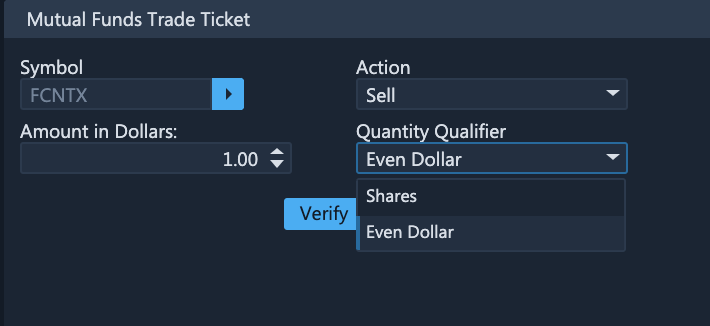
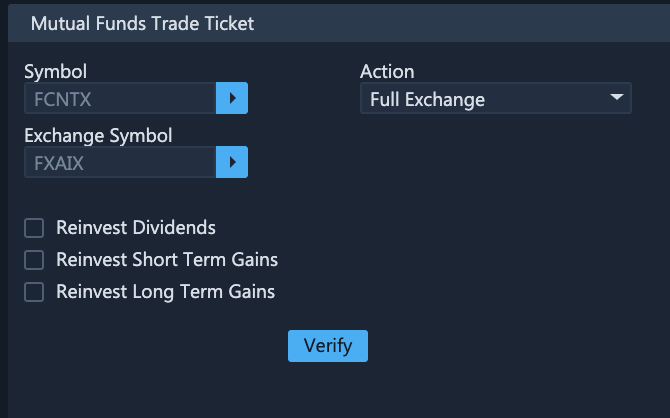
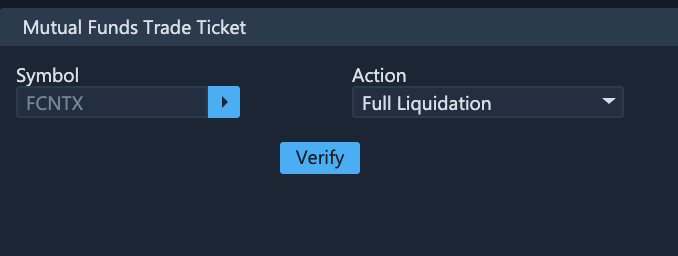
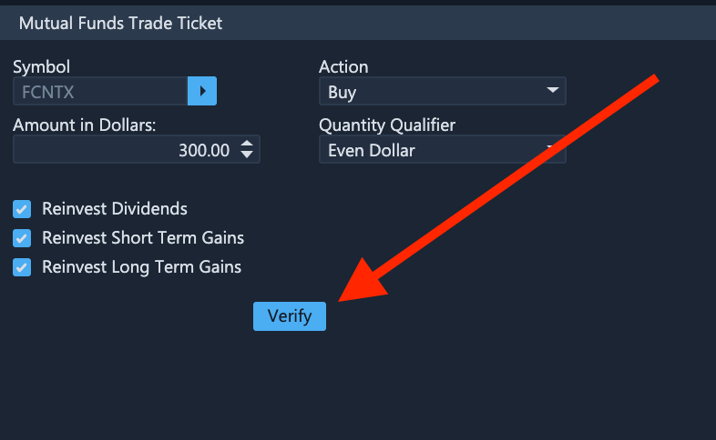
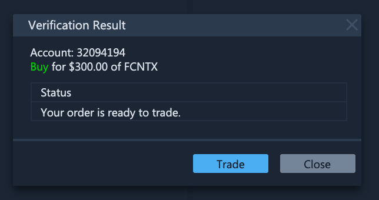
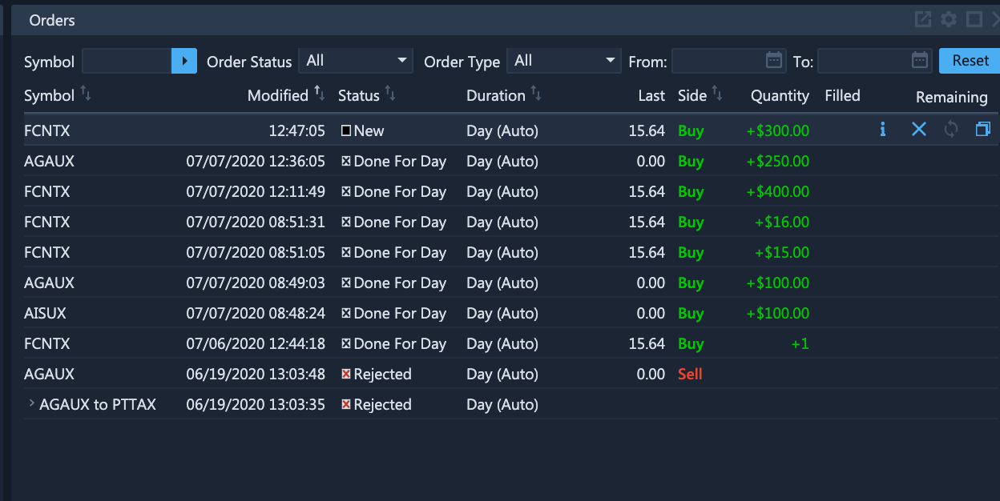

# Mutual Funds Trade Ticket

### Introduction

Mutual funds are a popular investment vehicle for investors who wish to delegate the responsibility for management of their funds to a group of professional investment managers that run said mutual funds. The nature of mutual funds somewhat differentiates them from stocks and bonds that can simply be purchased and sold on the exchange. Specifically, mutual funds can be exchanged or liquidated, the dividends received by the mutual fund from its holdings can be further reinvested or distributed back to the stockholder, etc. For this reason ETNA Trader contains separate user interfaces for trading of mutual funds both in ETNA Trader Web and in ETNA Trader for iOS and Android; and in this article we'll demonstrate the process in detail.

### Mutual Funds Trading in ETNA Trader Web

In ETNA Trader Web, trading of mutual funds transpires on the **Mutual Funds Trade Ticket** widget. This widget is responsible for purchasing, selling, exchanging, and liquidating of mutual funds. Here a trader can also indicate if they would like to reinvest dividends and capital gains.

First, you must specify the ticker symbol of the mutual funds that you would like to trade.

Next, specify one of the four target actions:

Depending on the action, the range of configurable options and quantity qualifiers will vary.

#### Purchasing Mutual Funds

When you buy a mutual fund, you may instruct the managers of the mutual fund to reinvest the dividends as well as the short-term and the long-term gains by selecting the corresponding checkboxes. The required quantity must be specified in dollars: so if you want to buy $300 worth of this mutual funds, simply enter 300 into the text field titled **Amount in Dollars**.

#### Selling Mutual Funds

Mutual funds can be sold in either a specific dollar amount (Even Dollar) or in a specific quantity (Shares):

#### Exchanging Mutual Funds

If a mutual fund belongs to a family of funds that can be freely exchanged, you can perform the exchange by specifying the ticker symbols of the mutual funds that you would like to exchange:

#### Full Liquidation

If you would like to liquidate your position in a mutual fund entirely, select the **Full Liquidation** action, and your shares will be redeemed.

### Placing an Order

Once you have determined the action you would like to perform on the mutual funds, click **Verify**.

The order will be verified by ETNA Trader's numerous validators and, if the order is properly configured and there are sufficient funds in the trading account, the order will be green-lighted. Click **Trade**.

If you navigate to the **Orders** widget, you will notice the newly placed order with the **New** status. It's likely that the order will not be immediately executed since mutual fund orders are usually executed after-hours.

### Mutual Funds Trading in ETNA Trader Mobile

Mutual funds trading can also be performed on the go using our mobile apps that have complete functionality on par with their web counterpart. You can use ETNA Trader for iOS and Android to purchase, sell, exchange, or liquidate mutual funds. Dividends, short-term, and long-term gains can similarly be reinvested.

### Mutual Funds Trading Schedule

During the night, from 12 AM to 9:30 AM Eastern Time, ETNA Trader collects the ticker symbols and quotes for all available mutual funds.&#x20;

Mutual fund orders are accepted from 9:30 AM ET until the cut-off time (defined by the broker).&#x20;

Prior to the start of the following trading session, positions in mutual funds will either appear or disappear depending on the order's type and status.
