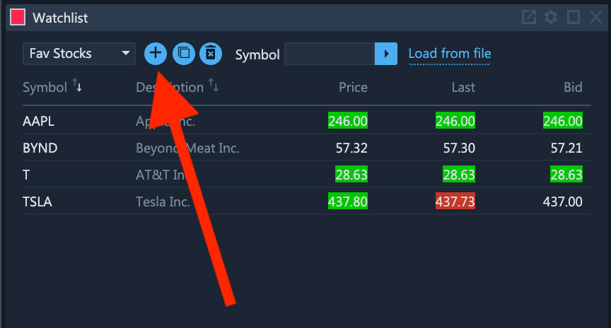
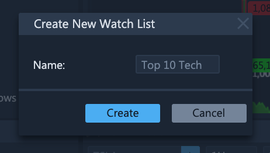
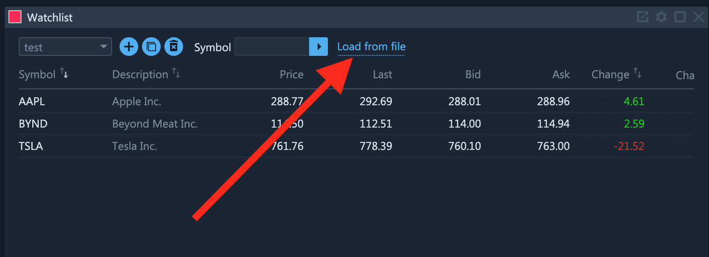
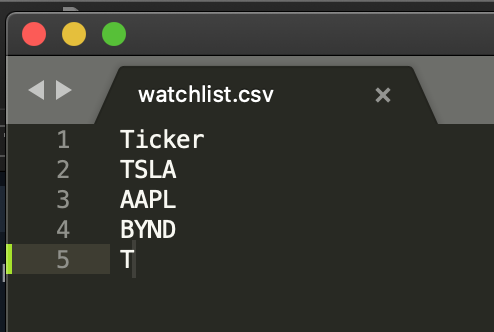
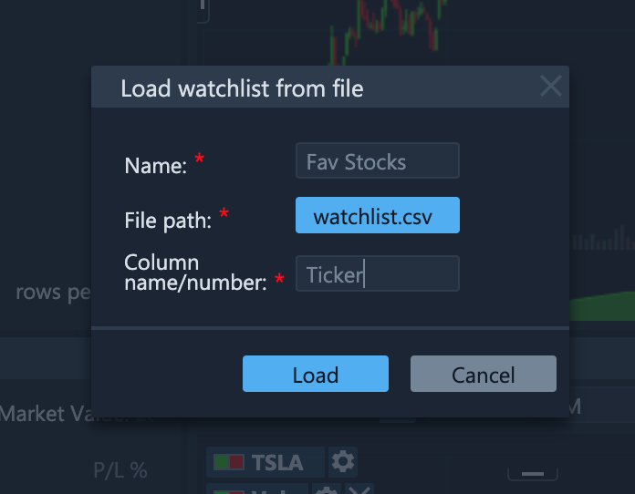
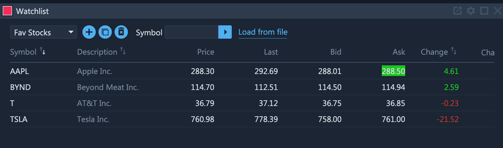
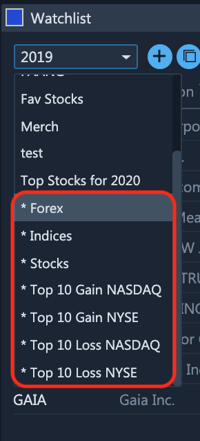

# Watchlists

### Exploring the Watchlists Widget

ETNA Trader's watchlist is designed to be sortable and filterable to help traders make decisions quicker \(this is especially important when trading options as it helps determine the entry strategy\). You can create your own watch list based on which groupings of stocks you would like to see in one view \(available in demo mode\). The screenshots below show the steps of creating your own watch list \(ex: _FANG_ watchlist\).

You can link the News widget with your watchlist or vice versa. Every watch list created can be linked with its News widget. You can create different watchlist and link each to a different News widget. You can also customize the information and the layout and of the watchlist you create, through the settings, as it shows in the post below.

### Importing Watchlists From CSV Files

In addition to manually creating new watchlists, ETNA Trader also enables traders to import watchlists from CSV Files. This can be done by clicking **Load from file**.

This will bring up the watchlist import window where you must:

1. Specify the name of the target watchlist.
2. Select a local CSV file containing the list of ticker symbols of companies that you would like to add to the new watchlist.
3. Specify the name or number of the column in the CSV file that contains the ticker symbols. For instance, here's a sample CSV File containing four ticker symbols:

   

Click **Load**.

Shortly after, the new watchlist will be added to your **Watchlist** widget:

### System Watchlists

In addition to custom user-created watchlists, the **Watchlist** widget also comes with several pre-defined system watchlists. These watchlists are marked with the `*` prefix:

The content of these watchlists is generated automatically so there's no need to provide the initial data or update it. 

The selection of system widgets available by default can be configured by contacting the support team \(they can be enabled or disabled individually\).

### Cross-Platform Synchronization of Watchlists

ETNA Trader being a cross-platform solution, all user data is always in sync in both ETNA Trader Web and the mobile apps. That also applies to watchlists — any modification made to the contents of any watchlist in ETNA Trader Web will immediately be reflected in the mobile apps and vice versa. In this way you can always be sure that there's no mismatch between watchlist data in any ETNA Trader app you use in you day-to-day trading.

