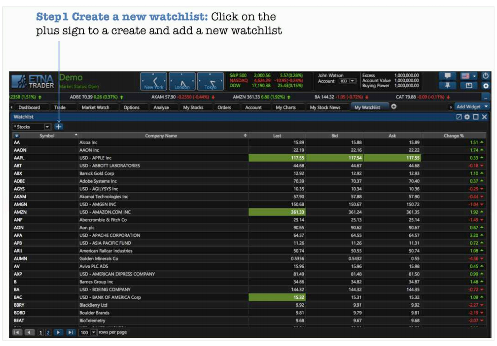
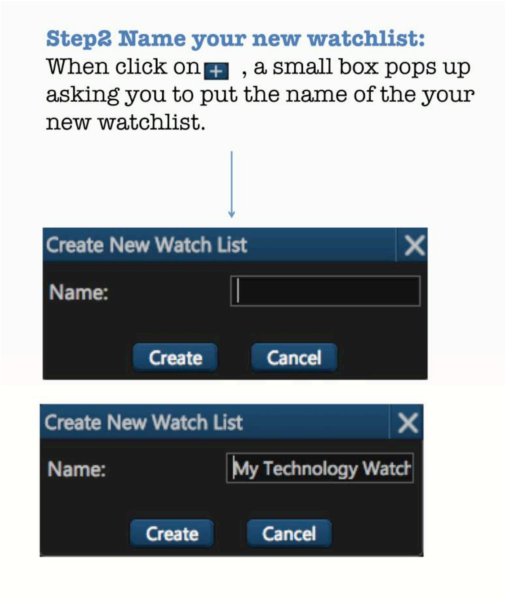
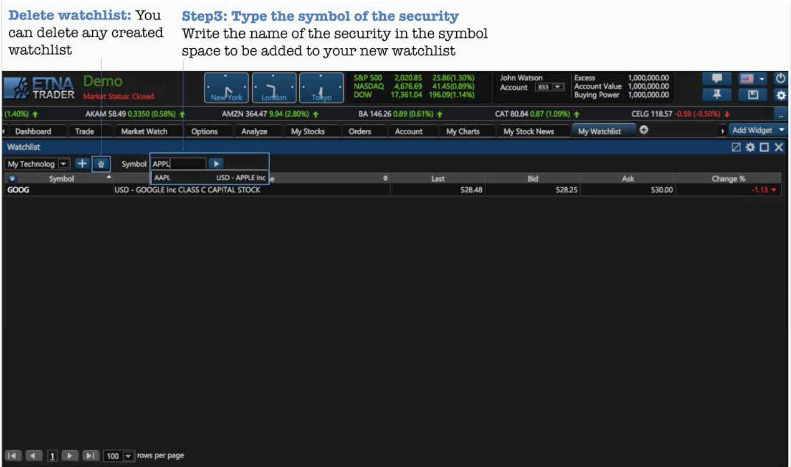
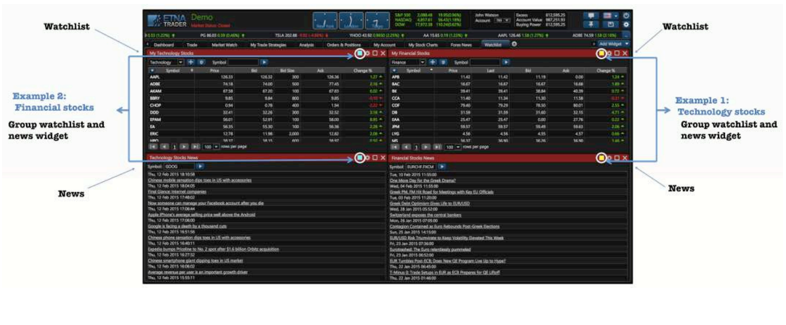
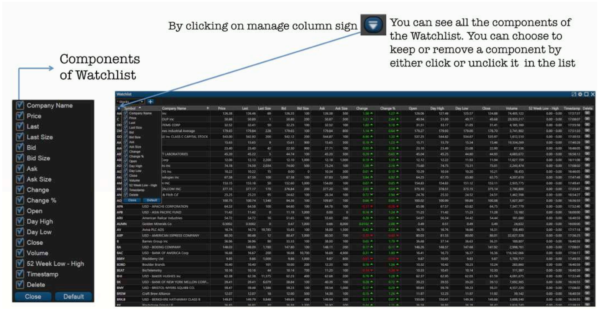

# Watchlists

### Exploring the Watchlists Widget

ETNA Trader's watchlist is designed to be sortable and filterable to help traders make decisions quicker \(this is especially important when trading options as it helps determine the entry strategy\). You can create your own watch list based on which groupings of stocks you would like to see in one view \(available in demo mode\). The graphs below show the steps of creating your own watch list \(ex: _FANG_ watchlist\).

You can link the News widget with your watchlist or vice versa. Every watch list created can be linked with its News widget. You can create different watchlist and link each to a different News widget. You can also customize the information and the layout and of the watchlist you create, through the settings, as it shows in the post below.

You can add and remove the components that you want to keep track of in the platform by using Manage Columns in the watchlist widget.

