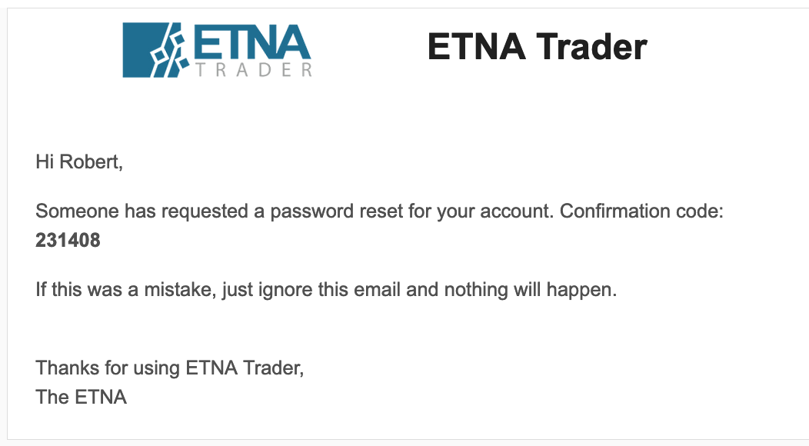

# 3. Generate a Token For a New Password

### Introduction

This POST endpoint enables you to generate a token using the confirmation code that the trader received by email during the [second step](1.-reset-traders-password.md) of the password reset process.

There are three required parameters that must be provided in the request:

1. **Et-App-Key** \(header\). This is the unique key of your app that identifies your app when communicating with our service. Contact your administrator to get this key.
2. **API version** \(path\). Unless necessary, leave it at "1.0".
3. **resource** \(body\). This is a JSON file that contains the confirmation code that the trader received by email.

#### Request Body

<table>
  <thead>
    <tr>
      <th style="text-align:left">Parameter</th>
      <th style="text-align:left">Description</th>
    </tr>
  </thead>
  <tbody>
    <tr>
      <td style="text-align:left">Code</td>
      <td style="text-align:left">
        <p>This is the confirmation code from the following email:</p>
        <p>
          
        </p>
      </td>
    </tr>
  </tbody>
</table>

```javascript
{
  "Code": "231408"
}
```

Here's the final template for this API request:

```text
POST apiURL/v1.0/users/password/reset/code
```

### Response

In response to this API request, you will receive a JSON file either confirming successful  token generation or enumerating errors that occurred in the process.

```javascript
{
  "Model": "ba6b8cac-6738-4434-bd26-825db020a05c",
  "Errors": [],
  "IsSucceed": true
}
```

The `Model` parameter contains the token that must be provided in the [final step](3.-update-the-password.md) of the password reset process.

### Common Mistakes

Here are some of the common mistakes that developers make when attempting to generate a token for password reset.

#### Failing to Specify the Et-App-Key Parameter

If you specify the wrong Et-App-Key parameter or fail to include it in the header altogether, you'll get the following error:

```javascript
{
    "error": "Application key is not defined or does not exist"
}
```

