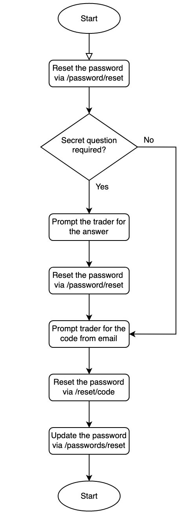

# Password Reset

### Resetting Traders' Password via API

In ETNA Trader, the process of resetting a trader's passwords consists of four steps:

1. Resetting the password by providing the answer to the secret question \(if necessary\).
2. Confirming the trader's intention to reset the password by sending a verification code to their email address.
3. Updating the old password.

The following diagram provides the step-by-step algorithm for resetting the password of a trader:

Once you understand the password reset workflow, proceed to reset the trader's password:



