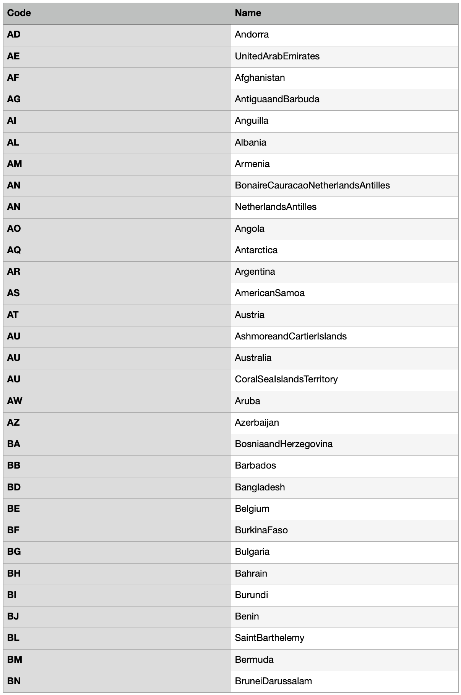
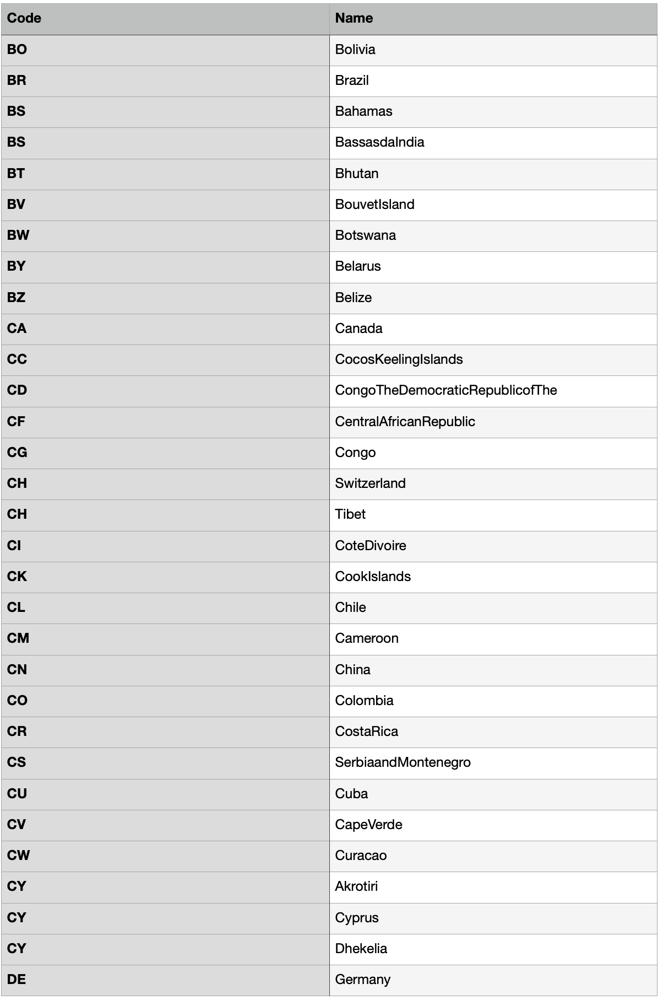
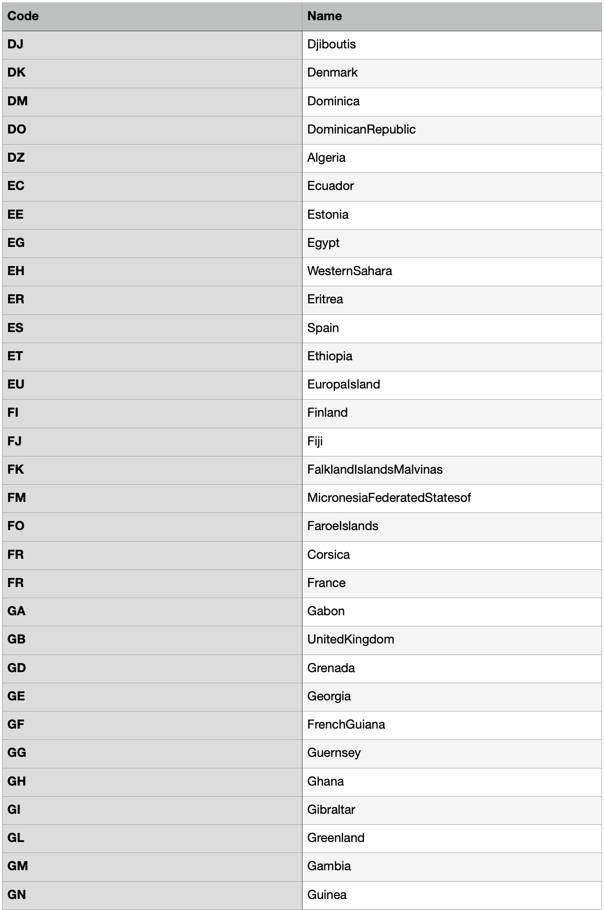
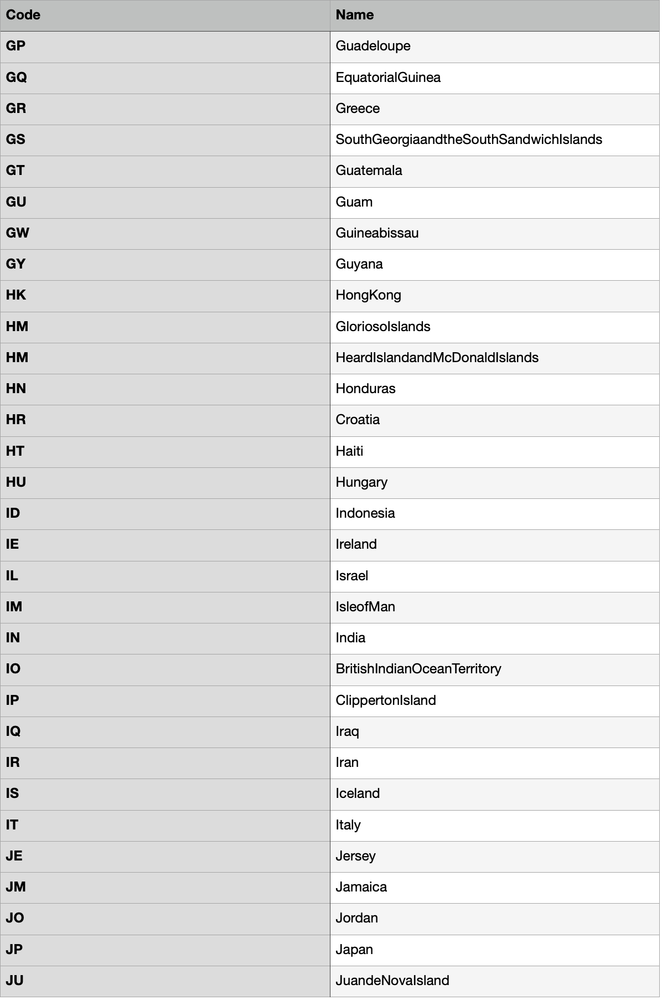
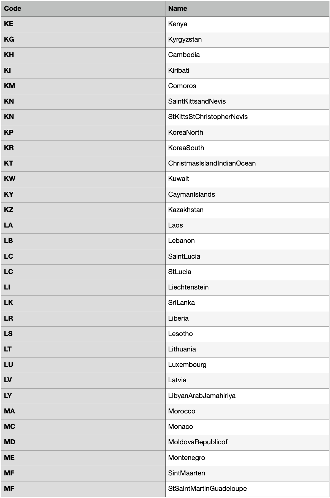
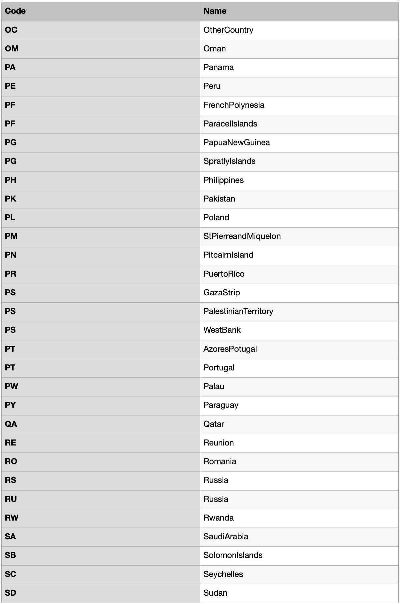
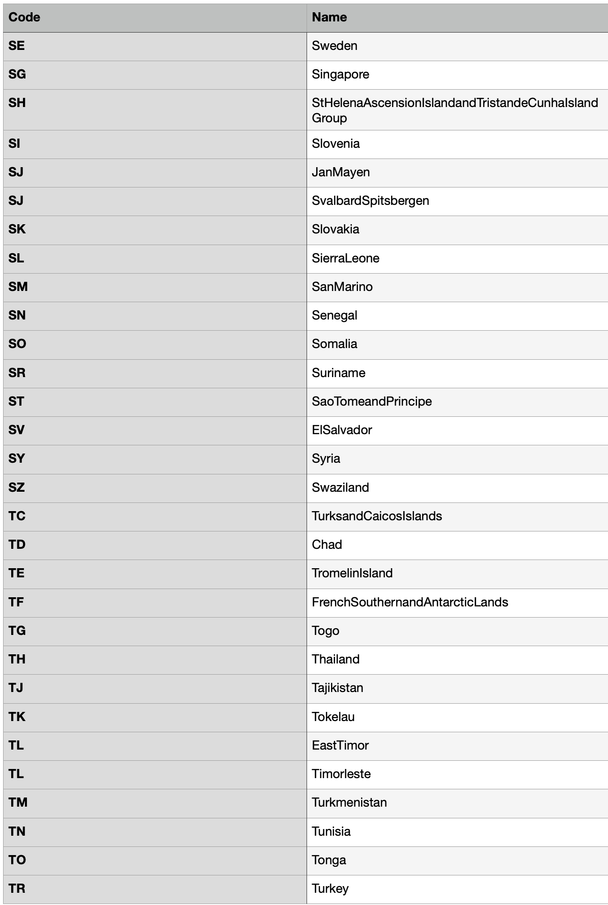
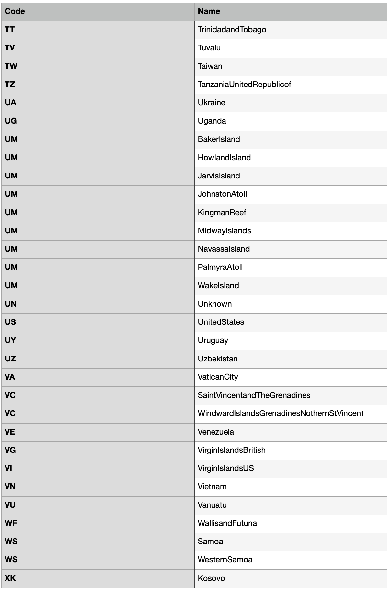
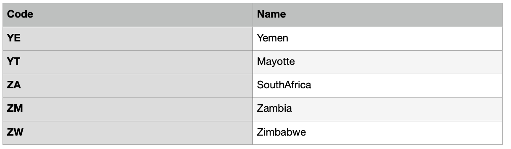

# Register a User

### Introduction

This POST endpoint enables you to register a new user. Before doing so, first learn which parameters are required during registration via the following endpoint:



There are five required parameters that must be provided in the request:

1. **Et-App-Key** \(header\). This is the unique key of your app that identifies your app when communicating with our service. You can retrieve this key in the **BO Companies** widget on the WebApi tab of the company modification window.
2. **origin** \(header\). This is the URL of the domain from which the request is made. The value must be consistent with the value of the hostname in the environment settings \(BO Companies - Edit - hostname\).
3. **API version** \(path\). Unless necessary, leave it at "v1.0".
4. **registrationRequest** \(body\). This is JSON dictionary containing information about the new user.

#### Body Syntax

The body of the request represents a JSON dictionary with required parameters.

```javascript
{
  "Credentials": {
    "Login": "roberttorro",
    "Email": "robert@someguy.com",
    "Password": "123456789Ab"
  },
  "Name": {
    "FirstName": "Robert",
    "LastName": "Torro",
    "MiddleName": "J.",
    "Suffix": "NoSuffix"
  }
}
```

#### Country Syntax

If it's necessary to specify the country, use the value from the **second** column of the following table \(UnitedStates, Canada, etc.\):




















The request ought to be sent to the following URL:

```text
POST apiURL/v1.0/registration/
```

### Response

In response to this request, if the user was successfully added, you will receive a JSON dictionary containing information about the new user:

```javascript
{
  "UserId": 16786,
  "FirstName": "Robert",
  "MiddleName": "J",
  "LastName": "Torro",
  "Login": "roberttorro",
  "Email": "robert@someguy.com",
  "AddedDate": "2020-02-20T12:59:13.9566533Z",
  "Salutation": "NoSalutation",
  "Suffix": "NoSuffix"
}
```

### Common Mistakes

Here are some of the common mistakes that developers make when registering new users.

#### Failing to Specify the Et-App-Key Parameter

If you specify the wrong Et-App-Key parameter or fail to include it in the header altogether, you'll get the following error:

```javascript
{
    "error": "Application key is not defined or does not exist"
}
```

#### Failure to Specify All Of the Required Parameters

If you fail to specify all of the parameters required for registration of users in your company, you will receive the 409 status code as well as an error message explaining the reason for registration failure. For example, if we omit the email, we will get the following error:

```javascript
{
  "Errors": [
    "Email was not set."
  ],
  "Reason": "SchemaValidationFail"
}
```

